# Placing orders {}

To buy or sell an stock, you need to register with an online broker (there are other ways, so you know). There are several available like Robinhood, Interactive brokers, TDAmeritrade, etc. They all offer zero commissions for trading with US stocks, but they still charge you the commission from the stock exchange where the given stock would be traded.

Here we will check Interactive brokers.

Generally speaking there are two type of trades: short and long.

## Short sale {-}
Short sale means to sell and then buy.

In this type of sale, you sell an stock that you do not own, when the price is high, with the expectation to buy back later on at a lower price. 

```{r, out.width = "50%", echo= FALSE, fig.align = 'center',fig.cap = 'Short sell'}
knitr::include_graphics("images/ShortSell.png")
```


Here you will profit from declining stocks.  Basically, the broker will lend you the shares and you will return them later. They will charge you an interest for depending how long you keep the stocks. This type of sale is only available, if your broker has shares of the given stock available for shorting.

## Long sale {-}
Long sale or buying the market means to buy and then sell. This type of trade is optimum if you think the stock will go up in price. Basically, you buy when the stock is low,  sell when it is high, and you keep the margin as a profit.

```{r, out.width = "50%", echo= FALSE, fig.align = 'center',fig.cap = 'Long sell'}
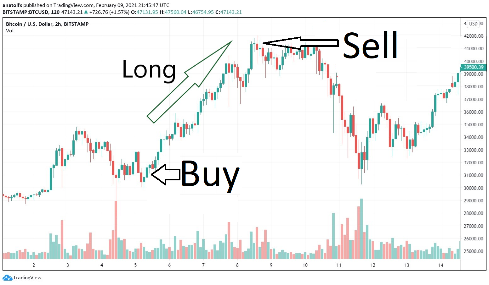
```

## Bid and ask price {-}

In the market there are two types of people: buyers and sellers.

When you want to buy a stock you offer to buy at a given price, that is call the "Bid" price.

When you want to sell, the price you want to sell at is called the "Ask" price.

So if you want to buy an stock, you can only buy at price the sellers are willing to sell (You buy at the "Ask" price).

If you want to sell a stock, you can only sell it at the price buyers are willing to buy, or so call "bid" price.


```{block2, type='rmdexercise'}
The price difference between the Ask and Bid price is called "The spread"
```


## Market order and limit order{-}
Generally, speaking you can buy or sell an stock in two main ways: market order or limit order.

In the market order, the price you get is the "Ask" or ""Bid" price at the moment you place the order. This type of order are filled right away. They prioritize timing but not price.


In the limit order, the order is only filled when the price of the stock reaches the price you what to sell or buy at. This order prioritizes price but not time.

### Timeframe for limit order {-}
While using a limit order, the broker has to wait for the stock to reach the price you demanded. That amount of waiting time can be set when placing the limit order in different ways:


Day: this means the order will expire at the end of trading day.

GTC: "Good-Til-Cancelled", the order will be valid until you choose to cancel it.

Allow pre-open: It means the order can be also filled from 4:00 am until 9:30, when the open.

Fill outside RTH: The order can be filled outside of regular trading hours: orders could be filled in either the morning or evening pre-trading sessions.

GTD: (Good-til-Date/Time), It means you can select the time and date until you want the broker trying to make the trade.   

OPG: that allows your order to be executed as close to the opening price as possible. The order will be accepted if it is received before 9:15AM (ET).

These different options are available when placing the order:

```{r, out.width = "50%", echo= FALSE, fig.align = 'center',fig.cap = 'Timing of limit orders'}
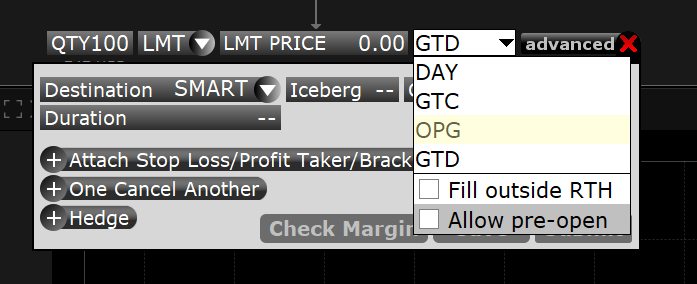
```


## Buy Limit order {-}
A Buy Limit order sets the condition to trigger a buy order when the price is at or below the Buy Limit price. In the Buy Limit order below, a buy order will be executed at prices equal or lower than the "Buy Limit" of \$130.

```{r, out.width = "100%", echo= FALSE, fig.align = 'center',fig.cap = 'Buy Limit order'}
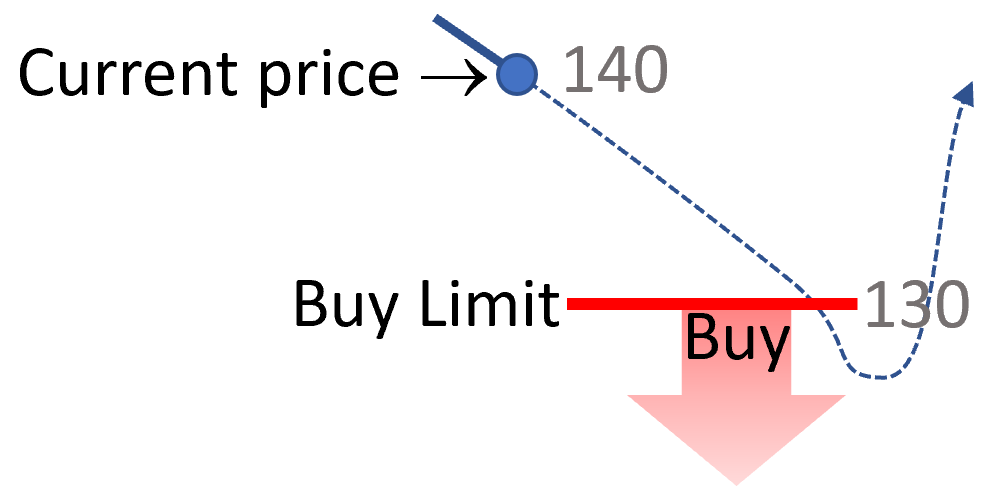
```

## Buy Stop order {-}

A Buy Stop order sets the condition to trigger a buy order when the price is at or above the Buy Stop price. In the Buy Stop order below, a buy order will be executed at prices equal or higher than the "Buy stop" of \$145.

You want to use a Stop Buy order, when you shorted a stock. If you shorted a stock (Sold stock you do not have at a high price, with expectation to buy it back if it drops), and want to avoid a loss, you can set a Stop Buy order, in which a order to buy will be executed if the price moves above the Stop Buy order.

```{r, out.width = "100%", echo= FALSE, fig.align = 'center',fig.cap = 'Buy Stop order'}
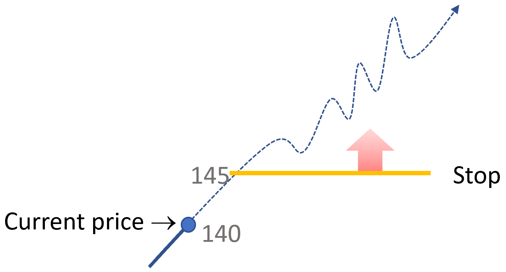
```

## Buy Stop Limit order {-}

It turns out that you can combine the functionality of the Buy Limit order (To buy below a price) with the functionality of the Buy Stop Limit Order (Buy above a price) in what is called a Buy Stop Limit order. Basically, buy above a Stop Price but below the Limit Price.


You can using this type of roder when going long, in a bull trend. The stock below is trading at \$140, and you think it is in a bull trend, but you want some more confirmation. In this case, you can place a Buy Stop Limit order, with a stop of 145 and a limit of \$150. Basically, the order will execute only if the price goes above \$145 but not any higher than \$150. that will protection of buy a stock that get high price too fast.


```{r, out.width = "100%", echo= FALSE, fig.align = 'center',fig.cap = 'Buy Stop Limit order'}
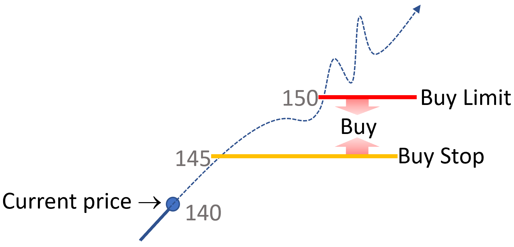
```


## Sell Limit order {-}

A Sell Limit order sets the condition to trigger a sell order when the price is at or above the Sell Limit price. In the Sell Limit order below, a sell order will be executed at prices equal or higher than the "Sell Limit" of \$150.


```{r, out.width = "100%", echo= FALSE, fig.align = 'center',fig.cap = 'Sell Limit order'}
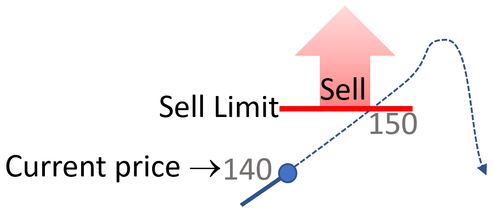
```


## Sell Stop order {-}
A Sell "Stop"  order sets the condition to trigger a sell order when the price is at or below the Sell Stop price. In the Sell Stop order below, a sell order will be executed at prices equal or lower than the "Sell Stop" of \$130.

```{r, out.width = "50%", echo= FALSE, fig.align = 'center',fig.cap = 'Sell Stop'}
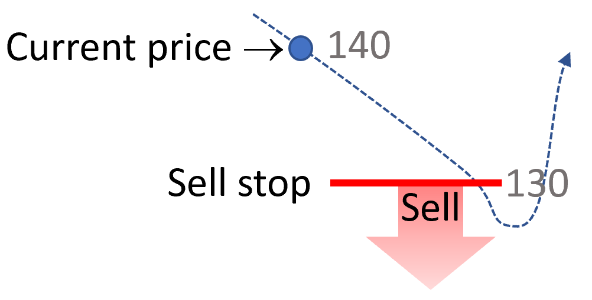
```
You can use a Sell Stop order as a protection when going long in a stock. When going long, the profit comes from the price going up. However, if by change the price chooses to go down, then you sell any stock below the Sell Stop price. This will minimize the loss.

## Sell Stop Limit order {-}

You can also combine a Stop Order (Sell below a price) with a Limit Order (sell above a price) in what is call "Sell Stop Limit" order. In the example below, an order to sell is triggered when price drops below the Stop sell price of \$140, but only if price is above the Sell Limit of $130.
If price drops below $\130, the order to sell will not execute.


```{r, out.width = "50%", echo= FALSE, fig.align = 'center',fig.cap = 'Sell Stop Limit'}
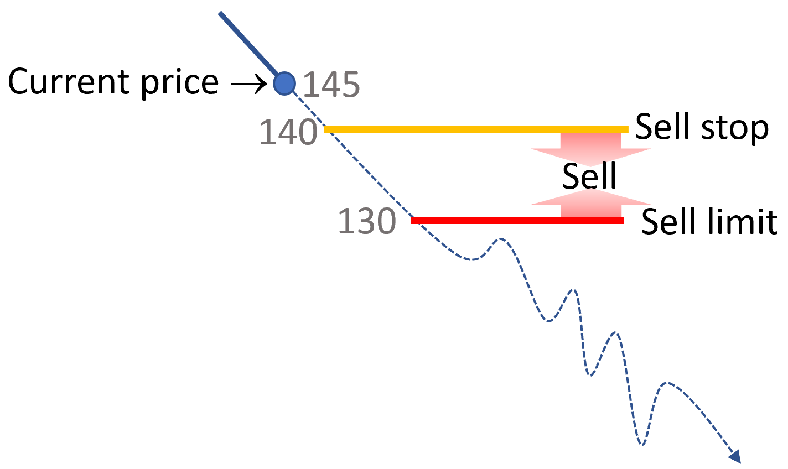
```

You can use a Sell Stop Limit, when shorting a stock. 

Say the price is going down, and you think it will continue but want more confirmation on the donwards trend. In the example above, you can place an order to sell if price gets below the Sell Stop of \$140, but only if price is higher than the Sell Limit of \$ 130. This would protect you of buying a stock that slips downwards too fast to place the order.


## Stops and Limits {-}
In summary, the Stops and Limits are conditions that can be used alone or combined in an order, to better control the entry or exit prices of a trade.
```{r, out.width = "50%", echo= FALSE, fig.align = 'center',fig.cap = 'Stops and Limits for Buying and Selling'}
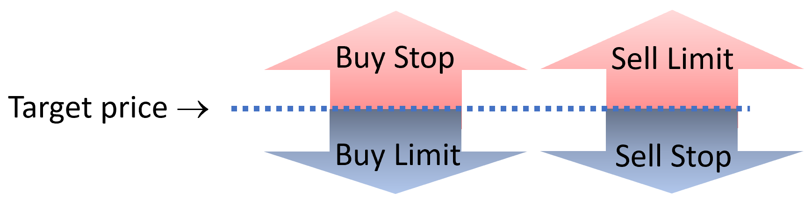
```
## Stop loss {-}

When you buy a stock with a limit order at a given price, your expectation is that the stock price will go up. 

But, there is a risk that the price goes down; to avoid major economic loss in this scenario, you use what is call an "Stop loss". 

Basically, at the time that you buy an stock with the limit order, you put a condition to resell the shares if the price hits a lower price. This reselling price, or stop loss, is how much you are willing to risk in a trade if things do no go the way you think.


```{r, out.width = "50%", echo= FALSE, fig.align = 'center',fig.cap = 'Stop loss'}
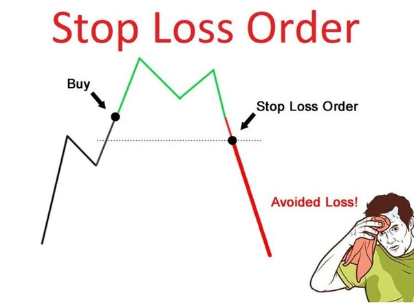
```

When shorting an stock, you would put an stop loss at a higher price. In the case of shorting, your risk is for the stock to go high in price.

```{r, out.width = "100%", echo= FALSE, fig.align = 'center',fig.cap = 'Stop loss'}
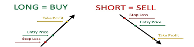
```

## Profit taker {-}
When you place an order to buy an stock, you can hold position (Not resell it) until you like. However, when placing the limit order, you could make your mind in advance about how much you want to gain from the trade if the price has gone high enough for your liking. This reselling price is call a "profit taker".

```{r, out.width = "100%", echo= FALSE, fig.align = 'center',fig.cap = 'Profit taker'}
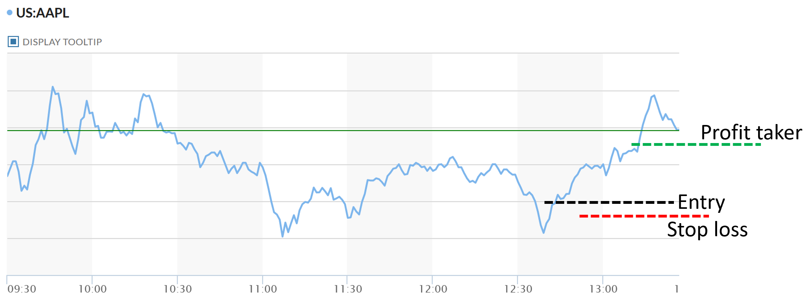
```

When shorting, you will place a high profit taker to buy at a lower price.


## Risk to profit {-}

Any time you make a trade, you are expecting a given trend in the stock price that will turn you a profit. However, there is also risk that the trend goes in the other direction, in which case you will loose money in the given trade.

It is generally recommended that you never risk to lose more than 1% of all your capital in a trade. 

Lets use an example, and say you have \$1000 in your brokerage account. So for every trade, you should not risk to loose more than  \$10.

Now let's say, you want to buy 100 shares of a given stock at \$10. In this case, you place your order for 100 shares at \$10 and place a stop loss at $9.9. 

Basically, if the price goes below 9.9, you would loose 10cents on each share * 100 shares=\$10.

Not to be greedy, you could place a Profit taker at \$10.2. So, you could take at least \$20 cents in profit in this trade. For this given trade, your risk to profit is 1:2. You risk to loose 10 cents but could gain 20.

On 100 shares a gain of 20 cents is \$20 dollars, for a temporary investment of \$1000, and a risk of \$10.

```{r, out.width = "100%", echo= FALSE, fig.align = 'center',fig.cap = 'Profit taker'}
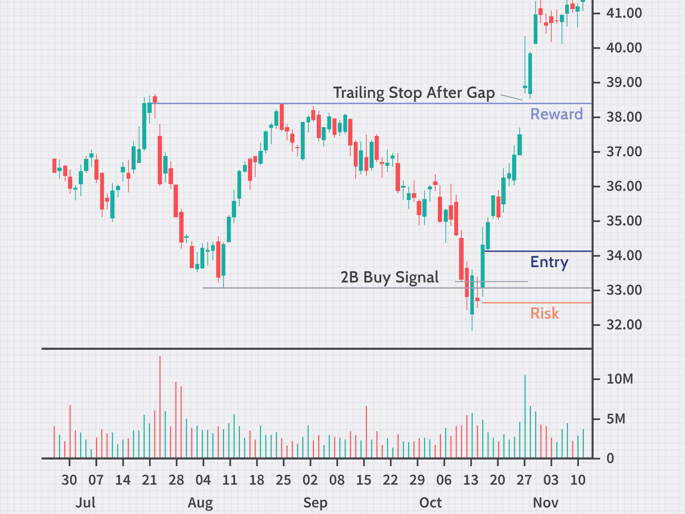
```

# Placing a order in IBroker {}

The operation to place an order to buy or sell an stock varies by  broker. Here I will explain the "Trader Workstation" TWS, which is the API from the Interactive Brokers. Just Google "TWS from Interactive brokers" to find how to download it.

Upon registering, and logging into the TWS, you will see an screen looking like this image below. The upper left window is the space to place orders (Yellow box)
```{r, out.width = "100%", echo= FALSE, fig.align = 'center',fig.cap = 'TWS'}
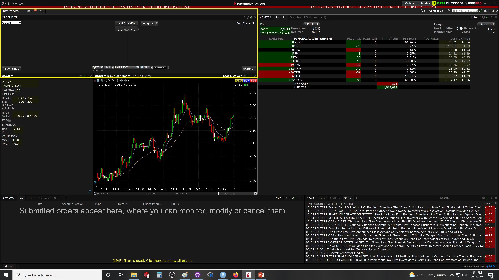
```

Zoom in that box, you have the different options needed to place an order:

```{r, out.width = "100%", echo= FALSE, fig.align = 'center',fig.cap = 'Profit taker'}
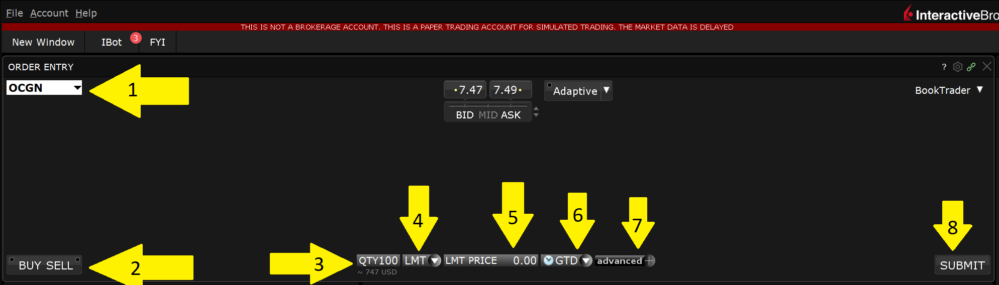
```

1. Select the stock name you want to trade. If not options are available, simply type the name of the stock. Choose the "Smart" option, which allows TWS to make your transaction in any stock exchange possible by the given stock.

2. Select whether to buy or sell.

3. Enter number of shares.

4. Select between market or limit order, (there are other types of orders, with added benefits)

5. If a limit order is selected, enter the price you want. Note how above, you can see the current Bid and Ask price. Look at those numbers to get a sense of how far off you are. 

If the Ask price (price at which people want to sell) is say \$10, but you place a limit order to buy at \$9, then this order may take a while to fill, may be never, if the price does not go that high. 

Basically, you want to buy at \$9, but the cheapest stock available (Ask price) is \$10. In other words, no one wants to sell you at the price you bid.

This consideration is important when placing a price for the limit order, as this determines the time it takes for trades to fulfill. It means you could also loose time in specific trades. 

If you want to buy stock with a limit order, it is recommended to buy a few cents above asking price, as to ensure you will get it. 

If you want to short an stock, to ensure filling of the order the price should be a few cents below bid price, as to ensure there will be enough buyers willing to buy at the price you want to sell.

These extra centes to the trade should be considered when planing the strategy.

```{block2, type='rmdexercise'}
To ensure trades are quickly filled, 

When buying shares, price should be at or a bit above Ask price.

When shorting, price should be at or a bit below Bid price.
```


6. Select the time choices for the trade

7. Add the stop loss and profit taker.

8. Submit.

After that, you will see a window describing the trade, and commission price. After you accept, the order is placed.


Here is a good video on how to place an order in TWS:
<center>
<iframe width="560" height="315" src="https://www.youtube.com/embed/c02mm33QvG4" title="YouTube video player" frameborder="0" allow="accelerometer; autoplay; clipboard-write; encrypted-media; gyroscope; picture-in-picture" allowfullscreen></iframe>
</center>


# The order book {-}

When you place an order, it goes into what is call an "Order book", this is a database maintained by the stock exchange listing all the people that have asked to buy or sell a given stock. It includes the number of shares and their Ask or Bid prices.

This book is important because it tells you, if there are shares to be traded at the price that you want. It also sets the priority of who gets the given trades.

Say you want to sell 10 shares at \$10, and you place your order after another person (lets call it person 2) placed a similar order 

A different person now wants to buy 5 shares at $10. In this case the stock exchange will sell the shares from person 2. That person had priority over you, as it placed the order earlier.


If another person want to buy other 10 shares at \$10, the exchange will sell the 5 shares remaining from person 2 and five shares of yours.

As you can image the Order book is very dynamic, and play a key role on the speed at which shares are traded. 


```{r, out.width = "100%", echo= FALSE, fig.align = 'center',fig.cap = 'Order book'}
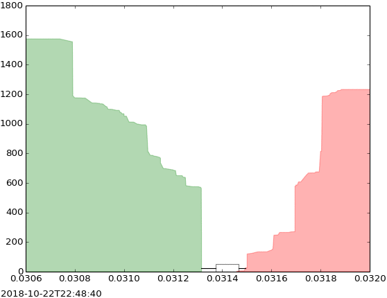
```

Commonly the full order book is called data Level 2 and it cost some money to see it in full. Most commonly, you will see what is called the "top of the book": only the best ask or bid orders in the book. In the TWS that information is on the left hand side...see arrow in image below.

```{r, out.width = "100%", echo= FALSE, fig.align = 'center',fig.cap = 'Order book'}
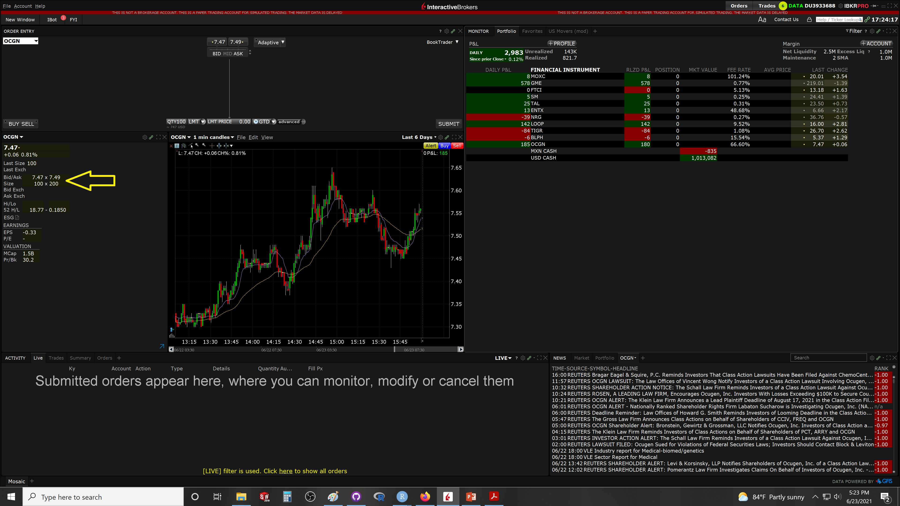
```


The "Chicago Board Options Exchange" or CBOe allows you to see the upper five lines of any given stock in real time, as well as the latest orders completed: [CBOe](https://www.cboe.com/us/equities/market_statistics/book/FREE/?mkt=edgx)


