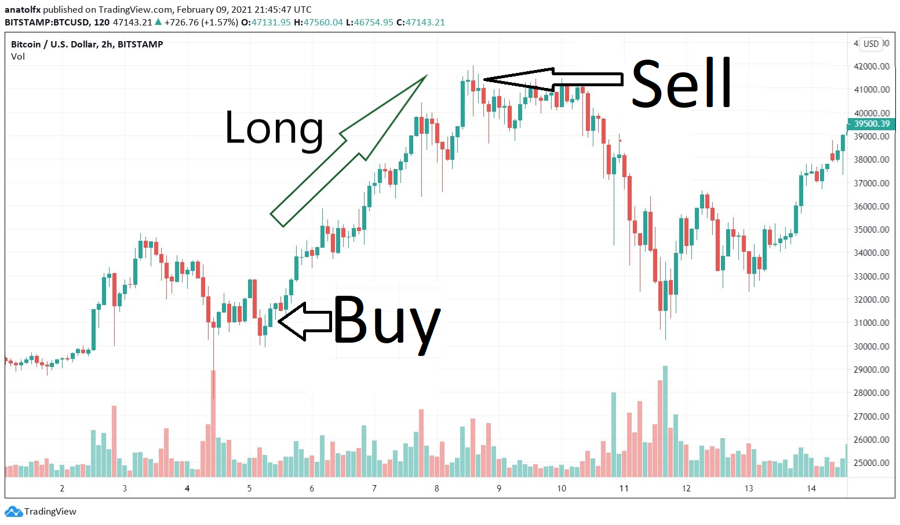
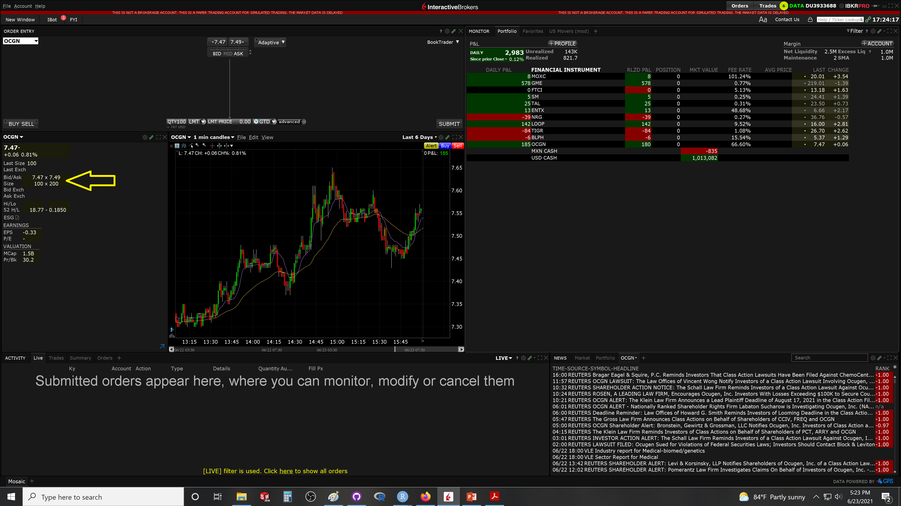
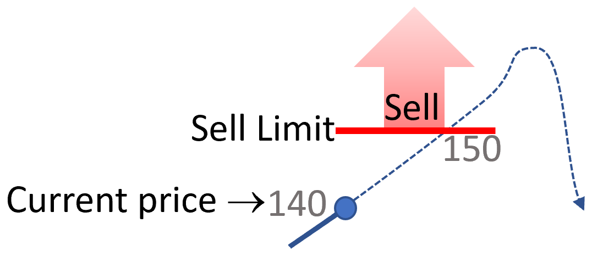
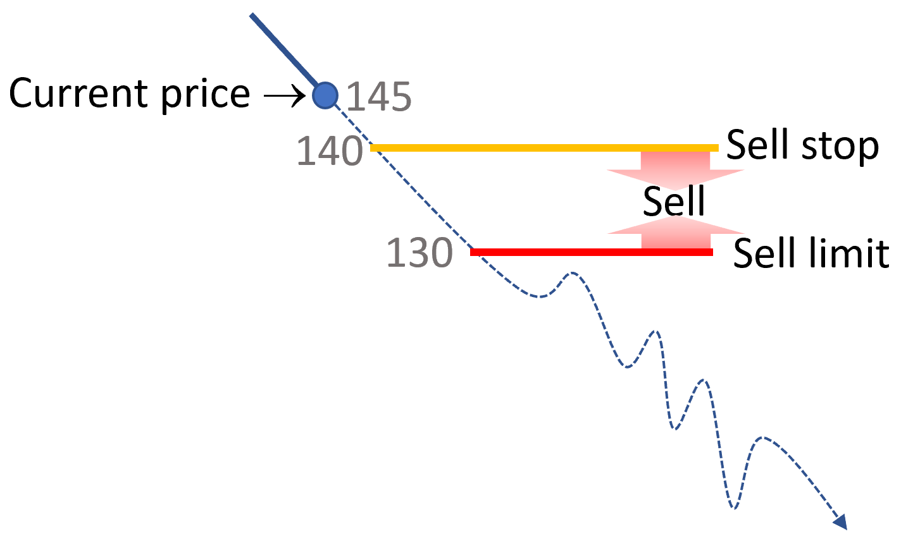
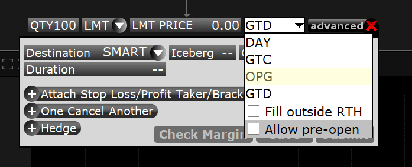
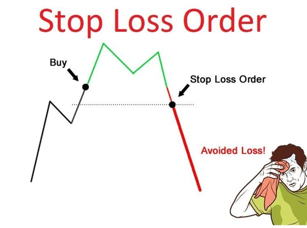
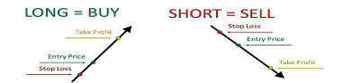

# Terms {}

## Trading times {-}
Shares of a given stock can be traded on any stock exchange in which a company is listed. Like you can buy Coke in Walmart or 7/11, but may be not in Homedepot. 

This is important because at times the same stock can have different prices in different exchanges. You can actually at times make money by just buying in one exchange and selling in another. There are all pretty fine tune, toug.

There are stock exchanges in almost every country, the most famous is the NYSE or the New York Stock Exchange. They operate from 9:30 am to 4:00 pm.

```{r, out.width = "100%", echo= FALSE, fig.align = 'center',fig.cap = 'Bitcoin crash'}
knitr::include_graphics("images/NYSE.png")
```


Other stock exchanges are fully electronic like the NASQAT. 

```{block2, type='rmdexercise'}
The Nasdaq is the largest and oldest electronic stock market in the world, meaning all of its buying and selling happens electronically, rather than on a physical trading floor. 
```

With the availability of digital trading, some stocks can be traded after hour:

The after-hours market trades are from 4:00 p.m. to 8:00 p.m. 
The pre-market are from 4:00 a.m. to 9:30 a.m.

These are times in New York.

## Long sale {-}
Long sale or buying the market means to buy shares of a stock and then sell them. This type of trade is optimum if you think the stock will go up in price. Basically, you buy when the stock is low,  sell when it is high, and you keep the margin as a profit.

```{r, out.width = "50%", echo= FALSE, fig.align = 'center',fig.cap = 'Long sell'}

```

## Short sale {-}
Short sale means to sell and then buy.

In this type of sale, you sell shares of a stock that you do not own, when the price is high, with the expectation to buy them back later when the price is lower. Here you will profit from declining stocks.  

```{r, out.width = "50%", echo= FALSE, fig.align = 'center',fig.cap = 'Short sell'}
knitr::include_graphics("images/ShortSell.png")
```


Basically, the broker will lend you the shares and you will return them later. They will charge you an interest depending how long you keep the stocks. This type of sale is only available if your broker has shares of the given stock available for shorting.


## Bulls and bears {-}

The market participants that rally for the price of a stock to go up are called $bulls$, those that rally for the stock to go down are call $bears$.

You will see or hear comments like stock ABC is "bearish". This means it currently has a downward tendency in price.

If the price of the stock is going higher, you will hear comments like it is moving into bull territory.

```{r, out.width = "100%", echo= FALSE, fig.align = 'center',fig.cap = 'Bull and bears'}
knitr::include_graphics("images/Bear.jpg")
```


## Bid and ask price {-}

In the market there are two types of people: buyers and sellers.

When you want to buy a stock you offer to buy at a given price, that is call the "Bid" price.

When you want to sell, the price you want to sell at is called the "Ask" price.

So if you want to buy an stock, you can only buy at price the sellers are willing to sell (You buy at the "Ask" price).

If you want to sell a stock, you can only sell it at the price buyers are willing to buy, or so call "bid" price.


```{block2, type='rmdexercise'}
The price difference between the Ask and Bid price is called "The spread"
```


## The order book {-}

When you place an order, it goes into what is call an "Order book", this is a database maintained by the stock exchange listing all the people that have asked to buy or sell a given stock. It includes the number of shares and their Ask or Bid prices.

This book is important because it tells you, if there are shares to be traded at the price that you want. It also sets the priority of who gets the given trades.

Say you want to sell 10 shares at \$10, and you place your order after another person (lets call it person 2) placed a similar order (10 shares at \$10).

A different person now wants to buy 5 shares at $10. In this case the stock exchange will sell the shares from person 2. That person has priority over you, as it placed the order earlier.


If another person want to buy 10 shares at \$10, the exchange will sell the 5 shares remaining from person 2 and five shares of yours.

As you can image the Order book is very dynamic, and play a key role on the speed at which shares are traded. 


```{r, out.width = "100%", echo= FALSE, fig.align = 'center',fig.cap = 'Order book'}
knitr::include_graphics("images/OrderBook.gif")
```

Commonly the full order book is called data Level 2 and it cost some money to see it in full. Most commonly, you will see what is called the "top of the book": only the best ask or bid orders in the book. In the TWS that information is on the left hand side...see arrow in image below.

```{r, out.width = "100%", echo= FALSE, fig.align = 'center',fig.cap = 'Order book'}

```


The "Chicago Board Options Exchange" or CBOe allows you to see the upper five lines of any given stock in real time, as well as the latest orders completed: [CBOe](https://www.cboe.com/us/equities/market_statistics/book/FREE/?mkt=edgx)


## Types of order{-}
Generally, speaking you can buy or sell an stock in two main ways: market order or limit order.


## Limit orders {-}
In the limit order, you tell the broker to buy or sell shares in a stock at prices equal or better than what you set as the limit price. This order prioritizes price but not time.

```{r, out.width = "100%", echo= FALSE, fig.align = 'center',fig.cap = 'Buy Limit order'}
knitr::include_graphics("images/BuyLimit.png")
```

```{r, out.width = "100%", echo= FALSE, fig.align = 'center',fig.cap = 'Sell Limit order'}

```

## Stop or market orders {-}
In the Stop or market order, you tell the broker to buy or sell shares of a stock as soon as the price reaches your desire price (so-call stop price) at the current market price. In this case you will get whatever  "Ask" or ""Bid" price is there available when the order is triggered. This type of order is filled right away. They prioritize timing but not price.

## Stop-Limit orders {-}
In stocks where there is large volatility or not much liquidity (not enough shares traded), there is always a risk of what is call slippage, basically the price can increase or decline rapidly. Under these conditions, if you enter a market order (trade at best available price) you may risk for the order to be traded at very different prices than you expected. The Stop-Limit orders are used as protection against this situations. 

The stop-Limit is identical to the stop order, but rather than triggering a market order (selling at whichever price is available), it triggers a limit order (filling at or better price that you set as limit). 


Lets consider the example below, in which you think the price is in a bull trend. So you want to buy low with the expectation to sell high later. However, if by any random chance the price slips upwards, you may ended up purchasing at too high of a price. To protect against this, you can set a buy stop-limit order. Buy only when prices reach the stop price but below the limit price.

```{r, out.width = "100%", echo= FALSE, fig.align = 'center',fig.cap = 'Buy Stop Limit order'}
knitr::include_graphics("images/StopLimit.png")
```

Below is an example in the opposite case for selling with stop-limit orders.
```{r, out.width = "50%", echo= FALSE, fig.align = 'center',fig.cap = 'Sell Stop Limit'}

```
## Timeframe for limit order {-}
While using a limit order, the broker has to wait for the stock to reach the price you demanded. That amount of waiting time can be set when placing the limit order in different ways:


Day: this means the order will expire at the end of trading day.

GTC: "Good-Til-Cancelled", the order will be valid until you choose to cancel it.

Allow pre-open: It means the order can be also filled from 4:00 am until 9:30, when the open.

Fill outside RTH: The order can be filled outside of regular trading hours: orders could be filled in either the morning or evening pre-trading sessions.

GTD: (Good-til-Date/Time), It means you can select the time and date until you want the broker trying to make the trade.   

OPG: that allows your order to be executed as close to the opening price as possible. The order will be accepted if it is received before 9:15AM (ET).

These different options are available when placing the order:

```{r, out.width = "50%", echo= FALSE, fig.align = 'center',fig.cap = 'Timing of limit orders'}

```


In summary, the Stops and Limits are conditions that can be used alone or combined in an order, to better control the entry or exit prices of a trade.

## Stop loss {-}

When you buy a stock, your expectation is that the stock price will go up. 

But, there is a risk that the price goes down; as protection against this scenario you use what is call an "Stop loss". 

Basically, at the time that you buy an stock, you put a condition to resell the shares if the price hits a lower "stop" price. This reselling price, or stop loss, is how much you are willing to risk in a trade if things do no go the way you think.


```{r, out.width = "50%", echo= FALSE, fig.align = 'center',fig.cap = 'Stop loss'}

```

Stop losses are also be used when shorting a stock. In this case, you would put an stop loss at a higher price that you bought it at. In the case of shorting, your risk is for the stock to go high in price.

```{r, out.width = "100%", echo= FALSE, fig.align = 'center',fig.cap = 'Stop loss'}

```

## Trailing stop {-}
A trailing stop (TS) is a stop loss that moves up if price move up, but remains the same if price moves down. This dynamic stop loss offers the safety of preventing major losses if price goes down, while securing gains in the case the price moves up.

Image you own shares of a stock at \$100 and deploy a TS of 1%. The stock trades lower, and if the price goes below \$99 a marker order will be triggered. However, if the price moves to \$102, the stop loss will move to ~\$101. At this moment, you will already secure \$1 profit per share. 

Stop losses and TSs should be deployed with care because at times quick oscillation of price can trigger them. For instance, one should consider monitoring a TS after a certain profit has been reached, rather than risking for the market going down, the TS should be set higher to secure a larger profit, while still leaving available the option for price to go up.


```{r, out.width = "100%", echo= FALSE, fig.align = 'center',fig.cap = 'Trailing stop'}
knitr::include_graphics("images/AAPLTS.png")
```

You may also chose to use TS to buy shares, buying them at the lowest possible price. Say you are expecting price should at a near time pullback from a downward trend, by placing a buy trialing stop, you will buy after the price moves up above the TS.


## Profit taker {-}
When you place an order to buy an stock, you can hold position (Not resell it) until you like. However, when placing an order, you could make your mind in advance about how much you want to gain from the trade if the price has gone high enough for your liking. This selling price is call a "profit taker".

```{r, out.width = "100%", echo= FALSE, fig.align = 'center',fig.cap = 'Profit taker'}
knitr::include_graphics("images/ProfitTaker.png")
```

When shorting, you will place a high profit taker to buy at a lower price.


## Risk to profit {-}

Any time you make a trade, you are expecting a given trend in the stock price that will turn you a profit. However, there is also risk that the trend goes in the other direction, in which case you will loose money in the given trade.

It is generally recommended that you never risk to lose more than 1% of all your capital in a trade. 

Lets use an example, and say you have \$1000 in your brokerage account. So for every trade, you should not risk to loose more than  \$10.

Now let's say, you want to buy 100 shares of a given stock at \$10. In this case, you place your order for 100 shares at \$10 and place a stop loss at $9.9. 

Basically, if the price goes below 9.9, you would loose 10cents on each share * 100 shares=\$10.

Not to be greedy, you could place a Profit taker at \$10.2. So, you could take at least \$20 cents in profit in this trade. For this given trade, your risk to profit is 1:2. You risk to loose 10 cents but could gain 20.

On 100 shares a gain of 20 cents is \$20 dollars, for a temporary investment of \$1000, and a risk of \$10.

```{r, out.width = "100%", echo= FALSE, fig.align = 'center',fig.cap = 'Profit taker'}
knitr::include_graphics("images/LossProfit.jpg")
```

## Open and close price {-}

In a trading day, the price of a stock at the start of the section is called "Open"...the opening price....

The price at the end of the day, when the section closes, is called "Close"..,. the closing price.

You will also see Open and close prices over shorter periods of time...

...say you want to look at the variation in price every five minutes. The price at the start will be called Open...and the price at the end of the five minutes close. If you take the lowest and highest value during those five minutes, you can build was is called a candle, which we will describe next.

```{r, out.width = "100%", echo= FALSE, fig.align = 'center',fig.cap = 'Open and close price'}
knitr::include_graphics("images/openclose.jpg")
```

## Candlesticks {-}

One way to visualize the trading data is to summarize it in what is call a candlestick chart. 

Basically, the data over a given time period is summarized as the maximum and minimum value of the stock, the price at the start (also called "Open"), and the price at which the stock ends in the given time period (also called "Close").

The maximum and minimum are  shown as a vertical line, also called a "shadow".

The open and close are shown as boxes, also called "body".


If the close is lower than the Open, (the stock when down in price during that time), the body is colored red.

If the close is higher than the Open (The price when up), the body will be colored green.

```{r, out.width = "100%", echo= FALSE, fig.align = 'center',fig.cap = 'Candlestick'}

```

You can select to see candlestick summarizing data at different time intervals, from minutes to days or or months, and they will look like this:
```{r, out.width = "100%", echo= FALSE, fig.align = 'center',fig.cap = 'Candlestick chart'}
knitr::include_graphics("images/CandleChart.png")
```


## Resistance and support {-}

When looking at the price of a stock over time, you will see that there are prices below which the price does not go. That lower threshold is called a support. That is the price supporting the given stock.

At times, you will see the price never going beyond a certain price. That given threshold is called a resistance. The price resist to go above that price.


```{r, out.width = "100%", echo= FALSE, fig.align = 'center',fig.cap = 'Resistance and support'}
knitr::include_graphics("images/Support and Resistance.png")
```

It is common that when a there is a breakthrough a resistance, the resistance then becomes the support. 

There are numerous reasons  for why the supports and resistance prices occur. 

A support could emerge, for instance, at prices at which many buyers want to buy (e.g., they may think that stock is cheap at that price), at this given price demand is higher than the supply, and this tends to increase price above the certain value. That price creates a support.

The opposite could be said about resistances, which could be seeing at prices at which supply becomes larger demand; the price cannot rise above that level because high supply by sellers wanting to close positions at that price to take profits or opening short position around that particular price. At resistance levels, the supply of stock from sellers is larger than there is demand from buyers, as a result price tends to move below that price. The price resists to move above that resistance price.

At times, support and resistance prices can also be set by the amount of shares that were bought  or shorted at the given price. An indicator called Volume profiles display the prices at which shares have been most commonly bought.

Support or resistance values can also occur at round numbers. Something above the price going above or below a round number makes people tickle. 


## Swings {-}

Swings are abrupt oscillations in the price of an stock. Oscillations happening on top of the trend are called "swing highs" and those occurring in the lower part of the trends are called "swing lows".

```{r, out.width = "100%", echo= FALSE, fig.align = 'center',fig.cap = 'swing highs and lows'}

```

## Volume {-}

Volume refers to the amount of shares sold of a given stock in a given time period. At times, volume is shown as a bar plot at the bottom of the price chart. See example below. Bars can be colored, as red to indicate volume when price when down or green which is volume when price when up.

```{r, out.width = "100%", echo= FALSE, fig.align = 'center',fig.cap = 'Volume'}
knitr::include_graphics("images/Channel.png")
```

## Liquidity {-}

Liquidity is how easy a stock can be bought or sold without affecting price. The higher the volume, the higher the liquidity. This is important to consider for many reasons. If you are placing an order in a stock with low liquidity it may never fill completely, or fill at much worse prices than expected. Another worse case scenario is when you own many shares of a stock with low liquidity, nobody may want to buy from you.

## Market profile {-}
The ultimate purpose of of fundamental data, technical indicators, candle and chart patterns is to identify specific points in price data, at which entering long or short could result in a profit.

At the most basic level, those critical entry points are 

1. When price is consolidated and then breaks down; a good short entry.
2. When price reverses upward from a downward trend; good long entry.
3. When price continues an upward trend; good long entry.
4. when price reverses downward from an upward trend; good short entry.
5. when price continues a downward trend; good short entry;
6. when price is consolidated and breaks up; good long entry.

```{r, out.width = "100%", echo= FALSE, fig.align = 'center',fig.cap = 'Price Pattern'}

```
 
