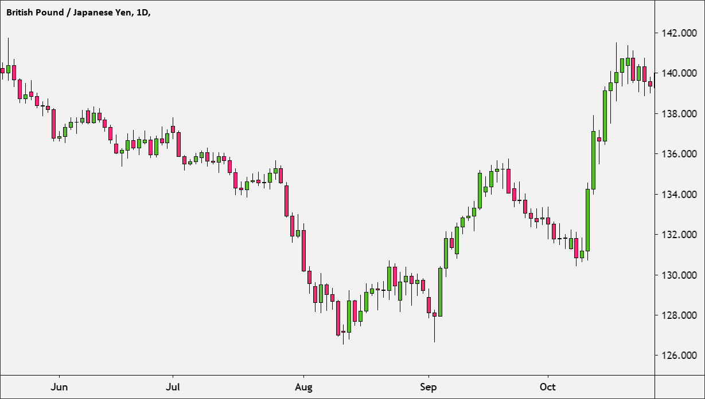
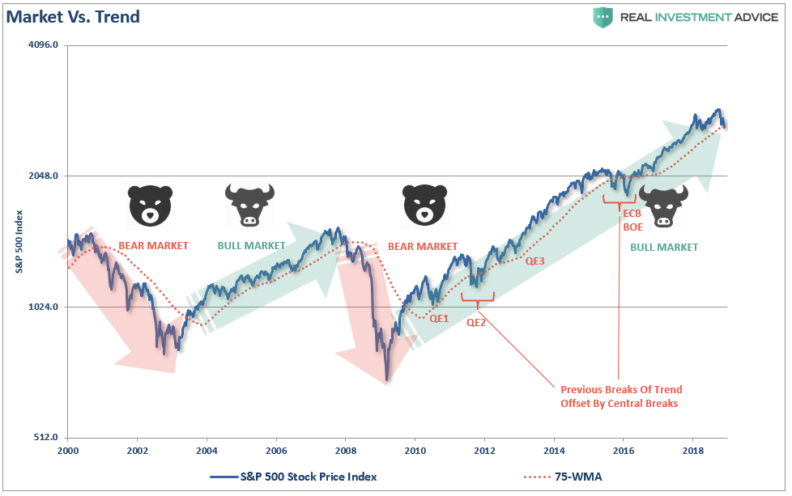
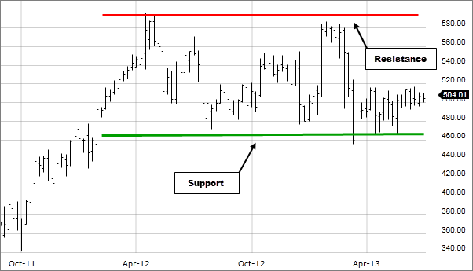

# Interpreting the short term market {}
As indicated earlier, in this book we are interested in short term trading. At that scale, a lot of predictable human behavior is at play. Think of it as a game with two teams: The Longers and the Shorters.

They want different things:

Longers, people that buy long, want the stock to go up.

Shorters, people that shorted the stock, want the stock to go down.

They fight a never ending war with many battles. 

At times, you see the longers wining by seeing the price increase, but energy may run low, and the shorters may attack, causing a reversal in price.

By affecting the demand and supply of shares, the balance of forces between the longers and the shorters determines the price of the stock.

```{r, out.width = "100%", echo= FALSE, fig.align = 'center',fig.cap = 'Shorters, longers and stock price'}
knitr::include_graphics("images/BearBull.png")
```

As a day trading plays out, the transactions by longers and shorters will make the price to go up or down, until a point in which one side sees no gain, and the other wins, causing a breakthrough in the stock price.

When you read into stock charts, you need to think on the motivation behind the people driving the patterns. 

At times, you can see patterns with no return, or very winnable patterns, you can win in.

Lets start by knowing some common terms:

# Open and close price{-}

In a trading day, the price of a stock at the start of the section is called "Open"...the opening price....

The price at the end of the day, when the section closes, is called "Close"..,. the closing price.

You will also see Open and close prices over shorter periods of time...

...say you want to look at the variation in price every five minutes. The price at the start will be called Open...and the price at the end of the five minutes close. If you take the lowest and highest value during those five minutes, you can buiuld was is called a candlestick, which we will describe next.

```{r, out.width = "100%", echo= FALSE, fig.align = 'center',fig.cap = 'Open and close price'}
knitr::include_graphics("images/openclose.jpg")
```
## Candlesticks {-}

One way to visualize the trading data is to summarize it in what is call a candlestick chart. 

Basically, the data over a given time period is summarized as the maximum and minimum value of the stock, the price at the start (also called "Open"), and the price at which the stock ends in the given time period (also called "Close").

The maximum and minimum are  shown as a vertical line, also called a "shadow".

The open and close are shown as boxes, also called "body".


If the close is lower than the Open, (the stock when down in price during that time), the body is colored red.

If the close is higher than the Open (The price when up), the body will be colored green.

```{r, out.width = "100%", echo= FALSE, fig.align = 'center',fig.cap = 'Candlestick'}
knitr::include_graphics("images/Candlestick.png")
```

You can select to see candlestick summarizing data at different time intervals, from minutes to days or or months, and they will look like this:
```{r, out.width = "100%", echo= FALSE, fig.align = 'center',fig.cap = 'Candlestick chart'}

```


# Bulls and bears {-}

Bull and bear are terms used to define the general upward (bull) or downward (bear) direction in which the price of a stock is moving.

You will see comments like stock ABC is "bearish". This means it currently has a downward tendency in price.

If the price of the stock is going higher, you will hear comments like it is moving into bull territory.

```{r, out.width = "100%", echo= FALSE, fig.align = 'center',fig.cap = 'Bull and bears'}

```

## Resistance and support {-}

When looking at the price of a stock over time, you will see that there are prices below which the price does not go. That lower threshold is called a support. That is the price supporting the given stock.

At times, you will see the price never going beyond a certain price. That given threshold is called a resistance. The price resist to go above that price.


```{r, out.width = "100%", echo= FALSE, fig.align = 'center',fig.cap = 'Resistance and support'}

```

It is common that when a there is a breakthrough a resistance, the resistance then becomes the support. Again human fixation on those given prices makes people in the exchange trade with those numbers as consideration.

For instance, it is common to see support or resistance values at round numbers. Something above the price going above or below a round number makes people tickle. 


## Swings {-}

Swings are abrupt oscillations in the price of an stock. Oscillations happening on top of the trend are called "swing highs" and those occurring in the lower part of the trends are called "swing lows".

```{r, out.width = "100%", echo= FALSE, fig.align = 'center',fig.cap = 'swing highs and lows'}
knitr::include_graphics("images/swing-trading-highs-lows.png")
```


