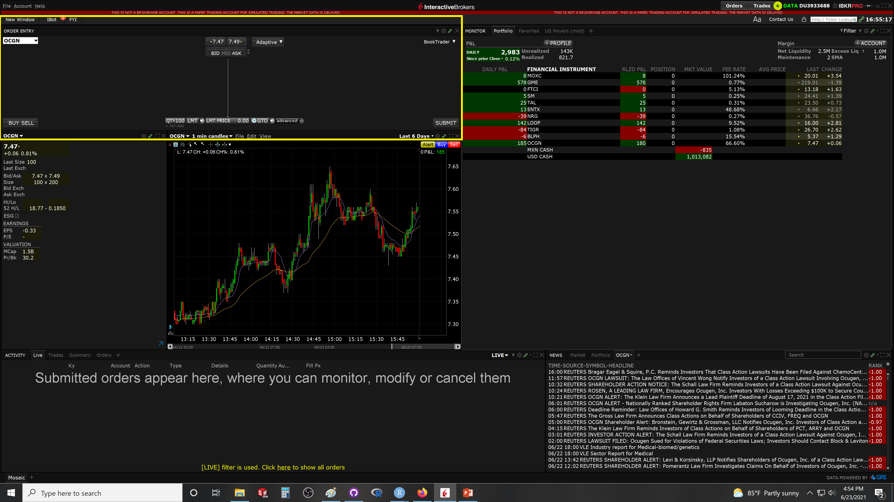

# Placing orders

To buy or sell an stock, you need to register with an online broker (there are other ways, so you know). There are several available like Robinhood, Interactive brokers, TDAmeritrade, etc. Many offer zero commissions for trading with US stocks, but they still charge you the commission from the stock exchange where the given stock would be traded.

Here we will check Interactive brokers.


## Placing a order in IBroker {-}

The operation to place an order to buy or sell an stock varies by  broker. Here I will explain the "Trader Workstation" TWS, which is the API from the Interactive Brokers. Just Google "TWS from Interactive brokers" to find how to download it.

Upon registering, and logging into the TWS, you will see an screen looking like this image below. The upper left window is the space to place orders (Yellow box)

```{r, out.width = "100%", echo= FALSE, fig.align = 'center',fig.cap = 'TWS'}

```

Zoom in that box, you have the different options needed to place an order:

```{r, out.width = "100%", echo= FALSE, fig.align = 'center',fig.cap = 'Profit taker'}
knitr::include_graphics("images/PlaceOrder.png")
```

1. Select the stock name you want to trade. If not options are available, simply type the name of the stock. Choose the "Smart" option, which allows TWS to make your transaction in any stock exchange possible by the given stock.

2. Select whether to buy or sell.

3. Enter number of shares.

4. Select between market or limit order, (there are other types of orders, with added benefits)

5. If a limit order is selected, enter the price you want. Note how above, you can see the current Bid and Ask price. Look at those numbers to get a sense of how far off you are. 

If the Ask price (price at which people want to sell) is say \$10, but you place a limit order to buy at \$9, then this order may take a while to fill, may be never, if the price does not go that high. 

Basically, you want to buy at \$9, but the cheapest stock available (Ask price) is \$10. In other words, no one wants to sell you at the price you bid.

This consideration is important when placing a price for the limit order, as this determines the time it takes for trades to fulfill. It means you could also loose time in specific trades. 

If you want to buy stock with a limit order, it is recommended to buy a few cents above asking price, as to ensure you will get it. 

If you want to short an stock, to ensure filling of the order the price should be a few cents below bid price, as to ensure there will be enough buyers willing to buy at the price you want to sell.

These extra centes to the trade should be considered when planing the strategy.

```{block2, type='rmdexercise'}
To ensure trades are quickly filled, 

When buying shares, price should be at or a bit above Ask price.

When shorting, price should be at or a bit below Bid price.
```


6. Select the time choices for the trade

7. Add the stop loss and profit taker.

8. Submit.

After that, you will see a window describing the trade, and commission price. After you accept, the order is placed.


Here is a good video on how to place an order in TWS:
<center>
<iframe width="560" height="315" src="https://www.youtube.com/embed/c02mm33QvG4" title="YouTube video player" frameborder="0" allow="accelerometer; autoplay; clipboard-write; encrypted-media; gyroscope; picture-in-picture" allowfullscreen></iframe>
</center>


