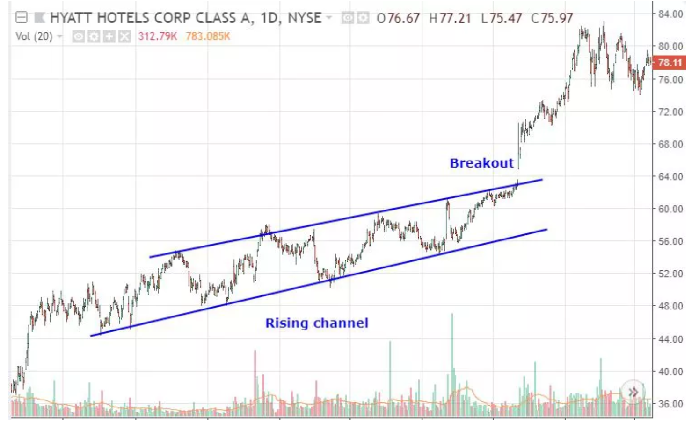

# Chart patterns

The internet is full of case examples of patterns in stock prices that commonly result in high profits. Let's review them.

## Channels {-}

### Upward Channels {-}

The observation here is that the swing highs and lows are successively larger. 

Think of it as the peak of the competition between Longers and Shorters.

Longers buy stock to increase the price causing higher swigns. In response, shorters sell stock  to reduce price causing the low swings. 

When the price goes above the line of the swing highs (upper blue lines in image below), the shorters know they lost and would have to buy the stock back to avoid losing money. This will result in many people trying to buy, which will push the price up.


```{r, out.width = "100%", echo= FALSE, fig.align = 'center',fig.cap = 'Channel'}

```

If the price of a stock moves below the line defined by the lower swigns (lower black line in image below), then the longers know they lost and would have to sell their shares to avoid loosing money from a falling price. The excess of shares will cause the price of the stock to go down even more.

```{r, out.width = "100%", echo= FALSE, fig.align = 'center',fig.cap = 'Channel downtrend'}

```

### Downward Channels {-}

Channels can also occur in declining trends. 

Here shorters try to bring the price down by selling shares, and in response longers buy stock to increase the price. 

If the price of a stock moves above the line of the swign highs (upper blue line in image below), the shorters know they lost, and would have to buy stock to avoid losing more money. The excess of people buying will cuase the price to go up.

```{r, out.width = "100%", echo= FALSE, fig.align = 'center',fig.cap = 'Channel downtrend'}

```

If the price of the stock breaks below the lower line of the channel, then there is a risk for the price to break lower. The shorters won.


```{r, out.width = "100%", echo= FALSE, fig.align = 'center',fig.cap = 'Channel downtrend'}

```
## Multi Tops or Bottoms  {-}

### Double Tops {-}

In this pattern, there is an increasing trend in price followed by two similar resistance values, and a swing low in the middle. If after the second swing high, the price drops below the low in the middle, it is expected that the price will go down.

So what is happening behind this pattern?

1. The longers keep buying stock causing an increasing trend in price. 

2. Once the price gets very high, shorters see an opportunity as a fall from that high of a price there could be a major gain, so they sell stock causing the first downturn in the stock. 

3. Longers fight back and buy again with the expectation that the price will continue to go up; this causes the swing low in the middle. 

4. Shorters fight back and sell stock causing the second high swing. If the price declines below the low swing in the middle, longers panic, and will start to sell bringing the price down.


```{r, out.width = "100%", echo= FALSE, fig.align = 'center',fig.cap = 'Double Top'}

```


### Double bottoms {-}
The same pattern and underlying mechanism can also happens in reverse and it is called a double bottom, instead.

```{r, out.width = "100%", echo= FALSE, fig.align = 'center',fig.cap = 'Double bottoms'}

```

### Triple bottoms {-}

The pattern of double bottoms can be seen over three bottoms. Basically, the same approach of the double bottom with basically one more attempt from the opposite site to keep their ongoing trend

```{r, out.width = "100%", echo= FALSE, fig.align = 'center',fig.cap = 'Tripple bottoms'}

```

### Triple tops {-}

Going back to the analogy of a war between longers and shorters, a triple tops is a war fought over three battles. If after the third high swing the price of the stock drops below the line of the lows, then the shorters win. Longers panic and in standpipe sell their shares to avoid loses, triggering a major decline in price.


```{r, out.width = "100%", echo= FALSE, fig.align = 'center',fig.cap = 'Tripple bottoms'}

```

### Rectangles {-}

At times, you will see the price of a stock bouncing up and down between a clear support and a resistance. This is basically like a pit in which shorters and longers are fighting equally. 

The equal fight back and forward is visible in the similar high and low swigns. Eventually, the price moves beyond the boundary limits, indicating who won this battle.

In this example, the longers win. The shorters are forced to buy stock to avoid losing money on their shorts. This makes the price go up.

```{r, out.width = "100%", echo= FALSE, fig.align = 'center',fig.cap = 'Rectangle'}

```

In the next example, there is an intense battle, eventually the price slips under the lower boundary, giving the victory to the shorters. In this example, the falling price, forces the longers to sell their stocks to avoid losing money on a falling price. The increasing availability of shares makes the price to go down.

```{r, out.width = "50%", echo= FALSE, fig.align = 'center',fig.cap = 'Rectangle'}

```


## Head and shoulders pattern {-}

This pattern is an extension of the the triple tops patterns, with the exception that the second peak is larger, reflecting a stronger push back of the longers to keep the trend going up. By the third peak, if it is lower than the peak prior, it is enough info for the longers to know they lost the war. They start to sell causing a breakdown price.

The fact that the second peak is higher that the two peak on each side creates a pattern resembling a head, with the two side peaks resembling the shoulders, there the name of the pattern.

```{r, out.width = "100%", echo= FALSE, fig.align = 'center',fig.cap = 'Head and shoulders'}

```

Here is another example:
```{r, out.width = "100%", echo= FALSE, fig.align = 'center',fig.cap = 'Head and shoulders'}

```

This same pattern above can happens in the opposite direction and it is called a reverse head and shoulders.

```{r, out.width = "100%", echo= FALSE, fig.align = 'center',fig.cap = 'Reverse head and shoulders'}

```


## Triangles {-}

### Ascending triangle {-}
Here the observation is that there is a hard resistance to the price (Sequential swing highs do not pass that limit). This causes a hard horizontal line in the upper price of the stock. Concurrently, the swing lows keep getting higher. The line drawn between the swing lows is ascending, while the resistance line is flat, causing what is called  an "Ascending triangle".

Basically, the longers keep buying stock to raise the price, while the shorters sell stock to bring down. The fact that the price gets closer and closer to the resistance implayes that the buyers are dominating the game. If the price breaks above the resistance price, then the shorters know they lost, and in panic they will buy shares to avoid losing in their shorts, causing the price to go up.


```{r, out.width = "100%", echo= FALSE, fig.align = 'center',fig.cap = 'Triangle'}

```

Here is a real example:

```{r, out.width = "100%", echo= FALSE, fig.align = 'center',fig.cap = 'Ascending triangle'}

```

###  Descending triangle {-}
The observation here is that there is a hard support level, and the swingn highs keep getting lower.

Basically, the shorters are on the attack selling stock (overflowing the market is supply)which causes the price to go down. The longers respond by buying stocks rasing the price. However, the fact that the buwing is not large enough cuases the swign high to appear lower and lower. If the price breaks below the support level, the longers know they lost, and wouldhave to sell to avoid lossing money. This will cuase the price to break lower.

```{r, out.width = "100%", echo= FALSE, fig.align = 'center',fig.cap = 'Descending triangle'}

```

### Symmetrical triangles {-}

The observation here is that for each swing high there is an equal swing low. The fact that the price difference between the highs and lows gets smaller means that longers and shorters are fighting equally strong. If the price breaks above the line joining the high swign, then the longers won, and the price will go up.

If the price break below the line join the lower swings, then the shorters won. The longers panic to sell, causing price to go down.


```{r, out.width = "100%", echo= FALSE, fig.align = 'center',fig.cap = 'Symetrical triangle'}

```


## Broadening pattern {-}
The triangle patterns described above relate to fast counter measures by the oppositie team, which results in increasingly narrower differences between the swing high and lows.

When there is hesitation among the longers and shorters, the difference between the swing highs and lows will get bigger and bigger. Basically, there is a broadening pattern. 

If the broadening happens at the peak of a price, it is called broadening tops, and if the broadening happens while the prices are down, it is called a broadening bottom.

When the current price surpasses the line set by the swing highs or lows, it indicates the likely direction of the price breakout.

For instance, in the image below, the price of this stocks enters into a broadening pattern (check how the difference between swign high and lows broadens). The pattern is happening while prices are on the low part, so this is called a "Broadening bottom",

Now check, how by point 5, the price excess the swings highs. This marks the likely beginning of a bull trend, and it probably signals a good point to buy stock.  


Basically, the shorters realize they cannot win the war when the see that despite their efforts, the price moved up. They have to start buying stock to avoid losses. This increase in buying power increases the price.


```{r, out.width = "100%", echo= FALSE, fig.align = 'center',fig.cap = 'Broadening Bottom longers win'}

```
Let's now check the pattern below. A broadening top, in which the shorters win.

```{r, out.width = "100%", echo= FALSE, fig.align = 'center',fig.cap = 'Broadening top, shorters win'}

```

At times, you could see the broadening patterns, also refereed as triangles...which is similar to the pattern describe earlier.

```{r, out.width = "100%", echo= FALSE, fig.align = 'center',fig.cap = 'Broadening triangle'}

```

When the pattern broadens a lot, you could also capitalize by buying at the bottom and selling at the top. Basically, when a price hit a swing low you can buy at that price, and place a profit taker at or just below the prior swing high.

```{r, out.width = "100%", echo= FALSE, fig.align = 'center',fig.cap = 'Broadening triangle'}

```

## Broadening candles {-}

At the end of a trend, it is common to see high volatility (large variation between open and close prices). This could happen as result of “dumb” money rushing to enter a late trend, while the “smart” money is exiting their trades: candles are much larger compared to the earlier ones.

This property could be captured by an index that assess if prior candles are narrower. That is: the range (difference between high and low) of the candlesdecreases away from the current period.


```{r, out.width = "100%", echo= FALSE, fig.align = 'center',fig.cap = 'Broadening candles'}

```

