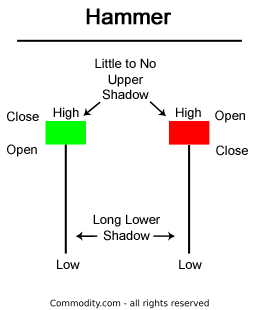

# Candlestick patterns {}

Another general tool to make inference about likely trends in stocks is a set of patterns observed in candlesticks. 

```{block2, type='rmdexercise'}
Candlesticks reflect the varation in price during a given period of time
```

Candlestick summarize the data over a given period of time, the low and high values are indicated by the black line (Call shadow), and the open and close price are the indicated by the body.

if the body is colored green or white it show the price is going up during that time. This is call a bull candle.

if the body is colored red  or black it show the price is going down during that time. This is call a bear candle.

```{r, out.width = "50%", echo= FALSE, fig.align = 'center',fig.cap = 'The bull and bear candles'}

```

How the shape of a candlestick changes from time to time, may reflect the aggressiveness, or lack there of, between longers and shorters.

The secuence of candles at time tell the story and/or balnce of the war between longers and shoters.

Let's review some candlestock patterns and what they mean.


## Three Line Strike {-}

Basically, three consecutive candlesticks by the same team, followed by one larger in the opposite direction. This patterns can take different shapes.


### Bullish three line strike {-}
Here the pattern is for three similar bull candlesticks in an increasing pattern, are followed by a massive bear candlesitck. The bear candlestick engulf all three prior candlesticks.

Think of it like three small attacks from the longers, that are counter by a massive attack from the shorters. The shorters normally win and the prices go down.


```{r, out.width = "50%", echo= FALSE, fig.align = 'center',fig.cap = 'Bullish Three Line Strike'}

```

```{r, out.width = "50%", echo= FALSE, fig.align = 'center',fig.cap = 'Bullish Three Line Strike'}

```

### Bearish three line strike {-}

Here the pattern is for the shorters/bears to strike three times. See how in the image below there are three bear candlesticks, in a downward pattern, which is followed by an engulfing bull candle. The bulls win and the price goes up.
According to Bulkowski, this reversal predicts higher prices with an 83% accuracy rate. 

```{r, out.width = "100%", echo= FALSE, fig.align = 'center',fig.cap = 'Bearish Three Line Strike'}

```

Here is another example:

```{r, out.width = "100%", echo= FALSE, fig.align = 'center',fig.cap = 'Bearish Three Line Strike'}

```

## Soldiers and crows   {-}
This pattern involves three candles. If they occur at the bottom of a trend, it is  called three white soldiers. If it happens at the top of a trend it is called three black soldiers or three black crows.


### Three white soldiers {-}

In the example below, the shorters have been in a long run of small attacks causing the price to go down. At the bottom of the trend, the longers get piss and launch three large consecutive atacks. 

The expected results is for the longers to win and the price to reverse and start to go up.

```{r, out.width = "100%", echo= FALSE, fig.align = 'center',fig.cap = 'Three white soldiers'}

```

### Three Black Crows {-}

In the opposite, the longers are in series of small anemic attacks (Evidenced by the small size of their green candles, yet the price is going up).

At the peak of the upward trend, the shorters launch three consecutive attacks (Three black soldiers or Crows). 

The size of the attacking candles barely overlaps suggesting massive consequences in the motivation of the longers.

Eventually, longers loose, and prices go down.

According to Bulkowski, this pattern predicts lower prices with a 78% accuracy rate. 

```{r, out.width = "100%", echo= FALSE, fig.align = 'center',fig.cap = 'Three black soldiers'}

```


Here is an example: 

```{r, out.width = "50%", echo= FALSE, fig.align = 'center',fig.cap = 'Three Black Crows'}

```
Worth nothing that the attacks may at times fail, so it is always good to wait for confirmation by checking the direction of a few candles after the three attacks.

```{r, out.width = "100%", echo= FALSE, fig.align = 'center',fig.cap = 'Three Black Crows fails'}

```


## Two black gapping {-}
Here there is a major gaps between two consecutive bear candles. The price is likely to continue going down.

Think of it like an attack by the shorters, with not counter attack, followed by another bear attack. no surprice the price is likely to go further down.

According to Bulkowski, this pattern predicts lower prices with a 68% accuracy rate.

```{r, out.width = "50%", echo= FALSE, fig.align = 'center',fig.cap = 'Two Black Gapping'}

```
Check and example below:
```{r, out.width = "100%", echo= FALSE, fig.align = 'center',fig.cap = 'Two Black Gapping example'}

```
## Evening and morning star {-}

Evening star patterns are associated with the top of a price uptrend, signifying that the uptrend is nearing its end. 

This pattern includes three candles:

Candle 1: a massive attack by the longers (long bull candle)

Candle 2: a smaller attack by either longers or shorters (a higher, but smaller candle)

Candle 3: a larger counter attack by the shorters (A large non-overlping bear candle)

There is no overlap between the two last attacks, which suggest no counter attacks. According to Bulkowski, 72% of the times, the price will go down.


```{r, out.width = "50%", echo= FALSE, fig.align = 'center',fig.cap = 'Evenin Start on single bull attack'}

```

Here is another example showing two consecutive bull attacks.


```{r, out.width = "100%", echo= FALSE, fig.align = 'center',fig.cap = 'Evenin Start on two bull attacks'}

```

A morning start forms at the end of a declining trend, and it signals a likely reverse in price trend.
```{r, out.width = "50%", echo= FALSE, fig.align = 'center',fig.cap = 'Morning start pattern.'}

```

Here is an example...

```{r, out.width = "100%", echo= FALSE, fig.align = 'center',fig.cap = 'Morning start pattern'}

```


The starts should be confirmed with the RSI indicators. If a morning start coincides with a low RSI  (the stock is oversold), then there is a further confirmation of price reversal.

## Abandoned Baby {-}

This pattern can take two different forms:


### Bullish abandoned Baby {-}

Shorters are in a strike of consecutive attacks (the price is going down), then

Candle 1: one large bear attack is observed,

Candle 2. but  energy runs low, with only a very small bear candle to follow (The poor abandoned baby),

Candle 3. weakness is observed by the longers, and they attacks heavely in return. 

According to Bulkowski,  49.73% of the times this pattern will result in a price increase.

Think about this pattern as an war by a the bears/shorters that runs out of full. 

```{r, out.width = "100%", echo= FALSE, fig.align = 'center',fig.cap = 'Bullish abandoned Baby'}

```

Here is an example:

```{r, out.width = "100%", echo= FALSE, fig.align = 'center',fig.cap = 'Bullish abandoned Baby'}

```

### Bearish abandoned Baby {-}

When the longers are in the offensive but run out of fuel, then are the shorters the ones that win.
```{r, out.width = "100%", echo= FALSE, fig.align = 'center',fig.cap = 'Bear abandoned Baby'}

```
## Engulfing {-}

### Bearish engulfing {-}
Longers are on the offensive (price is going up) with smaller attacks (Small bull candle sticks). The bears respond by deploying a nuclear attacks, so big that engulf the size of the prior bull candle. This is enough to defeat the bulls, and the price goes down.

```{r, out.width = "100%", echo= FALSE, fig.align = 'center',fig.cap = 'Bearish engulfing'}

```
### Bullish engulfing {-}

In bullish engulfing , the Shorters are on the offensive launching small attacks causing the price to go down. Longers/bull launch a massive counter attack, scaring off the relinquish bears. The wining longers cause the price to go up.


```{r, out.width = "100%", echo= FALSE, fig.align = 'center',fig.cap = 'Bullish engulfing'}

```

## The hammer, the start and hanging man {-}

The hammer, inverse hammer, shooting start and hanging man are all patterns involving a single and very similar candle at the end of a price trend. 

The general look of the candle is a long single shadow and a small body (the candle looks like a hammer). Whether it occurs at the peak or bottom of a trend determines the name.

```{r, out.width = "100%", echo= FALSE, fig.align = 'center',fig.cap = 'The hammer'}

```

In general, this candle reflects an anemic war. Basically, both teams fought hard during the time of this candle (as indicated by the length of one of the shadows). Unfortunately, the team to lose more is the one leading the prior trend. So commonly, this candle indicates a reverse in the price trend.

Again, what this type of candle indicates is an anemic attack by both teams at the end of a long war. They tried, which explains the large variation in price during the time of the candle, but at the end, the price closes at a very similar price that it opened;  and the consequence is a reversal in price. 

```{r, out.width = "100%", echo= FALSE, fig.align = 'center',fig.cap = 'The hammer, the start and hanging man'}

```

### The hammer {-}

In the hammer pattern, the candle looks just like a hammer....a long shawdon and a smaller body.

It does not matter whether it is bull or bear candle, but it has to be at the end of a downward price trend.

What the candle tell you is that there was a massive attempt by the bears to bring down the price (Evidence by the low shadow of the candle), but when closing the price when still up. Basically, the attacks during that time were not enough for the bears to win the battle decisively.

The consequence of the anemic effort is for the longers to dominate and win. It is expected for the price to grow after a hammer candle.


```{r, out.width = "100%", echo= FALSE, fig.align = 'center',fig.cap = 'The hammer'}

```

### The Inverted hammer {-}
The hammer can also also be inverted and have the same effect. The price will go up.

```{r, out.width = "100%", echo= FALSE, fig.align = 'center',fig.cap = 'Inverted Hammer'}

```


### Shooting start {-}
This is the same shape of the hammer, but it occurs at the end of an upward price trend.

Note how the shadow of the candle points up, with which where the name Shooting Start comes.

This type of candle at the peak of a trend, predicts that the price will reverse and star to go down.

In other works, The actions by the leading team (the longers) are insufficient to keep up the trend. As it is expected, that is gains for the shorters.

```{r, out.width = "100%", echo= FALSE, fig.align = 'center',fig.cap = 'Shooting Start'}

```

Here is an example
```{r, out.width = "100%", echo= FALSE, fig.align = 'center',fig.cap = 'Shooting Start'}

```

And one more...
```{r, out.width = "50%", echo= FALSE, fig.align = 'center',fig.cap = 'Shooting Start'}

```

### The hanging man{-}
When the shooting starts is reverse, that candle is called a hanging man. 

The same deal here. After a long war by the longers, there were anemic responses by both teams at the peak of the trend. That is gain for the shorters. 

```{r, out.width = "50%", echo= FALSE, fig.align = 'center',fig.cap = 'Hanging man'}

```

## Dark cloud cover {-}

This pattern involves two candles: A large bull candle, and a equal size but higher bear candle. The second candle by being higher creates a cover over the lower one, and because it is black (bear), there its name "Dark cloud cover".


```{r, out.width = "50%", echo= FALSE, fig.align = 'center',fig.cap = 'Dark cloud cover'}

```

In this pattern, there is a bull trend...at the peak of it, a major attack by the bulls creates a large bull candle. The candle that follows occurs at a larger price (indicating the ongoing dominance by the bulls), but remarkably that second candle finishes being a bear. That suggest that despite a bull trend, and a major bull attack, in that second candle, the bears pulled their muscle and reverse the trend. 

Commonly, it follows a decline in prices as the bears emerge victorious.

It is recommended to confirm the trend by waiting to see the third candle.


```{r, out.width = "50%", echo= FALSE, fig.align = 'center',fig.cap = 'Dark cloud cover'}

```


