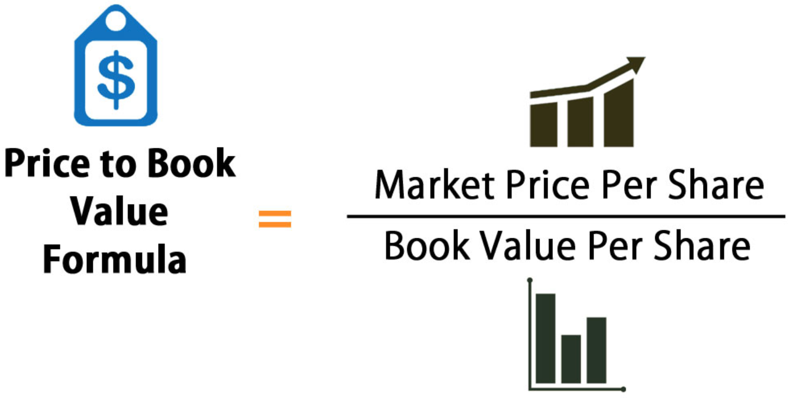

# Fundamentals

The use of patterns on candles (e.g., the hammer, the soldiers, etc.) and indicators (e.g., EMA, MACD, etc.) are broadly defined as technical studies.

Imagine that you want to go for a swim in a pool. Say your body temperature is rising (you have a fever); in this case, the temperature rise is an indicator telling you that probably going to the pool is not a good idea. 

**Technical indicators** are sort of the same; they provide hints upon whether investing in an stock is a good idea or not. Say there is no volume being traded in an stock with very new highs, while showing an overbought (high RSI), and there is no momentum up (e.g., very low to none Ehler's correlation), this probably tells you that buying is not a good idea.

**Fundamental indicators** is another source of information used to improve the odds. In the case of the fever analogy, fundamental indicators, are like funidng out why you got sick.

There are numerous fundamental indicators that provide hints into the health of a company. This is the strategy of Warrent Buffet, which is to study companies that are undervalue (e.g., low RSI) but are solid (e.g., to big to fail, like APLE, Facebook, etc.).

Lets check over some Fundamental indicators:

## Earning per Share ratio (EPS) {-}
EPS is simply the earnings (e.g., profits) of a company divided by the outstanding shares of its common stock. 

Say a company makes \$100 in profits and has 100 shares. Here the EPS of this company is \$1. 

You could look over time to EPS to see how well a company is doing, or you can compare among companies in the same sector, to see if by comparison the company is doing better or worse.

```{r, out.width = "50%", echo= FALSE, fig.align = 'center',fig.cap = 'EPS'}

```

The index could be more precise by adding any diluted shares or preferred dividents [e.g., basically agreements the company has that could be turned into shares (e.g., a debt that can be paid with shares)] leading to:

```{r, out.width = "50%", echo= FALSE, fig.align = 'center',fig.cap = 'EPS'}

```


The overall expectation is that if EPS within a company increases, or is higher than other companies in the same sector, the stock price will increase. One would expect traders will be willing to pay more for such a good company.

That conclusion is not bullet proof, price may go up in low or lowers EPS, if on the eyes of analysts, EPS should have been even worse.


## Price to Earning (P/E) {-}

You can extent the use of the EPS to adjust by the price of the shares. 


```{r, out.width = "50%", echo= FALSE, fig.align = 'center',fig.cap = 'P/E ratio'}

```


This metric is interpreted a couple ways:

1) how much money you have to pay in stocks with this company to get \$1; or

2) how many years you have to wait to get your money back with this company.

A high P/E could mean that a stock's price is high relative to earnings and possibly overvalued. A low P/E can indicate either that a company may currently be undervalued or that the company is doing exceptionally well relative to its past trends.

Lets consider two companies:

AI's Ice cream (A): <br />
  Stock Price = \$18 <br />
  Diluted EPS = \$2 <br />
  P/E = 9x (\$18 ÷ \$2) <br />
    
Bob's frozen snacks (B):<br />
  Stock Price = \$18 <br />
  Diluted EPS = \$6 <br />
  P/E = 3x  (\$18 ÷ \$6) <br />


```{r, out.width = "50%", echo= FALSE, fig.align = 'center',fig.cap = 'P/E ratio'}

```
In this example, in company A you pay \$9 for \$1 of earnings, while in company B you pay \$3 for \$1 of earnings. Basically, you can get three times as much in returns by investing in company B.


**Forward Price-To-Earnings** is a variant of the P/E index, which uses best guess estimations of future earnings of the company. You could also see the  **trailing P/E** or **TTM**, which is the P/E ratio in the last 12 months.

## Price to Earning Growth ratio (PEG) {-}
A variation on the P/E ratio is the price-to-earnings-to-growth ratio, or PEG. 

The PEG ratio is calculated as a company’s price-to-earnings (P/E) ratio divided by the growth rate of its earnings for a specified time period.

```{r, out.width = "50%", echo= FALSE, fig.align = 'center',fig.cap = 'PEG ratio'}

```

PEG ratios can be termed “trailing” if using historic growth rates or “forward” if using projected growth rates.

A low P/E ratio may suggest that a stock is undervalued and therefore should be bought – but factoring in the company's growth rate to get its PEG ratio can tell a different story. If there is not growth in earnings, it would not be as good as if there is positive and significant growth. One could be more confident buying an undervalued stock (low P/E) with large growth (Low PEG). 

Lets consider an example:

**Company A ** <br />
  Price per share = \$46  <br />
  EPS this year = \$2.09  <br />
  EPS last year = \$1.74  <br />
      <br />
  P/E ratio = \$46 / \$2.09 = 22  <br />
  Earnings growth rate = ($2.09 / \$1.74) - 1 = 20%  <br />
  PEG ratio = 22 / 20 = 1.1  <br />

**Company B** <br />
  Price per share = \$80  <br />
  EPS this year = \$2.67  <br />
  EPS last year = \$1.78  <br />  <br />

  P/E ratio = \$80 / $2.67 = 30  <br />
  Earnings growth rate = (\$2.67 / \$1.78) - 1 = 50%  <br />
  PEG ratio = 30 / 50 = 0.6  <br />

The lower P/E ratio could make company A look more attractive (one could get more return for less money invested). But compared to Company B, it doesn't have a high enough growth rate to justify its P/E. Company B is trading at a discount to its growth rate and investors purchasing it are paying less per unit of earnings growth. 

```{r, out.width = "50%", echo= FALSE, fig.align = 'center',fig.cap = 'Low PEG is better'}

```

As a broad rule of thumb, some investors feel that a PEG ratio below one is desirable. PEG values smaller than one suggest that the price of the stock is low compare to the anticipated growth (i.e., a good hint to buy). Note, however, that stock price can be affected by many other factors.


## Book value {-}

The book value tells you how much a company is worth. Basically, the book value reflects the total value of a company's assets that shareholders of that company would receive if the company were to be liquidated.

It is the net difference between that company's total assets and total liabilities.

```{r, out.width = "50%", echo= FALSE, fig.align = 'center',fig.cap = 'Book Value'}

```

Say a given company A owns a building, a  truck, desks, chairs, etc. And also owns shares in other companies. If you were to sell everything that would be the total value of the assets of company A. Say is it \$300.

Say, this company, also, has a /$100 in debt.

The book value of  company A then, would be Assets (\$300) - liabilities (\$100)= \$200.

Book value could be compared to company's market value to indicate whether a stock is under- or overpriced. 
 
 ```{block2, type='rmdexercise'}
Market value or market capitalization is calculated by multiplying the number of outstanding shares by the current share price
```
Book value is used in other indicators.

### Book value per share (BVPS) {-}
Should a company be dissolve, the book value per common share (BVPS) indicates the dollar value remaining for shareholders after all assets are liquidated and all debtors are paid. 

BVPS is calculated as:

```{r, out.width = "100%", echo= FALSE, fig.align = 'center',fig.cap = 'Book value per share'}

```

If a company’s BVPS is higher than its market value per share, then its stock may be considered to be undervalued.


###  Price-To-Book (P/B Ratio) {-}
Also refereed as price-equity ratio, the price-to-book ratio (P/B ratio) compares a firm's market capitalization to its book value. It's calculated by dividing the company's stock price per share by its book value per share (BVPS):
```{r, out.width = "50%", echo= FALSE, fig.align = 'center',fig.cap = 'Price-To-Book ratio'}

```

Say you want to invest in Ed's company with the following profile:  <br />


Book value =\$1,000,000   <br />
Outstanding shares= 100,000  <br />
Stock price = \$20  <br />  <br />

From this,   <br />

Book value per share= \$1,000,000/100,000 shares= \$10. <br />

This tells you that if the company were to be close each owner of one share would get \$10. <br />

P/B Ratio = \$20 (Stock price) / \$10 (Book value per share)= 2x  <br />

This tell you Ed's stock cost twice as much as its assets could be sold for.  

A larger than 1 P/B value suggest that investors value this company a lot; likely is is expected to growth more and be more valuable in the near future.

If stocks prices trade lower than their book value (e.g., P/B value smaller than one) indicates that investors consider the stated value assets of the company to be exaggerated.

##  Debt-to-equity Ratio {-}

As the name imply, this index divides the debt of a company by its equity.

A larger than 1 Debt-to-equity Ratio implies the company owns more than it is worth.

```{r, out.width = "100%", echo= FALSE, fig.align = 'center',fig.cap = 'Debt-to-equity examples'}

```


But a high Debt-to-equity Ratio can mean different things:

1. the company can be at risk of defaulting on loans, if interest rates were to increase.
2. The company can leverage good returns on debt. Basically, it gets a lot of money back for money that it loans.

The difference above highlights the need to use the Debt-to-equity Ratio in combination with other indicators.


##  WACC vs ROIC Ratio {-}

WACC is weighted average cost of capital (how much the company needs to pay for its debt and equity funding), while ROIC refers to its return on invested capital.

MacDonals, for instance, has a ROIC = 23.27% and WACC =3.45%. **The WACC vs ROIC Ratio** = 23.27 / 3.45 = $6.7. 

Basically, this company earns $6.70 for every dollar of debt and equity it holds. Thus, borrowing (or leverage) has made this company more profitable. 


##  Implied Volatility (IV) and Historical Volatility (HV) {-}
Volatility, or how fast prices change, is often seen as a way to gauge market sentiment, and in particular the degree of fear among market participants.

The **Implied volatility (IV)**  is based on the option prices of stocks. These options include projected prices and  expiration dates, so they can be used to measure expected sentiment and likely volatility of a stock.

The **Historical Volatility** also measures variations in prices but based on actual historical data.

So, IV is a forward-looking measure implied by the options market, and HV is backward looking.

An IV that’s lower than HV could suggest that IV is understating the stock’s potential price change. An IV that’s higher than HV could suggest the opposite.

Further, a low IV percentile could indicate that options premiums are relatively low, and there might be opportunities to go long.

IV can also be used to define the bounds of profit takes. One should not aim to gain more than what the volatility is likely to achieve.


```{r, out.width = "100%", echo= FALSE, fig.align = 'center',fig.cap = 'Implied volatility'}

```

##  Short Interest {-}
An mentioned earlier in this booklet, short means to borrow shares to sell, with the expectation that price will go down, then buy them back and return the shares. After you pay the interest, any left is profit.

It follows then that rising short interest positions (the number of shares being shorted) in a stock is a bearish indicator.

The number of shares being shorted is reported every other [week](https://www.nasdaq.com/market-activity/stocks/aapl/short-interest).

