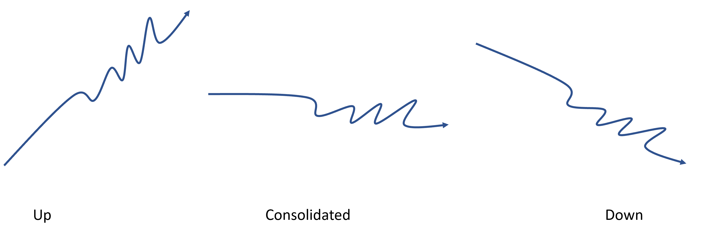
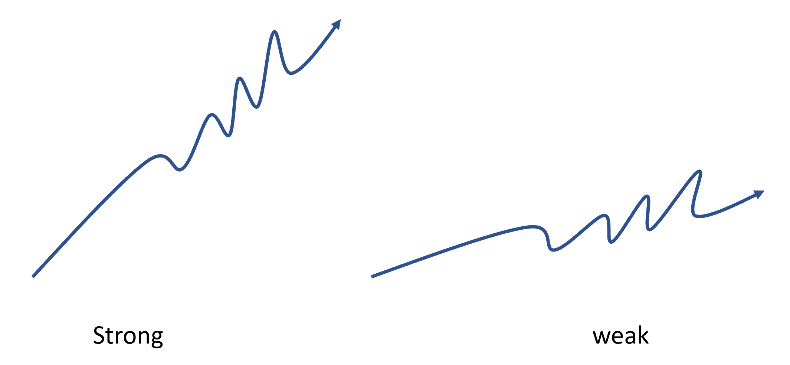
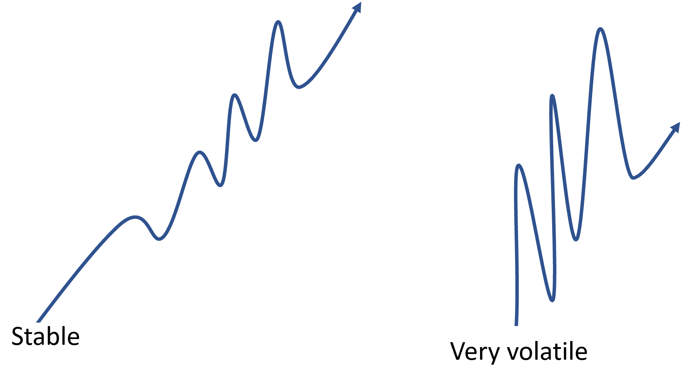
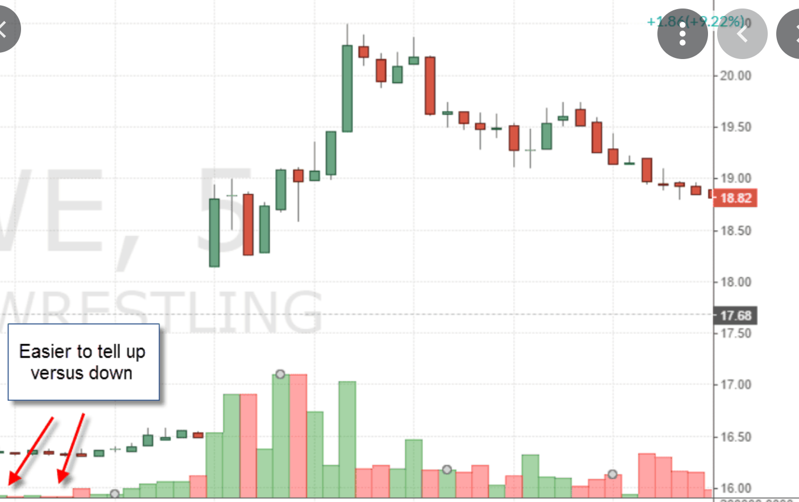
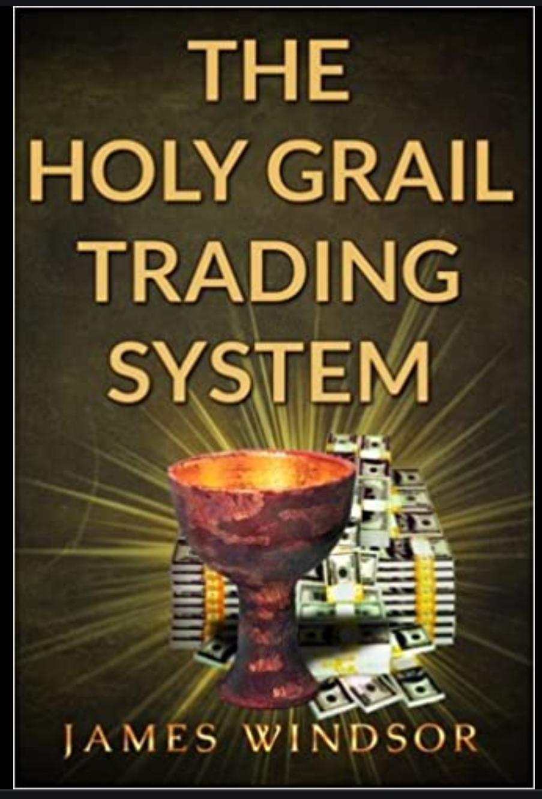
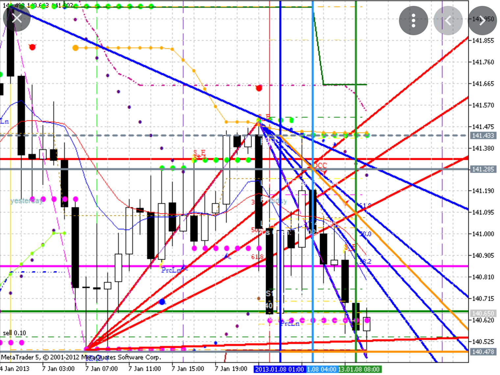

# Technical indicators {}

Technical indicators are mathematical calculations based on historic price, volume, or traders' interest that aims to forecast stock direction.

Generally speaking, these indicators can be grouped in four main categories that describe different aspects of a stock price:

1) Trend: these types of indicators aim to identify the general tendency of a stock price; like up, down,  stable or so-call consolidated.

```{r, out.width = "100%", echo= FALSE, fig.align = 'center',fig.cap = 'Trend'}

```

2) Momentum: These indicators attend to identify the strength of a trend
```{r, out.width = "100%", echo= FALSE, fig.align = 'center',fig.cap = 'Momentum'}

```

3) Volatility:  attend to identify how variable the stock price is.
```{r, out.width = "100%", echo= FALSE, fig.align = 'center',fig.cap = 'Volatility'}

```

4) Volume: These indicators describe variations over the number of stocks traded (commonly, volume is shown as the bars at the bottom of most stock prices).  It is expected that any strong trend should be based on large volume traded. Volume is like the foundation over which price should be built.
```{r, out.width = "100%", echo= FALSE, fig.align = 'center',fig.cap = 'Volume'}

```

There are tens of different indicators on each category, and at times some indicators are difficult to categorize in an specific group. The holy grail in stock trading is to find the magic indicator that will tell us when to buy and when to sell at a profit.

```{r, out.width = "50%", echo= FALSE, fig.align = 'center',fig.cap = 'Holly grail indicators'}

```

Most likely those individuals that have gone to become billionaires in trading likely found that magic indicator. Doubtfully, such a prolific indicator will be any public indicator as it will be worth billions if not trillions of dollars.

It is commonly mentioned that the best strategies combine indicators in different categories. It is also commonly mentioned that it is better to avoid multiple indicators from within the same category. The main reason for this is that it crowds the computer screen, making it difficult to comprehend so much data. 

```{r, out.width = "100%", echo= FALSE, fig.align = 'center',fig.cap = 'Holly grail indicators'}

```

However, with the help of new software it is possible to also create indicators based on indicators, which can help to combine indicators from the same category to confirm, and at times filter wrong signals.  [Example here](https://currency.com/awesome-oscillator-vs-macd)

