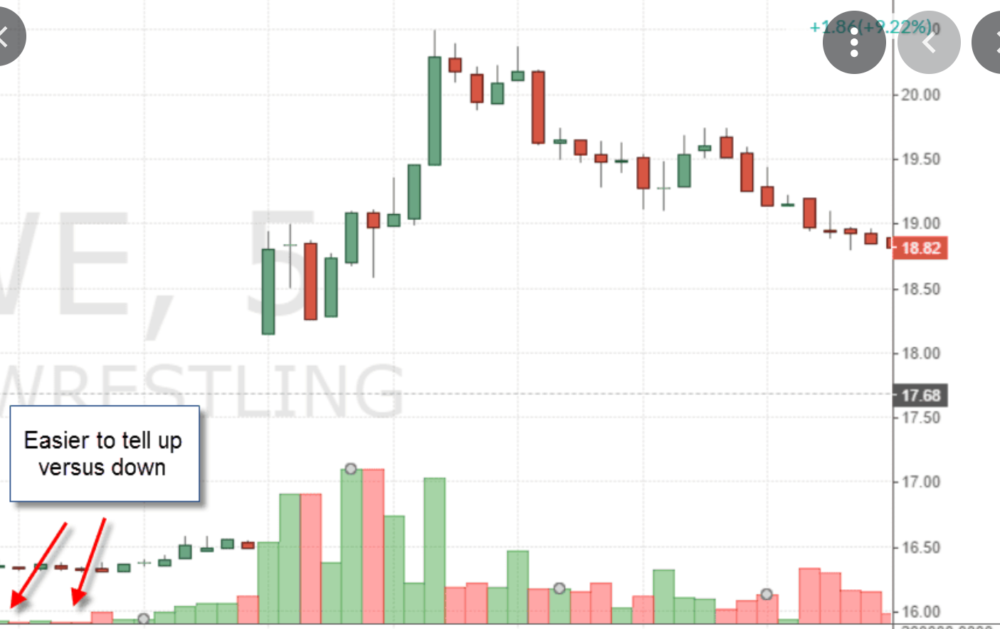
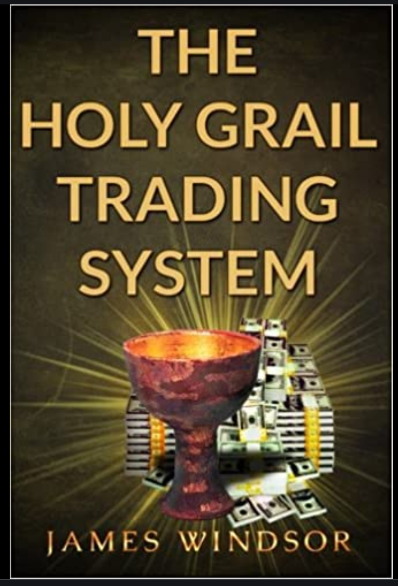
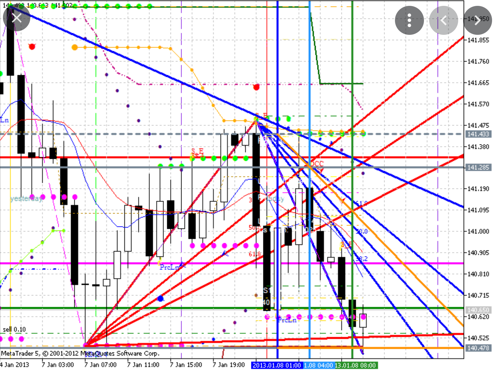

# Technical indicators

Technical indicators are mathematical calculations based on historic price, volume, or traders' interest that aims to forecast stock direction.

Generally speaking, these indicators can be grouped in four main categories that describe different aspects of a stock price:

1) Trend: these types of indicators aim to identify the general tendency of a stock price; like up, down,  stable or so-call consolidated.

```{r, out.width = "100%", echo= FALSE, fig.align = 'center',fig.cap = 'Trend'}
knitr::include_graphics("images/Trend.png")
```

2) Momentum: These indicators attend to identify the strength of a trend
```{r, out.width = "100%", echo= FALSE, fig.align = 'center',fig.cap = 'Momentum'}
knitr::include_graphics("images/Momentum.png")
```

3) Volatility:  attend to identify how variable the stock price is.
```{r, out.width = "100%", echo= FALSE, fig.align = 'center',fig.cap = 'Volatility'}
knitr::include_graphics("images/Volatility.png")
```

4) Volume: These indicators describe variations over the number of stocks traded (commonly, volume is shown as the bars at the bottom of most stock prices).  It is expected that any strong trend should be based on large volume traded. Volume is like the foundation over which price should be built.
```{r, out.width = "100%", echo= FALSE, fig.align = 'center',fig.cap = 'Volume'}

```

There are tens of different indicators on each category, and at times some indicators are difficult to categorize in an specific group. The holy grail in stock trading is to find the magic indicator that will tell us when to buy and when to sell at a profit.

```{r, out.width = "50%", echo= FALSE, fig.align = 'center',fig.cap = 'Holly grail indicators'}

```

Most likely those individuals that have gone to become billionaires in trading likely found that magic indicator. Doubtfully, such a prolific indicator will be any public indicator as it will be worth billions if not trillions of dollars.

It is commonly mentioned that the best strategies combine indicators in different categories. It is also commonly mentioned that it is better to avoid multiple indicators from within the same category. The main reason for this is that it crowds the computer screen, making it difficult to comprehend so much data. 

```{r, out.width = "100%", echo= FALSE, fig.align = 'center',fig.cap = 'Holly grail indicators'}

```

However, with the help of new software it is possible to also create indicators based on indicators, which can help to combine indicators from the same category to confirm, and at times filter wrong signals.  [Example here](https://currency.com/awesome-oscillator-vs-macd)

## Tecnical setup for entries {-}

While there are tens, if not hundreds, of technical indicators, they are all based on just two attributes: Price and Volume. Yet, price and Volume can be measured in many different ways that allows you to get different insides into the most likely, next move, of an stock's price. 

In theory, there should be four critical aspects of the market setup for which technical indicators can give you hints into the stock's next move: Position, direction, intention and volatility.

### Position {--}
Where you are can help you know where you can go.  

By comparing current price to a historical reference point, you can know if the current price is at the bottom or top of a price trend. If the current price is near a top of a trend, the most sensible thing will be to go short. 

Multiple indicators such as MACD, PPO, Stochastic, etc. can provide reference points of current price position. 

It is also critical to analyze those indicators in a fractal mode, to know the best time resolution for your trade. One thing is to be at the top of the last hour, and another at the top in the last day. 

To identify the best time resolutions for your specific trading strategy, you probably need measure position at a timeframe in which volatility will be enough to satisfy your desired profit. 

For instance, say, you are after a 1% profit for a given entry, you look at the volatility of your stock and find that 1% change occurs about each week. So for price to reach your target, you probably need to measure Position in the resolution of weeks. You do not want to jump in a long for a 1% profit, if price is sitting at the top of weekly trend. There will not be enough price extension from that point to reach of profit take.

```{r, out.width = "100%", echo= FALSE, fig.align = 'center',fig.cap = 'Setting up an entry: Position'}

```

### Direction {--}
Direction is like the compass for a stock price movement. The idea here is to know if price is moving up or down.

Multiple indicators can help identify this attribute like the rate of change (ROC), and breakouts from Donchian channels or Bollinger bands 
```{r, out.width = "100%", echo= FALSE, fig.align = 'center',fig.cap = 'Setting up an entry: Direction'}

```

### Intention {--}
The idea here is to use technical indicators to provide hints if the next most likely move of the stock will be strong or week. 

Here one can relay on multiple indicators, for which it will be important to know their underlying mathematical equations to know what they are showing and how to interpret their results.

For instance, indicators of momentum could provide hints if a trends is getting exhausted, or has been slacking off. It is a good recommendation to study your specific active to see what the given stock does when such levels are reached.

Another set of useful indicators for intention are those related to volume. Like money flow or volume profiles. They can help to identify areas of little or strong interest, and whether price is likely to move or not in a given direction.

```{r, out.width = "100%", echo= FALSE, fig.align = 'center',fig.cap = 'Setting up an entry: intention'}

```

### Operation range {--}
Do not ask from a stock what it cannot give you.

This aspect of the best setting for an entry is to check if the potential for price extension is sufficient to accommodate the profit take.

Check if your desired profit take is within the  returns likely to be generated by an stock. Say a given stock has a yearly volatility of 5% and you want to get a 15% profit in your entry; basically, it will be years before you can secure that sort of profit from such a stock. An obvious recommendation is to aim for a profit take that is only a fraction of the stock's volatility.

```{r, out.width = "100%", echo= FALSE, fig.align = 'center',fig.cap = 'Setting up an entry: VolatilityProfit'}

```

