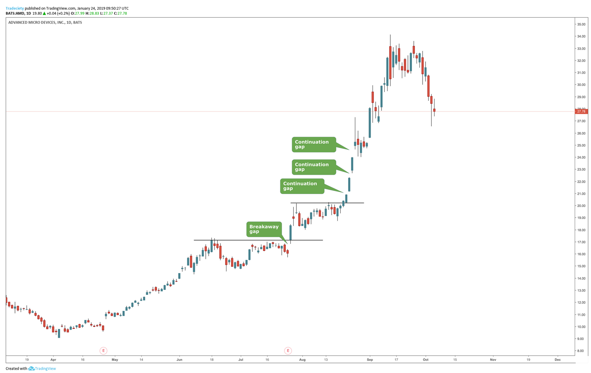
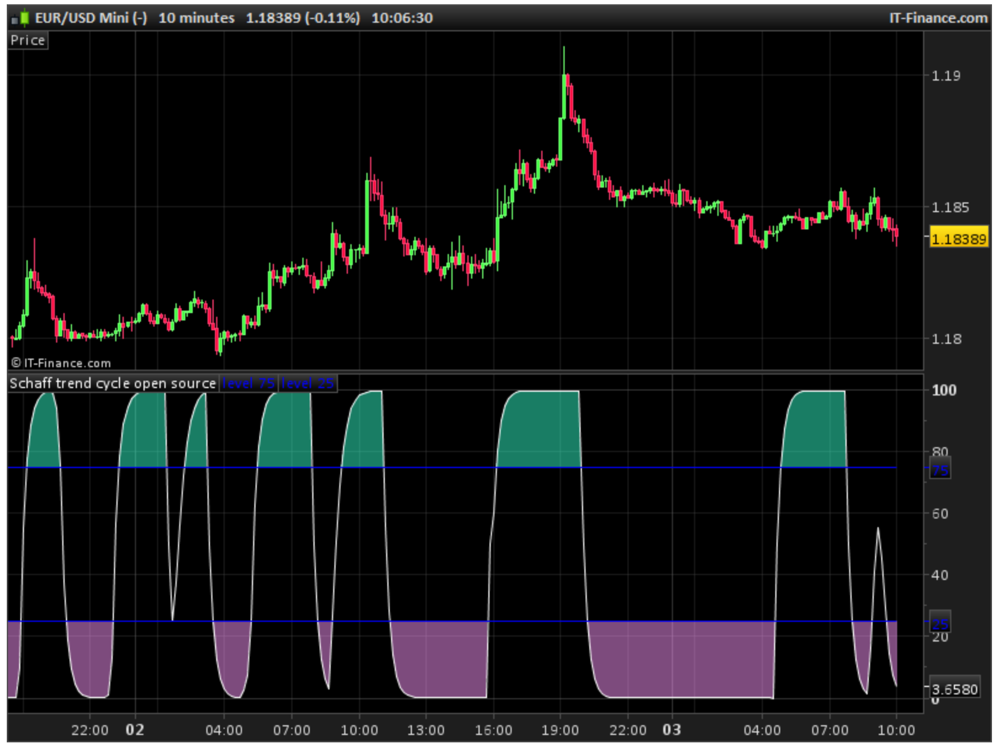

# Momentum

This group of indicators aim to diagnose the strength or speed at which stock price is moving.

## 01 Absolute Price Oscillator (APO) {-}
It is the absolute difference between a slow and a fast Exponential Moving Averages. MACD and APO are equivalent. MACD returns an additional series
called Signal, which is a short moving average on the MACD.


```{r, out.width = "100%", echo= FALSE, fig.align = 'center',fig.cap = 'APO'}

```

when APO crossing above zero is considered bullish, when ranhging in positive territory indicates an upward movement. When there is a divergence between APO and price, it may indicate price reversals.

```{r, out.width = "100%", echo= FALSE, fig.align = 'center',fig.cap = 'APO divergency'}

```


## 02 Advance Decline ratio (ADR) {-}

Here the number of stocks that closed higher than the prior close (advancing) are divided by the number of stocks that closed lower (declining). 
When the indicator rises, stocks are advancing faster than stocks  that are  declining: a market that is potentially overbought. The advance-decline ratio can provide a signal that the market is about to change directions.

This is not a technical indicator for a given stock but a general indicator for the market.

```{r, out.width = "100%", echo= FALSE, fig.align = 'center',fig.cap = 'ADR'}
knitr::include_graphics("images/ADR.png")
```

## 03 Awesome oscillator (AO) {-}
The Awesome Oscillator is used to measure trend momentum and to affirm trends or to anticipate possible reversals.

To calculate this index,

1.    For each time period, calculate the median price [(high + low)/2]
2.    Calculate a 5-period EMA of the median price.
3.    Calculate a 34-period EMA of the median price.
4.    Subtract the 5-period EMA from the 34-period EMA. This is called the Awesome Oscillator

```{r, out.width = "100%", echo= FALSE, fig.align = 'center',fig.cap = 'Awesome Oscillator'}

```

When AO crosses above the Zero Line, short term momentum is now rising faster than the long term momentum. This can present a bullish buying opportunity.
```{r, out.width = "100%", echo= FALSE, fig.align = 'center',fig.cap = 'Awesome Oscillator'}

```


### AO twing peaks  {-}
Here the AO is used when two consecutive high peaks appears in the AO, with the later being lower than the former. This suggest that the trend is slowing down, coming to an end, and reversing (i.e., the lower second peak). This signal is used to short the stock.

In the opposite two low through, with the second being higher, signals a slow down of a downwards trend, and a likely reversal, and signal to buy.

See examples below.


```{r, out.width = "100%", echo= FALSE, fig.align = 'center',fig.cap = 'AO twing peaks'}

```

### AO crossing zero {-}
When AO crosses, moves, above zero, it indicates an upward trends, and a signal to buy. When AO crosses below zero indicates a bear trend, and a signal to sell.

The problem with this strategy is that most common than not, it takes the trends halfway through.

```{r, out.width = "100%", echo= FALSE, fig.align = 'center',fig.cap = 'AO crossing zero'}

```
### AO Saucer {-}
In this strategy, it is suggested to enter a buy trade after a reversal in AO, while AO is above zero. Basically, the bulls are winning, but the bears are fighting back. The reversal, indicates advance by the bulls, and one can capitalize in the expected uptrend.

In the opposite, a sell signal is indicated when AO is below zero, and there is a lower reversal in AO. 

```{r, out.width = "100%", echo= FALSE, fig.align = 'center',fig.cap = 'AO Saucer'}

```


## 04 Balance of Power (BOP) {-}

BOP evaluates the overall strength of buyers and sellers in the market using as formula:

(Close price – Open price) / (High price – Low price)

A positive BOP indicates buyer market dominance, whereas negative BOP indicates seller market dominance. When BOP is equal to zero, it shows that buyers and sellers are equal in the current market.

BOP is not smooth so, it benefits from passing it by an EMA.

```{r, out.width = "100%", echo= FALSE, fig.align = 'center',fig.cap = 'Balance of Power'}

```

## 05 Bias {-}
Bias is the difference between price and a moving average divided by the average. This gives a relative value of how far price is trending from the mean. Re-bouncing from extreme bias can indicate reversals.


```{r, out.width = "100%", echo= FALSE, fig.align = 'center',fig.cap = 'Bias'}
knitr::include_graphics("images/Bias.png")
```

## 06 AR {-}

This index is available in the Pandas library as ABAR, and no information is provided on how it should be used.


[This](https://help.eaglesmarkets.com/hc/en-us/articles/900003588066-Foreign-exchange-technical-analysis-what-is-Brar-in-foreign-exchange-technical-analysis) page suggest that the indicator reflects the overall sentiment of the stock, and its variation may help to indicate market trend and momentum.

The equation of the indicator is

HO= High - Open
OL= Open - Low

AR= sum(HO, length) - sum(OL, length)

Basically, the distance from the high and low to the open price aims to quantify who is having the most dominance: if HO is smaller than OL, the largest price efefct was caused by the bears.

The indicator an be used at different candle resolutions and the difference of the indicator at different resolutions can inidcate ternd continuation and reversals.


```{r, out.width = "100%", echo= FALSE, fig.align = 'center',fig.cap = 'AR'}

```

## 07 Center of Gravity (cg) {-}
CG attempts to identify turning points while exhibiting zero lag and smoothing.

```{r, out.width = "100%", echo= FALSE, fig.align = 'center',fig.cap = 'Center of Gravity'}

```


## 08 Chaikin Accumulation Distribution  {-}

In the On Volume Balance indicator, volume was added or subtracted sequentially depending if price when up or down. In the Chaikin accumulation, volume is added or subtracted depending on how the close price compares to the high and low price. 

If the close price is nearer to the high price than to the low price, then the money flow is added proportionally to how near.

If the close price is nearer to the low price than to the high price, then the money flow is subtracted proportionally to how near.

The money flow at any given time is then added to the prior money flow.


The index estimates money flow by better gauging the dominant team.

The index is useful to indicate price reversals when divergences occurs: if the indicator is moving up and the security's price is going down, prices will probably reverse and start going up.

```{r, out.width = "100%", echo= FALSE, fig.align = 'center',fig.cap = 'Chaikin Accumulation Distribution'}


```

Chaikin can also indicate reverals, when it show divergency with price:

```{r, out.width = "100%", echo= FALSE, fig.align = 'center',fig.cap = 'Chaikin Accumulation Distribution'}

```
## 09 Chande Forecast Oscillator (cfo) {-}
CFO calculates the percentage difference between the current price and the Time Series Forecast (the endpoint of a linear regression line). If the Forecast Oscillator stays below zero, it indicates that prices are about to fall, and if the Oscillator stays above zero, it indicates that prices are about to rise. 

The CFO is accompained with a signal lines, which is an exponential moving average of the Forecast Oscillator. When the Oscillator crosses above/below the signal line, then prices are expected to rise/fall.

[Help](https://www.fmlabs.com/reference/default.htm?url=ForecastOscillator.htm)

```{r, out.width = "100%", echo= FALSE, fig.align = 'center',fig.cap = 'Chande Forecast Oscillator'}

```

## 10 Chande Momentum Oscillator (cmo) {-}

CMO calculates the difference between the sum of both recent gains and recent losses, then dividing the result by the sum of all price movement over the same period. It thus provides a reference for the momentum of the price trend.It can be combined with a fast EMA to reveal entry or exit signals.

```{r, out.width = "100%", echo= FALSE, fig.align = 'center',fig.cap = 'Chande Momentum Oscillator'}

```


## 11 Close Location Value (CLV) {-}

CLV quantifies the position of the close price relative to the high and low. Spots the tendency in the price move of the security. Ranges from +1.0 to -1.0; a higher positive value indicates the closing price is nearer to the day's high price (going bull) and a greater negative value indicates that the closing price is nearer to the day's low price (going bear).


```{r, out.width = "100%", echo= FALSE, fig.align = 'center',fig.cap = 'Close Location Value'}
knitr::include_graphics("images/clv.png")
```

It is used as part of other indicators.
```{r, out.width = "100%", echo= FALSE, fig.align = 'center',fig.cap = 'Close Location Value'}
knitr::include_graphics("images/clv2.png")
```

## 12 Commodity Channel Index (CCI) {-}
The Commodity Channel Index (CCI) measures the difference between the current price and the historical average price. Basically, it tells you if the price is above or below a given historical average.

Here is the equation:

```{r, out.width = "100%", echo= FALSE, fig.align = 'center',fig.cap = 'CCI equation'}

```

When CCI moves up from below zero to 100, it suggest the start of a new uptrend, and vic.

CC is unbounded, meaning it can go higher or lower indefinitely. This makes it hard to identify overbought or oversold states (e.g., trend saturation) based on a single CCI value. These states of overbought or oversold need to be established by comparison to historical levels of CCI within a given stock. 


```{r, out.width = "100%", echo= FALSE, fig.align = 'center',fig.cap = 'CCI'}

```

When CCI diverges from price values in a stock, this may also indicate a weakness in the trend; an early signal of trend reversal.

## 13 Connors RSI {-}

It uses three components; The RSI, UpDown Length, and Rate-of-Change to form a momentum oscillator. Connors RSI outputs a value between 0 and 100, which is then used to identify short-term overbought and oversold conditions. THe equation is:

```{r, out.width = "100%", echo= FALSE, fig.align = 'center',fig.cap = 'Connors RSI'}
knitr::include_graphics("images/Connore.png")
```

It signals bull trends when turning up from low values.
```{r, out.width = "100%", echo= FALSE, fig.align = 'center',fig.cap = 'Connors RSI'}

```
It signals bear trends when turning down from high values.
```{r, out.width = "100%", echo= FALSE, fig.align = 'center',fig.cap = 'Connors RSI'}
knitr::include_graphics("images/Connorb.png")
```

## 14 Consecutive Ups Downs (CUD) {-}
Counts the number of candles in sequence in which price moves in the same direction. It can be used as a metric of exhaustion.

```{r, out.width = "100%", echo= FALSE, fig.align = 'center',fig.cap = 'Consecutive Ups Downs'}

```

## 15 Coppock Curve {-}
The Coppock Curve looks at rate of change in price to quantify momentum and major downturns and upturns in a stock.

To calculate this index one calculates the difference in price between the most recent close price and the close price at two given prior times (usually 11 and 14 prior periods), the so-call Rate-of-Change (ROC). Those two ROC are added for each time period, and then an EMA is applied to those values, which becomes the Coppock curve.

When the ROC is positive suggest price is going up. By adding, the ROC over two time periods, the Coppock ensures to capture the price tendency. 

Inflection point is Coppock indicate price reversal; crossover zeros may show momentum as well as price reversals...


```{r, out.width = "100%", echo= FALSE, fig.align = 'center',fig.cap = 'Coppock'}

```

## 16 Correlation Trend Indicator (CTI) {-}
It is an Ehler's index. It compares the price (or any other indicator) against a straight diagonal line, revealing the direction and velocity of the price. Reversals in the index can reveal turing points.

```{r, out.width = "100%", echo= FALSE, fig.align = 'center',fig.cap = 'Correlation Trend Indicator'}
knitr::include_graphics("images/Cor.png")
```

## 17 Correlation Trend Indicator Double {-}
CTI can also be used at different time windows to spot reversals. When CTI is the same at two time windows it suggest strong trending, but when the fast CTI starts to deviate from the slow, it indicates a likely reversal.

```{r, out.width = "100%", echo= FALSE, fig.align = 'center',fig.cap = 'Ehlers Correlation Trend Indicator crossovers'}

```
It can be convertedd to a single indicator, by adding the slow indicators of the different time windows...when three time windows are used, the maximum value will be 3, meaning the trends is bull...or -3 the trend is bear.

```{r, out.width = "100%", echo= FALSE, fig.align = 'center',fig.cap = 'Ehlers Correlation Trend Indicator crossovers'}

```


## 18 Directional Movement Average (DM) {-}

The Directional Movement Index  and the Average Directional Index use the same metrics. Basically,  by adding price differences between the highes (current high minus prior high) and lowes (current low minus prior low) over a given time frame, this indicator reveals the strength of the market on specific directions.


```{r, out.width = "100%", echo= FALSE, fig.align = 'center',fig.cap = 'Average Directional Movement'}
knitr::include_graphics("images/ADX1.png")
```


If +DM is larger than -DM, then the price is going up, and vice verse.

DMs are averaged over a prior time period. ADX is simply (+DM) minus (-DM) divided by the sum of (+DM) and (-DM). Basically, ADX is a relative indicator of whether price is going up or down over a time period.

ADX can be displayed with three lines (+DM, -DM, and ADX). When ADX is large (near 100), it suggests that prices are trending (the direction is to be indicated by the larger +DM or -DM). 

When ADX is low (e.g., below 25) it suggests that both +DM and - DM are similar, so there is no trend in price. See case examples below.

```{r, out.width = "100%", echo= FALSE, fig.align = 'center',fig.cap = 'ADX'}

```

## 19 Efficiency Ratio (er) {-}
Also called Kaufman Efficiency Ratio. It is calculated by dividing the net change in price movement over N periods by the sum of the absolute net changes over the same N periods.
    
If a stock's trend is at perfect efficiency, it could move up 20 points over 20 days: 20 / 20  x 100 = 100. Or down 20 points in 20 days: -20 / 20 x 100 = -100.
        
```{r, out.width = "100%", echo= FALSE, fig.align = 'center',fig.cap = 'Efficiency Ratio'}

```

## 20 Elder Ray Index (eri) {-}
Two metrics are calculates: BULLPOWER (high - EMA(close, length))(green line) and the BEARPOWER (low - EMA(close, length))(red line). It can be reduced to a single line by BullBearPower=BullPower+BearPower (blue line).

Consider long positions if the bull power is rising, bear power is in negative territory and rising (getting weaker), and EMA is sloping upward (all uptrend signals). 

If the EMA is sloping downward, the bull power is above zero and falling (weakening), and the bear power is falling, traders should consider short positions or selling.


```{r, out.width = "100%", echo= FALSE, fig.align = 'center',fig.cap = 'Elder Ray Index'}

```

## 21 Fisher Transform {-}
Fisher Transform takes the relative difference between the mean price of a stock and the historical lowest low and highest high, (res-scale between -1 to 1) and transform those difference following a gaussian curve (e.g., a log modification of the data).  The log transformation basically adjust data with a saturation curve, such that the higher or lower a price gets the smaller that difference should become.

Fishers can be used over different time periods to better adjust toi specific trading time frames.

Extreme values of fishers can indicate trend reversals.

```{r, out.width = "100%", echo= FALSE, fig.align = 'center',fig.cap = 'Fisher Transform'}

```

Lower consecutive highest in Fishers, can also indicate a trend saturation and a likely reversal, as shown in the image below.
```{r, out.width = "100%", echo= FALSE, fig.align = 'center',fig.cap = 'Fisher Transform'}

```

## 22 Inertia {-}
It is the Relative Vigor Index smoothed by the Least Squares Moving Average. Positive Inertia when values are greater than 50, Negative Inertia otherwise.
```{r, out.width = "100%", echo= FALSE, fig.align = 'center',fig.cap = 'Inertia'}

```

## 23 KDJ {-}
It is similar to the Stochastic indicator, but includes an extra line. The KDJ indicator has a total of three lines; %K%D%J. The %J is simply put, the difference between the %K and the %D lines, which is similar to the MACD.

```{r, out.width = "100%", echo= FALSE, fig.align = 'center',fig.cap = 'KDJ'}

```

## 24 Know Sure Thing (KST) {-}
Know Sure Thing takes four different timeframes of ROC and smooth's them out using Simple Moving Averages. KST then calculates a final value that fluctuates between positive and negative values above and below a Zero Line. There is also a signal line which is an SMA of the KST line itself. Essentially, the Know Sure Thing Indicator measures the momentum of four separate price cycles. Technical Analysts use this information to spot divergences, overbought and oversold conditions and crossovers


```{r, out.width = "100%", echo= FALSE, fig.align = 'center',fig.cap = 'Know Sure Thing'}

```

## 25 Largest consecutive Higher or lower highs or lows and green and red candles {-}
Count the largest number of consecutive red candles, lower highs, lower lowes (descending trends) and green, higher highs and higher lows (ascending trend). It is expected that larger values in one direction will correlate with larger profit in the opposite direction entry (basically, a correction due to extreme declines or increases).

## 26 Momentum {-}
It is the velocity of price change, by measuring price difference. Similar to ROC, which divides current by prior price and multiply it by 100.

```{r, out.width = "100%", echo= FALSE, fig.align = 'center',fig.cap = 'Momentum'}
knitr::include_graphics("images/Momentum2.png")
```

## 27 Money Flow since start of opening market day {-}
It is the Money flow indicator, but starting each trading day. 

## 28 Money Flow since start of week {-}
It is the Money flow indicator, but starting each trading week.

## 29 Moving Average Convergence Divergence (MACD) {-}

To calculate this index,

1.    Calculate a 12-period exponential Moving average (EMA).
2.    Calculate a 26-period EMA .
3.    Subtract the 26-period EMA from the 12-period EMA. This is called the MACD line.
4.    Calculate a nine-period EMA of the result obtained from step 3. This is called the signal line.


The MACD is specific to each stock as it provide adsolute differences in prices between MAs. A way to compare among stocks is the so-call "Price percentage indicator", which is the same as the MACD but rather than price it uses percentages.

Basically, what the MACD line does is to center the data around zero. so when the MACD line move above zero, the short-term EMA  is moving above long-term prices, and viceversa.


By now taking a shorter EMA from the MACD line, one can get better clarify the signals.... MACDs can be used in three different ways.

### Crossovers {-}

Here we use times when the "signal" line crosses the ""MACD" line to buy or sell. In the example below, the signal (orange) line crosses upwards the MACD line, signalling that the price will go up, probably a chance to buy.

```{r, out.width = "100%", echo= FALSE, fig.align = 'center',fig.cap = 'MACD crossover'}

```
### Divergence {-}

When the MACD forms highs or lows that diverge from the corresponding highs and lows on the price, it is called a divergence. It signals a reversal of a price trend. 

Note in the image below the how the trend in price is downwards, while the MACD is upwards (Divergence), what follow is a price increase.


```{r, out.width = "100%", echo= FALSE, fig.align = 'center',fig.cap = 'MACD divergence'}

```
In the opposite, if the high swings in prices have opposite patterns that that Swings high in the MACD line, it signals a price decline.

If looking to enter a trade based on divergence, wait for the price to break the current trend, confirming the divergence, before acting. 


```{r, out.width = "100%", echo= FALSE, fig.align = 'center',fig.cap = 'MACD divergence'}

```

### Rapid Rises or Falls  {-}

Here the MACD raises and falls quickly indicating a period of overbought or oversold, and the beginning of a price reversal. This trend can be verified with the RSI. 

```{r, out.width = "100%", echo= FALSE, fig.align = 'center',fig.cap = 'MACD Rapid Rises or Falls'}

```

## 30 Percentage Price Oscillator {-}
The Percentage Price Oscillator is similar to MACD in measuring momentum. It takes the difference between the two EMAs and divides it by the slow ema and multiply it by 100, making MACD a percentage, and allowing comparison among other securities.

```{r, out.width = "100%", echo= FALSE, fig.align = 'center',fig.cap = 'Percentage Price Oscillator'}

```
## 31 Percentage Volume Oscillator (PVO) {-}
Percentage Volume Oscillator is a Momentum Oscillator for Volume. Basically,
pvo = 100 * (ema(src, fastLength) - ema(src, slowLength)) / ema(src, slowLength)

```{r, out.width = "100%", echo= FALSE, fig.align = 'center',fig.cap = 'Percentage Volume Oscillator'}

```

## 32 Pretty Good Oscillator {-}
The PGO measures the distance of the current close from its N-day Simple Moving Average (BIAS), divided by average true range over a similar period. Long if greater than 3.0 and short if less than -3.0

```{r, out.width = "100%", echo= FALSE, fig.align = 'center',fig.cap = 'Pretty Good Oscillator'}

```

## 33 Price gap {-}
Gaps are fast changes in price that cause the open price to be much lower or higher than the close price. This occurs with large price orders, in stocks with small liquidity or an overreaction. These gaps can indicate several things depending on where they occur along the price trend.


**Breakaway gaps** occur after a consolidation period. Mark the start of a trend. The direction of the price change indicates whether it is bull or bear trend.

```{r, out.width = "100%", echo= FALSE, fig.align = 'center',fig.cap = 'Breakaway Price gap'}

```


**Exhaustion gap** usually happens during a trending period and can signal an end to tpe price movement or reversal. 

```{r, out.width = "100%", echo= FALSE, fig.align = 'center',fig.cap = 'Exhaustion Price gap'}

```

**Continuation gaps** occur in the middle of trends. In an uptrend, a gap upwards signals a continuation and it shows that additional buyers entered the market to push price higher.

Preferably, continuation gaps are not extremely large in size to confirm sustainability. Any extreme price or gap movements might foreshadow a shift in the buyer and seller dynamic.

```{r, out.width = "100%", echo= FALSE, fig.align = 'center',fig.cap = 'Continuation Price gap'}

```

**Common Gaps** occur during consolidate prices and have not significnat reason behind them.


```{r, out.width = "100%", echo= FALSE, fig.align = 'center',fig.cap = 'Common Price gap'}

```


Things to keep in mind:

Once a stock has started to fill the gap, it will rarely stop, because there is often no immediate support or resistance.

Exhaustion gaps and continuation gaps predict the price moving in two different directions—be sure you correctly classify the gap you are going to play.

Retail investors are the ones who usually exhibit irrational exuberance; however, institutional investors may play along to help their portfolios, so be careful when using this indicator and wait for the price to start to break before taking a position.

Be sure to watch the volume. High volume should be present in breakaway gaps, while low volume should occur in exhaustion gaps. 


## 34 Psychological Line (psl) {-}
PSL is an oscillator-type indicator that compares the number of the rising periods to the total number of periods. In other words, it is the percentage of bars that close above the previous bar over a given period.

It reflects the buying power in relation to the selling power. If PSL is above 50%, it indicates that buyers are in control.  If the PSY moves along the 50% area, it indicates balance between the buyers and sellers and therefore there is no direction movement for the market.

```{r, out.width = "100%", echo= FALSE, fig.align = 'center',fig.cap = 'Psychological Line'}

```

## 35 Quantitative Qualitative Estimation (qqe) {-}

The Quantitative Qualitative Estimation (QQE) is similar to SuperTrend but uses a Smoothed RSI with an upper and lower bands. The band width is a combination of a one period True Range of the Smoothed RSI which is double smoothed using Wilder's smoothing length (2 * rsiLength - 1) and multiplied by the default factor of 4.236. A Long trend is determined when the Smoothed RSI crosses the previous upperband and a Short trend when the Smoothed RSI crosses the previous lowerband.

```{r, out.width = "100%", echo= FALSE, fig.align = 'center',fig.cap = 'Quantitative Qualitative Estimation'}

```

## 36 Rate of Change (roc) {-}
ROC measures the percent change in price with the previous price 'n' (or length) periods ago.
    
```{r, out.width = "100%", echo= FALSE, fig.align = 'center',fig.cap = 'Rate of Change'}

```

## 37 Relative Strenght Index (RSI) {-}

This index looks back over certain number of periods, and estimates the ratio between the number of times the price when up (gains) and the number of times the price when down (losses).

Basically, it is like the scoreboard of the war between longers and shorters.

This score ranges from 0 to 100. When the score is 50%, it means during the period analysed, the number of gains and losses have been the same. 

When above 50% the longers are wining....values above 70% are called overbought. When the RSI is below 30% is called "Oversold", the shorters are wining.

The blue line in the image below shows the RSI trend for a given stock.

```{r, out.width = "100%", echo= FALSE, fig.align = 'center',fig.cap = 'RSI'}

```


Say you see RSI moving below 30% (the shorters are wining, image above), then it starts to move up....this is signalling that the longers are fitting back and gaining terrain in the war.

If we think this as a long term war, in which RSI has been consistently below 30% (shorters domination), and starts to go up, it could signal exhaustion by the shorters. It may indicate a good time to buy, as the price may just start to go up.

Focus now on the image below, showing price (upper plot) and (RSI) lower plot. Note how the RSI starts to fall down, and indication that the shorters are gaining terrain, as you may expect this leads to a price reduction.

```{r, out.width = "100%", echo= FALSE, fig.align = 'center',fig.cap = 'RSI'}

```


## 38 Relative Strength Xtra (rsx) {-}

RSX is a smoothed, non laggy and noise free version of the RSI (Relative Strength Index). 

```{r, out.width = "100%", echo= FALSE, fig.align = 'center',fig.cap = 'Relative Strength Xtra'}

```

## 39 Relative vigor index (RVI) {-}
The Relative Vigor Index (RVI) measures the strength of a trend by comparing a security's closing price to its trading range while smoothing the results using a simple moving average (SMA).

In short, RVI looks at the difference between the current close price and the three prior closing prices (to assess rate of change in the closing price) and then divides that by the difference between the current high and the three prior lows. The expectation here is that prices closing higher than they open is an uptrend, and closing lower than they open is downtrend. 

```{r, out.width = "100%", echo= FALSE, fig.align = 'center',fig.cap = 'Relative vigor index equation'}

```

The crossover between the signal and the RVI can at times indicate price reversals.

```{r, out.width = "100%", echo= FALSE, fig.align = 'center',fig.cap = 'Relative vigor index'}
knitr::include_graphics("images/RVI.png")
```


## 40 Schaff Trend Cycle (STC) {-}

The STC works by detecting trends, uses exponential moving averages (EMAs), but includes a cycle to include trends in currency sequences.

The STC indicator combines the MACD with a slow stochastic indicator and provides an early signal to recognize trends.

The STC indicator oscillates between 0 and 100.
Less than 20 readings are considered oversold. Over 80 readings are considered overbought.

```{r, out.width = "100%", echo= FALSE, fig.align = 'center',fig.cap = 'Schaff Trend Cycle'}

```

## 41 Size Candle {-}
Price difference between high and low price. When comapring relative sizes of candles, this indicator can reveal the occurence of large moves.

## 42 Size Lower Wick {-}
Price difference between the low body of a candle and the low price. A relative comparison to the size of the upper candle can reveal strength of price movement.

## 43 Size Upper Wick {-}
Price difference between the high price and the upper part of a body candle. A relative comparison to the size of the Loer candle can reveal strength of price movement.

## 44 Slope {-}
ROC calculates the rate of change between a given prior value and the current price. Slope looks over all values. This reduces the chances of outliers affecting the ROC. It should be very similar to the Correlation Trend Indicator.

```{r, out.width = "100%", echo= FALSE, fig.align = 'center',fig.cap = 'Slope'}
knitr::include_graphics("images/Slope.png")
```
## 45 Squeeze {-}
Also known as John Carter's "TTM Squeeze".  The relationship between two studies: Bollinger Bands® and Keltner's Channels. When the volatility increases, so does the distance between the bands, conversely, when the volatility declines, the distance also decreases. It finds sections of the Bollinger Bands which fall inside the Keltner's Channels.
When the Bollinger Bands go inside of the Keltner Channel, the market is said to be in a squeeze. 

The final component of the TTM Squeeze indicator is a momentum indicator. Once the Bollinger Bands move outside of the Keltner Channel, a squeeze has “fired”. In order to determine the direction of the move, we then look to the momentum. If it is above zero, the squeeze has fired long. Inversely, a short
squeeze would be signified by negative momentum. 

```{r, out.width = "100%", echo= FALSE, fig.align = 'center',fig.cap = 'Squeeze'}

```

## 46 Squeeze Pro {-}
It finds sections of the Bollinger Bands® study which fall inside the Keltner's Channels.
```{r, out.width = "100%", echo= FALSE, fig.align = 'center',fig.cap = 'Squeeze Pro'}
knitr::include_graphics("images/squize_pro.png")
```

## 47 Stochastic Oscillator And Williams %R {-}

Short for Stochs, this indicator compares the most recent close, to the highest difference in price over a prior period of time. 
The general theory for this indicator is that in a market trending upward, prices will close near the historical high, and in a market trending downward, prices close near the historical low.

Stochastic is quite similar in its nature to the  Williams %R with the most notable difference being their scales. The Williams Percent Range uses a 0 to -100 scale, while for the Stochastic the readings vary from 0 to 100. The Stochastic can also boast a moving average, used as a source of crossover signals.


This indicator can be used as confirmation from other indicators about reversal or trend continuation. Say, for instance, there has been a bull trend, but the Stochs start trending towards the lower part of recent price, this could indicate that the trend is running out of steam and could soon revert.


```{r, out.width = "100%", echo= FALSE, fig.align = 'center',fig.cap = 'Stoch'}

```

As a hypothetical example, if the 14-day high is \$150, the low is \$125 and the current close is \$145, then the reading for the current session would be: (145-125) / (150 - 125) * 100, or 80. 


The Stoch indicator is defined with %K. At times, to smooth the data in %K, a moving average is added, or so call %D (e.g., commonly a 3-period moving average of %K). 


Stochastic oscillator charting generally consists of two lines: one reflecting the actual value of the oscillator for each session, and one reflecting its three-day simple moving average. 

This indicator varies between 0 and 100. Traditionally, readings over 80 are considered in the overbought range, and readings under 20 are considered oversold.

Because price is thought to follow momentum, the intersection of these two lines is considered to be a signal that a reversal may be in the works, as it indicates a large shift in momentum from day to day.

```{r, out.width = "100%", echo= FALSE, fig.align = 'center',fig.cap = 'Stoch'}

```

## 48 Stochastic RSI {-}
The Stochastic RSI (StochRSI) applies the Stochastic oscillator formula to a set of relative strength index (RSI) values rather than to standard price data. Using RSI values within the Stochastic formula gives traders an idea of whether the current RSI value is overbought or oversold.

```{r, out.width = "100%", echo= FALSE, fig.align = 'center',fig.cap = 'Stochastic RSI formula'}

```

It is more sensitive to RSI but in principle functions the same indicating oversold and over bouth areas.
```{r, out.width = "100%", echo= FALSE, fig.align = 'center',fig.cap = 'Stochastic RSI'}

```

## 49 Tom DeMark Sequential {-}
Tom DeMark's Sequential indicator attempts to identify a price point where an uptrend or a downtrend exhausts itself and reverses.

## 50 Time since last swing {-}
Counts the number of candles since the last major swing in a trend.

```{r, out.width = "100%", echo= FALSE, fig.align = 'center',fig.cap = 'Time since last swing'}

```

## 51 Trix {-}
It is comprised of the rate of change of a triple exponentially smoothed moving average. The key signals generated by TRIX are divergences and signal line crossovers.

There are four components to the TRIX calculation:

1. Single Smoothed EMA = 18 Period EMA of Closing Price.

2. Double Smoothed EMA = 18 Period EMA of the Single Smoothed EMA.

3. Triple Smoothed EMA = 18 Period EMA of the Double Smoothed EMA.

4. TRIX = 1 Period Percent Change of Triple Smoothed EMA.

There is also typically a signal line which is an EMA of the TRIX line

```{r, out.width = "100%", echo= FALSE, fig.align = 'center',fig.cap = 'Trix'}

```


## 52 True Strength Index (TSI) {-}

The true strength index (TSI) divides the price change (negative or positive) over the absolute value of change. Basically, of the given change in price in an stock, was it going up or down?. It can also be combined with a fast moving average of the TSI (i.e., signal), allowing to check for crossovers. Basically, if TSI moves above the signal TSI then price has bull momentum.

```{r, out.width = "100%", echo= FALSE, fig.align = 'center',fig.cap = 'TSI'}

```

When TSI crosses above zero, it suggest bull trend, this can be used as a signal of trend continuation.

```{r, out.width = "100%", echo= FALSE, fig.align = 'center',fig.cap = 'TSI crossing zero line'}

```


## 53 Ultimate Oscillator {-}
UO is used to measure momentum across three varying timeframes. It reduces the chances of false signals common to other oscillators.

Function: 
Buying Pressure (BP) = Close - Minimum (Lowest between Current Low or Previous Close)
True Range (TR) = Maximum (Highest between Current High or Previous Close) - Minimum (Lowest between Current Low or Previous Close)

Average7 = (7 Period BP Sum) / (7 Period TR Sum)
Average14 = (14 Period BP Sum) / (14 Period TR Sum)
Average28 = (28 Period BP Sum) / (28 Period TR Sum)

UO = 100 x [(4 x Average7)+(2 x Average14)+Average28]/(4+2+1)

The primary trading signals generated by the Ultimate Oscillator are bullish and bearish divergences.


```{r, out.width = "100%", echo= FALSE, fig.align = 'center',fig.cap = 'Ultimate Oscillator'}

```

## 54 Williams Accumulation / Distribution {-}
Williams AD measures market pressure. Look for divergence with price. When the price makes a new low, but the AD does not, buy, and vice versa.

```{r, out.width = "100%", echo= FALSE, fig.align = 'center',fig.cap = 'Williams Accumulation / Distribution'}

```

It does not have volume into account. 

```{r, out.width = "100%", echo= FALSE, fig.align = 'center',fig.cap = 'Williams Accumulation / Distribution'}

```

## 55 Woodies Commodity Channel Index {-}
The Woodies Commodity Channel Index (CCI) indicator is a modification of the original CCI indicator that is used by traders to help determine turning points. The Woodies CCI indicator consists of two CCIs that are set with the periods 6 and 14, one being a fast curve that is used to track and foresee the movement’s of the slower CCI, the other a slow curve. A histogram is also used to track the results of the slow CCI and is expressed with various colors.

It can be simmplified to a single indicator by substracting the two lines, which may help to indicate crossovers.

```{r, out.width = "100%", echo= FALSE, fig.align = 'center',fig.cap = 'woodies'}

```

