# Overlap Indicators

This type of indicator could be regarded as describing the trend, but it is named here as "overlap", meaning the indicator can be placed on the same scale as price, to use the same terms used in the Pandas technical indicators tool set.

They are primarely moving averages.


Basically, it is a rolling window, where the price at any given time is recalculated based on different ways to calculate an average of all values during a defined prior  period. 

For instance, a Single Moving Average (SMA) of 50, in a chart of daily data, means that the  average is based on the mean value in the prior 50 days. 

If the chart is displaying data in minutes, then MA(50) means the MA is based on the last 50 minutes of data.


The moving average basically removes the extreme values from the price trend. In other words, MA smooths out the trend in price.

```{r, out.width = "100%", echo= FALSE, fig.align = 'center',fig.cap = 'Moving average'}
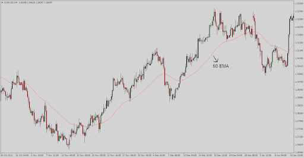
```

By taking a longer prior time period, this index allows to see the long-term trend in the stock price.

By using only a few prior periods, the index allows to see the short-term trend.

Prices always have to move toward the average. So any time a price is trading above average, then you can expect for the price to start going down. 

When price is moving below average, then you an expect for the price to move up.

```{r, out.width = "100%", echo= FALSE, fig.align = 'center',fig.cap = 'Moving average'}
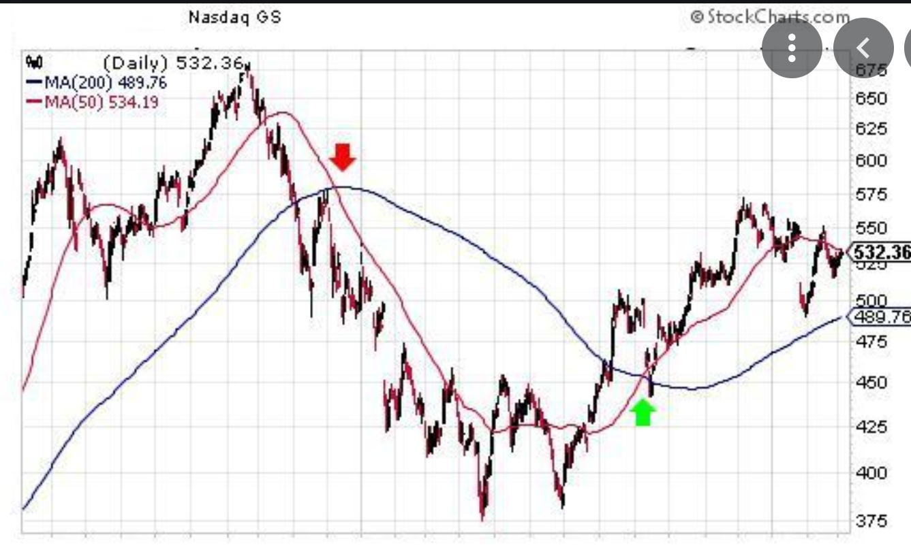
```


Given that single truth...One can use the times when the short-term average crosses the long-term average to gain signals of trends...this is called "moving Average Crossover signals".

When the short-term moving is above the long term mean and then crosses it, you can expect the price will start to move down...probably a good time to short the stock (red arrow in image above).

when the short-term MA is moving below long-term average and crosses above the long-term MA, you can expect the price will start to go up (blue arrow above) Probably a good time to buy stock, if you shorted it.


## 56 Arnaud Legoux Moving Average  {-}
The Arnaud Legoux Moving Average (ALMA) is different from other moving averages because of its specific design to use Gaussian distribution that is shifted with a calculated offset in order for the average to be biased towards more recent days, instead of more evenly centered on the window. 

```{r, out.width = "100%", echo= FALSE, fig.align = 'center',fig.cap = 'ALMA'}
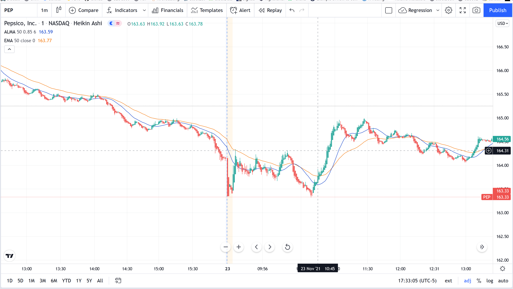
```

It could be used with the Bias indicator to generate alternative price deviations.

## 57 David Varadi Intermediate Oscillator (dvi or VDO) {-}
The DV Intermediate oscillator (DVI) is a very smooth momentum oscillator that can also be used as a trend indicator. Essentially the DVI is like the DVO of intermediate oscillators and was designed to take both 1) the magnitude of returns over different time windows smoothed and 2)the stretch–or the relative number of up versus down days into account over different time windows to produce superior results. 

The Varadi Oscillator (VDO) aim to reduce the influence of the trend component in oscillators. The DVO can be described as a rolling percent rank of detrended prices over a certain lookback period. The detrending process used for the calculation of the indicator is based on the simple moving average of the ratio between the closing price and median ( hl2 ) price. 

## 58 Double Exponential Moving Average (dema) {-}
DEMA (red) is an ema on another ema (blue). It smooths and approximates the trend better. It may be usefull to remove common lags in the ema. It can be used for MACD.

```{r, out.width = "100%", echo= FALSE, fig.align = 'center',fig.cap = 'Double Exponential Moving Average '}
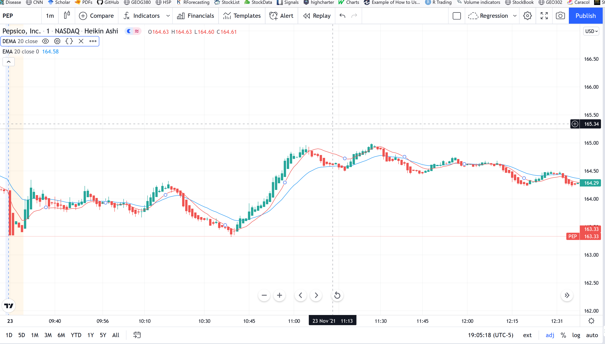
```

## 59 Ehlers Super Smoother Filter {-}
Another way to smooth price data. It claims to reduce noise.

```{r, out.width = "100%", echo= FALSE, fig.align = 'center',fig.cap = 'Double Exponential Moving Average '}
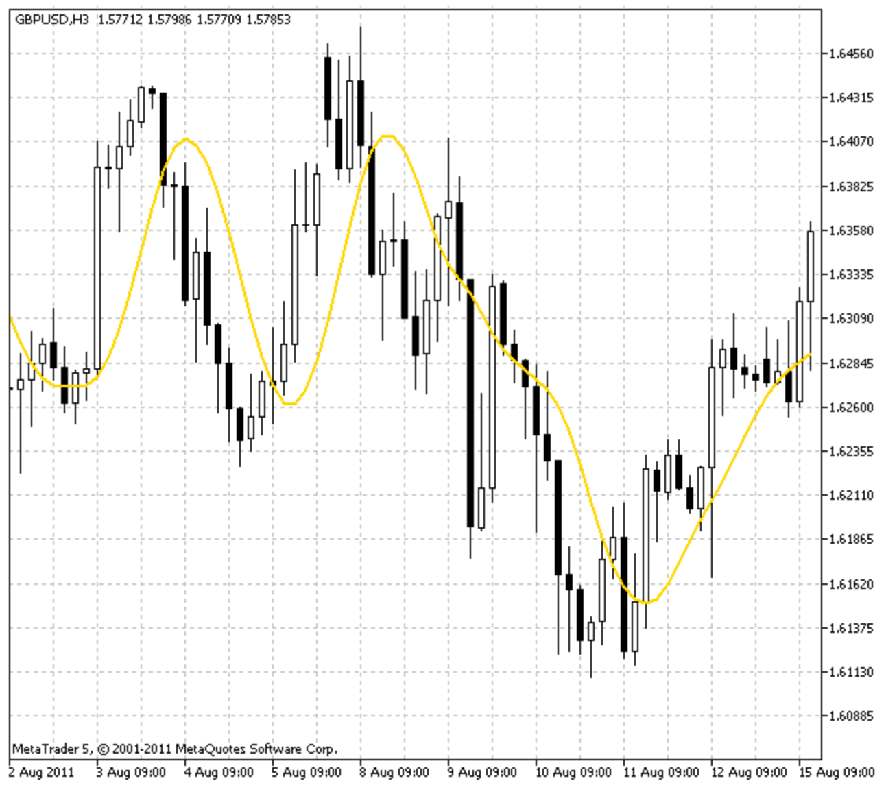
```

## 60 Even Better Sinewave {-}
This indicator measures market cycles and uses a low pass filter to remove noise. Its output is bound signal between -1 and 1 and the maximum length of a detected trend is limited by its length input. It will let you know how long to stay with a trade and it works best with a trend confirmation but it can also work on it's own fairly well. Buy when the indicator line is green and sell when it is red.

```{r, out.width = "100%", echo= FALSE, fig.align = 'center',fig.cap = 'Even Better Sinewave'}
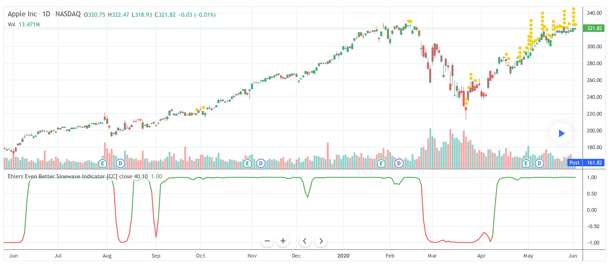
```

## 61 Exponential Moving Average (EMA) {-}
The Exponential Moving Average (EMA) is a specific type of moving average that points towards the importance of the most recent data and information from the market. The Exponential Moving Average is just like it’s name says - it’s exponential, weighting the most recent prices more than the less recent prices. The EMA can be compared and contrasted with the simple moving average.

It can be used with the BIAS indicator to show divergencies and crossovers as signals.

```{r, out.width = "100%", echo= FALSE, fig.align = 'center',fig.cap = 'Exponential Moving Average '}
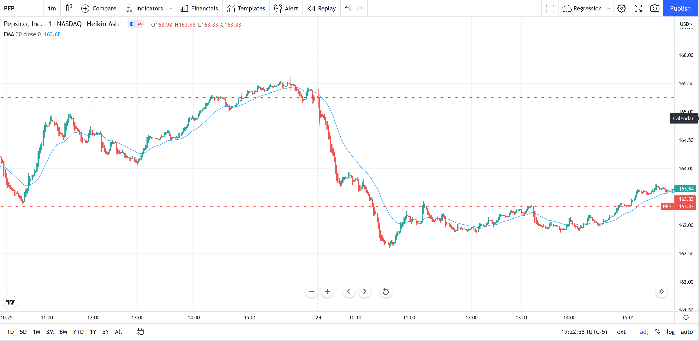
```


## 62 Fibonaccis Weighted Moving Average {-}
Fibonacci's Weighted Moving Average is similar to a Weighted Moving Average (WMA) where the weights are based on the Fibonacci Sequence.

```{r, out.width = "100%", echo= FALSE, fig.align = 'center',fig.cap = 'Fibonaccis Moving Average '}
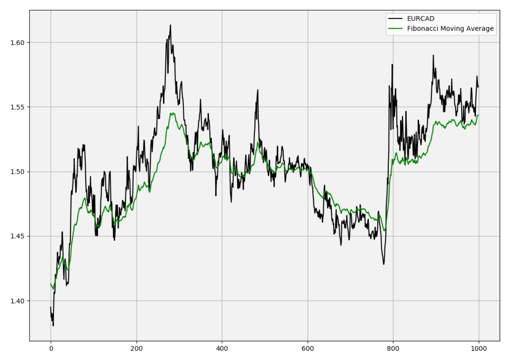
```


## 63 Gann High Low Activator {-}
It is a moving average based trend indicator consisting of two different simple moving averages.
    
The indicator tracks both curves (of the highs and the lows). The close of the bar defines which of the two gets plotted.
    
Increasing high_length and decreasing low_length better for short trades, vice versa for long positions.

The image below show the Gann line (organge and red) compared to an EMA of the same length.

```{r, out.width = "100%", echo= FALSE, fig.align = 'center',fig.cap = 'Gann High Low Activator'}

```

## 64 Guppy Multiple Moving Averages (guppy) {-}
It is a combination of several slow and several fast EMAs. Slow emas reflect the sentiment of long-term investors, while the set of fast EMAs reflect that of short-term traders. Crossovers among EMAs reflect price transitions.

It could be combined in a single indicator by using the Standard Deviation from all EMAs at a given price.


```{r, out.width = "100%", echo= FALSE, fig.align = 'center',fig.cap = 'Guppy Multiple Moving Averages'}
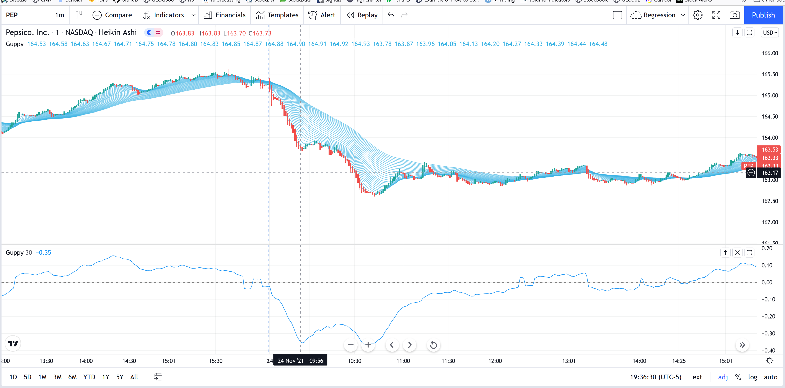
```

## 65 Holt Winter Moving Average (hwma) {-}
Indicator HWMA (Holt-Winter Moving Average) is a three-parameter moving average by the Holt-Winter method; the three parameters should be selected to obtain a forecast.

```{r, out.width = "100%", echo= FALSE, fig.align = 'center',fig.cap = 'Holt Winter Moving Average'}
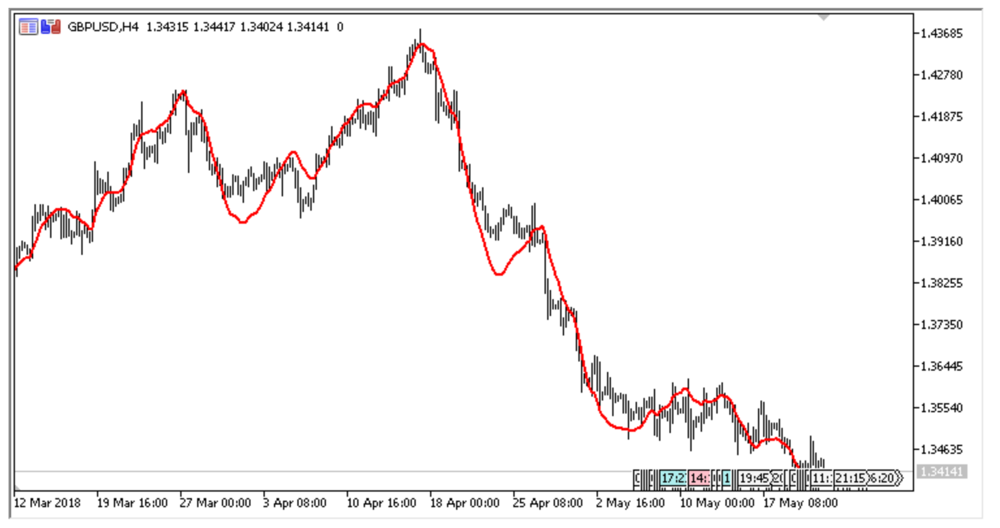
```

## 66 Hull Exponential Moving Average (hma) {-}
The HMA attempts to remove lag in its entirety, while simultaneously improving upon smoothing. To calculate the Hull Moving Average, follow the steps below.

Begin by calculating a Weighted Moving Average with period n / 2 and then multiply this value by 2.

Next, go ahead and calculate another Weighted Moving Average for period n and then subtract this value from the result in Step 1.

Finally, calculate a Weighted Moving Average with period sqrt(n)by using the data you’ve collected from the results of Step 2.

Another version of this calculation can be found below.

HMA = WMA(2*WMA(n/2) − WMA(n)),sqrt(n))

Below are two HULL at different time windows.

```{r, out.width = "100%", echo= FALSE, fig.align = 'center',fig.cap = 'Holt Winter Moving Average'}

```

## 67 Jurik Moving Average {-}
(JMA) attempts to eliminate noise to see the "true"  underlying activity. It has extremely low lag, is very smooth and is responsive to market gaps.

```{r, out.width = "100%", echo= FALSE, fig.align = 'center',fig.cap = 'Jurik Moving Average'}
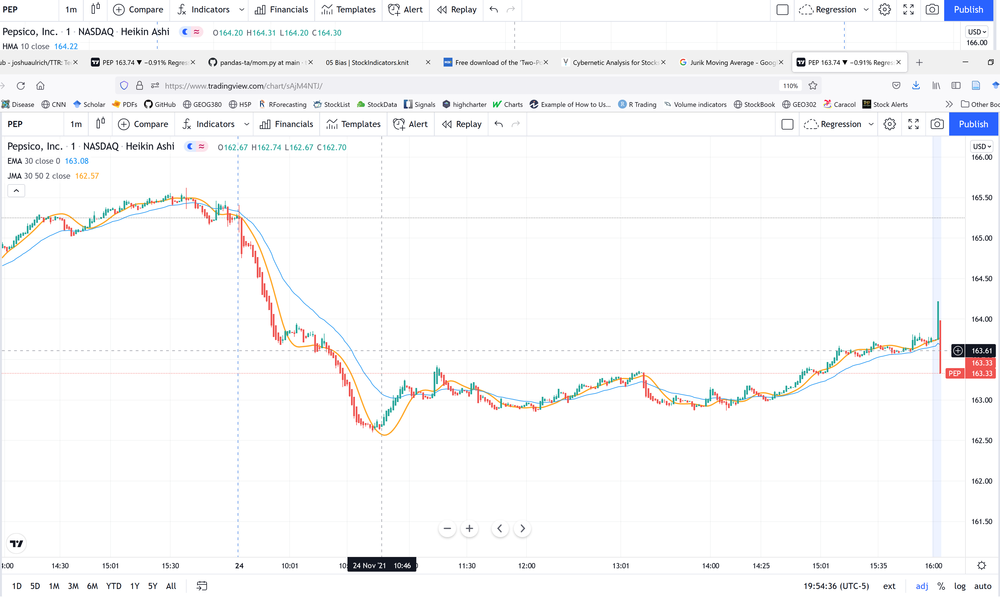
```

## 68 Kaufmans Adaptive Moving Average (kama) {-}
KAMA is a moving average designed to account for market noise or volatility. KAMA will closely follow prices when the price swings are relatively small and the noise is low. KAMA will adjust when the price swings widen and follow prices from a greater distance. This trend-following indicator can be used to identify the overall trend, time turning points and filter price movements.
    
```{r, out.width = "100%", echo= FALSE, fig.align = 'center',fig.cap = 'Kaufmans Adaptive Moving Average'}
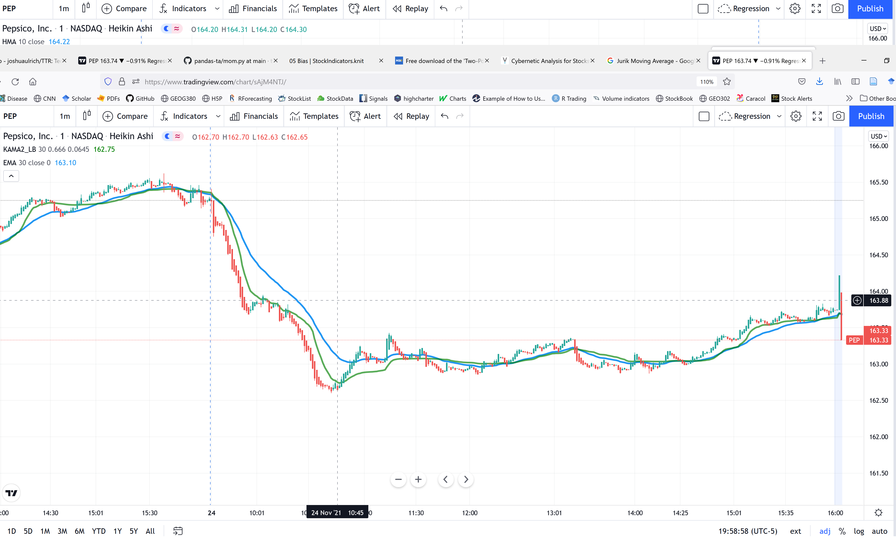
```   

## 69 McGinley Dynamic (mcgd) {-}
The McGinley Dynamic looks like a moving average line, yet it is actually a smoothing mechanism for prices that minimizes price separation, price whipsaws, and hugs prices much more closely. Because of the calculation, the Dynamic Line  speeds up in down markets as it follows prices yet moves more slowly in up markets.

```{r, out.width = "100%", echo= FALSE, fig.align = 'center',fig.cap = 'McGinley Dynamic'}
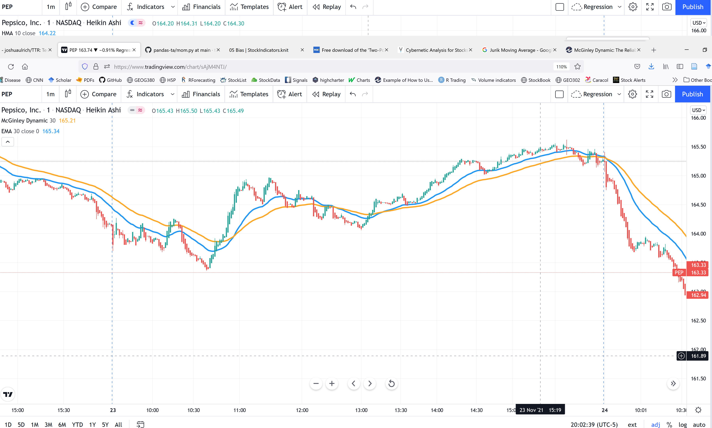
```   

## 70 Oscar {-}
It is like a weigetd average of the relative position of price compare to the high and low values. A fast average is applied to create a signal.

```{r, out.width = "100%", echo= FALSE, fig.align = 'center',fig.cap = 'Oscar'}
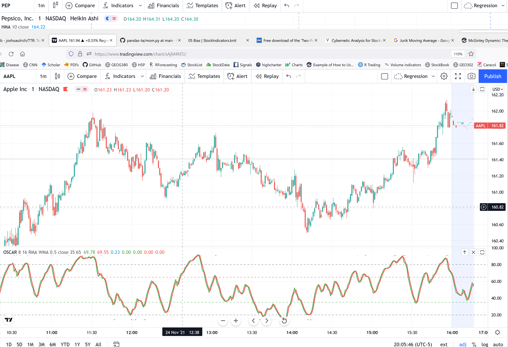
``` 

## 71 Pascals Weighted Moving Average (pwma) {-}
Pascal's Weighted Moving Average is similar to a symmetric triangular window except PWMA's weights are based on Pascal's Triangle.

## 72 Sine Weighted Moving Average sinwma) {-}
A weighted average using sine cycles. The middle term(s) of the average have the highest weight(s).

```{r, out.width = "100%", echo= FALSE, fig.align = 'center',fig.cap = 'Sine Weighted Moving Average'}
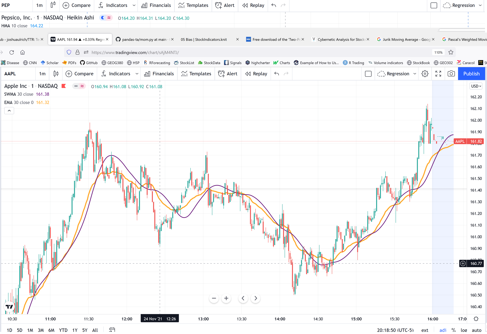
``` 

## 73 Supertrend {-}
Supertrend is a trend-following indicator based on Average True Range (ATR). The calculation of its single line combines trend detection and volatility. It can be used to detect changes in trend direction and to position stops. The SuperTrend indicator is calculated utilizing the ATR to offset the indicator from the common price. When the price touches the SuperTrend collection it turns to the other direction. One of the advantages of the SuperTrend is definitely that it just moves in direction of the trend.

```{r, out.width = "100%", echo= FALSE, fig.align = 'center',fig.cap = 'Supertrend function'}
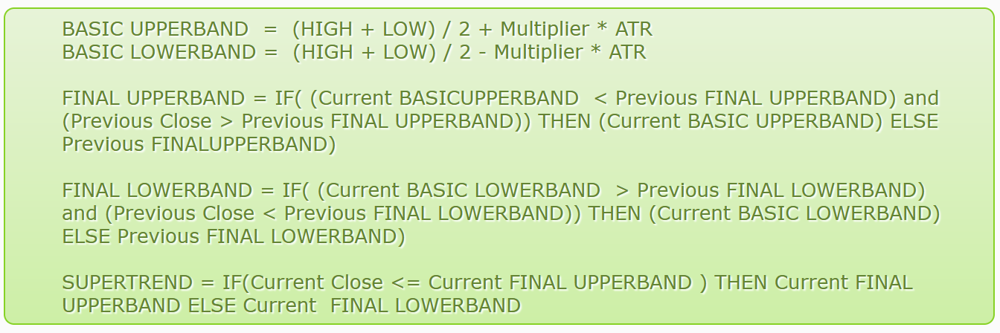
``` 

When the price falls below the indicator curve, it turns red and indicates a downtrend. Conversely, when the price rises above the curve, the indicator turns green and indicates an uptrend. After each close above or below Supertrend, a new trend appears.

```{r, out.width = "100%", echo= FALSE, fig.align = 'center',fig.cap = 'Supertrend'}
knitr::include_graphics("images/SF.png")
``` 

## 74 Symmetric Weighted Moving Average {-}
Weight distribution starts from median of given period and it's reduced linearly to the sides so the ending and starting point of period have the least weight.
It's smooth and fast but reacts late to trend changes on higher lengths, it could be considered both advantage and disadvantage. 

```{r, out.width = "100%", echo= FALSE, fig.align = 'center',fig.cap = 'Symmetric Weighted Moving Average'}
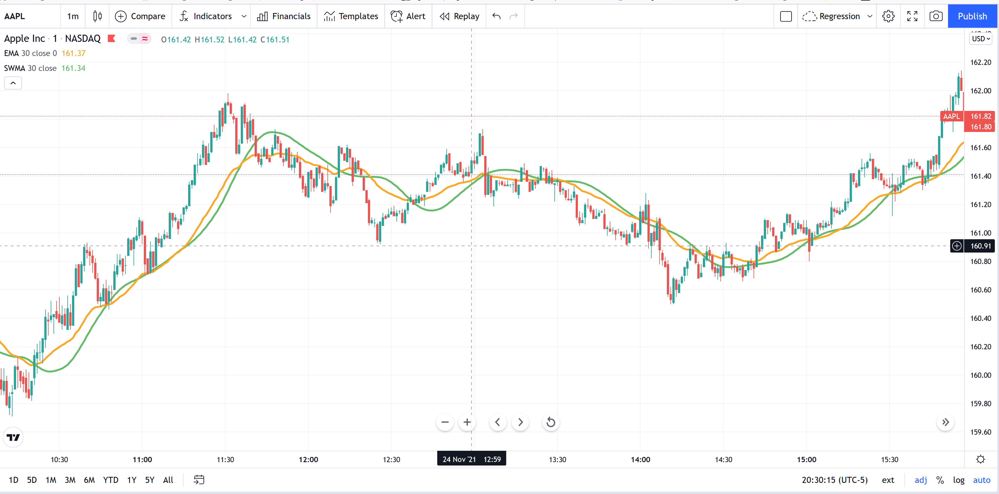
``` 

## 75 T3 Moving Average (t3) {-}

Another form to aproximate price data with a moving average.
```{r, out.width = "100%", echo= FALSE, fig.align = 'center',fig.cap = 'T3 Moving Average'}
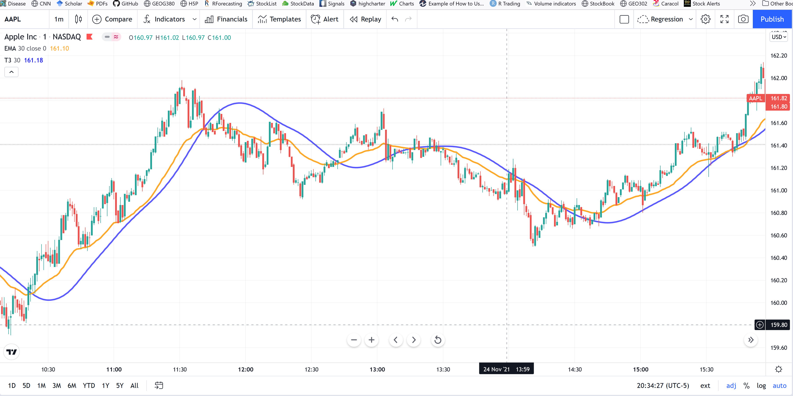
``` 

## 76 Trend Detection Index (TDI) {-}
TDI helps to detect the start of a trend.

The trend detection index (Blue line below) will signal a trend if it shows a positive value. TDI shows consolidation when values are negative. The direction indicator (red line) points the current direction of the trend. 

A buy signal appears when TDI (Blue line) and direction indicator (red line) are both positive.


```{r, out.width = "100%", echo= FALSE, fig.align = 'center',fig.cap = ' Trend Detection Index'}
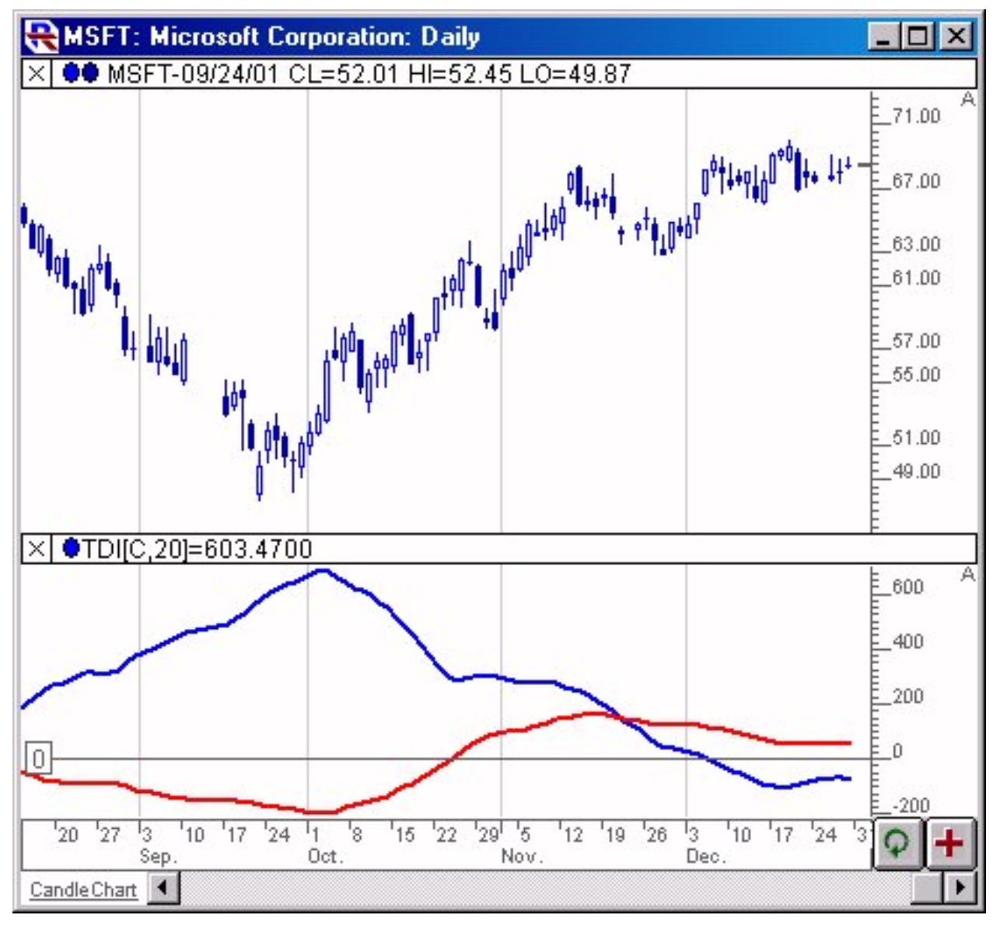
``` 

## 77 Triangular Moving Average (trima) {-}
The Triangular Moving Average (TRIMA) represents an average of prices, but places weight on the middle prices of the time period. The calculations double-smooth the data using a window width that is one-half the length of the series.

```{r, out.width = "100%", echo= FALSE, fig.align = 'center',fig.cap = 'Triangular Moving Average'}
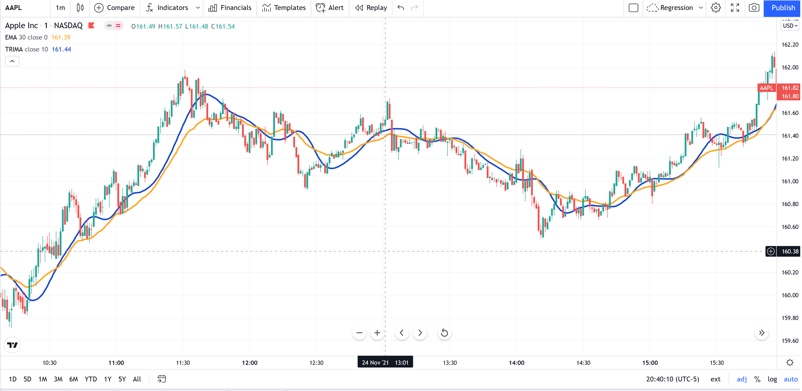
``` 

## 78 Triple Exponential Moving Average (TEMA) {-}
An ema applied to an ema, which was applied to another ema, which was applied to price. This creates a much close aproximation to the trend.

```{r, out.width = "100%", echo= FALSE, fig.align = 'center',fig.cap = 'Triple Exponential Moving Average'}
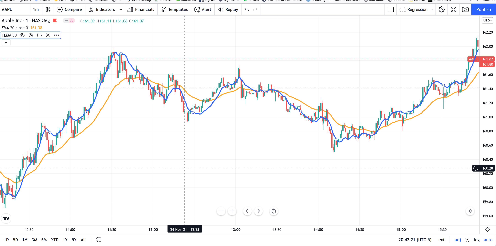
``` 

## 79 Variable Index Dynamic Average (vidya) {-}
It is similar to an Exponential Moving Average but it has a dynamically adjusted lookback period dependent on relative price volatility as measured by Chande Momentum Oscillator (CMO). When volatility is high, VIDYA reacts faster to price changes. It is often used as moving average or trend identifier.

```{r, out.width = "100%", echo= FALSE, fig.align = 'center',fig.cap = 'Variable Index Dynamic Average'}
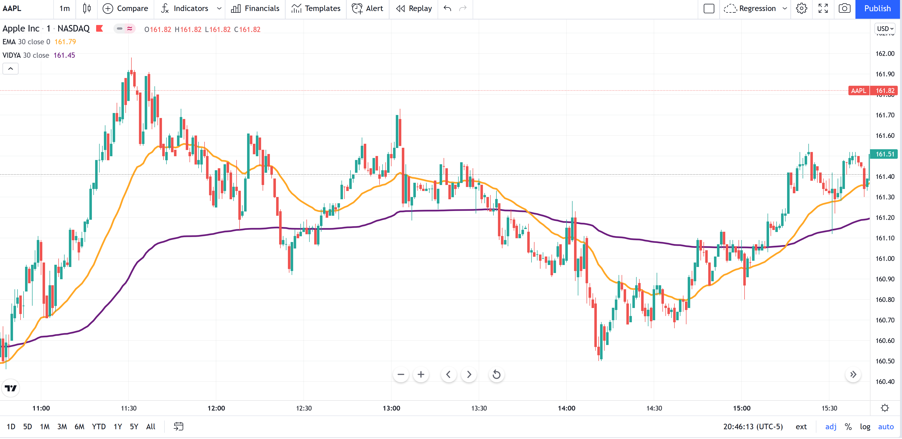
``` 

Volume Weighted Moving Average

## 80 Volume Average Weighted Price (VWAP)  {-}

Basically, volume is multiplied by price (VP). Then starting at an specific time (e.g., start of trading section), VP is added cumulatively and divided by the cumulative volume. Basically, this index average volume weighted by the price. 

When VWAP moves up, it suggest that volume and prices are both moving up, and vic. 

VWAP can signal different aspects of price.

If price moves above VWAP, there is momentum on the price.

```{r, out.width = "100%", echo= FALSE, fig.align = 'center',fig.cap = 'VWAP'}
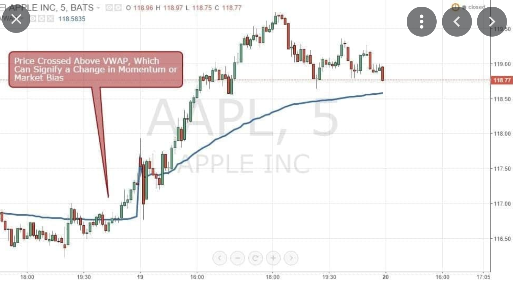
```
It can also indicate if price is high or low by comparison to volume.
```{r, out.width = "100%", echo= FALSE, fig.align = 'center',fig.cap = 'VWAP'}
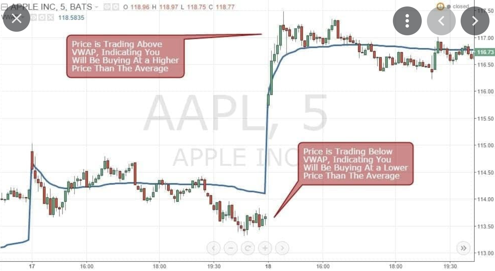
```

If price moves above or below VWAP, it suggest strong trend and momentum.
```{r, out.width = "100%", echo= FALSE, fig.align = 'center',fig.cap = 'VWAP'}
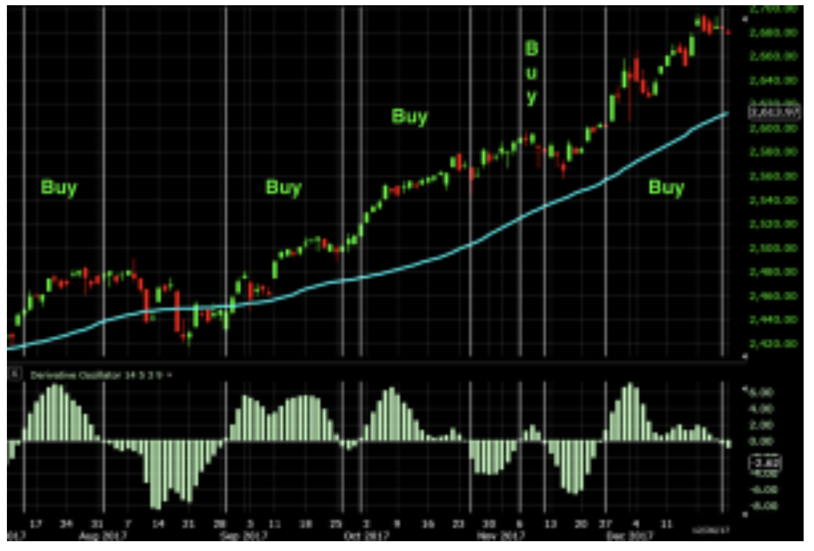
```

## 81 Volume Weighted Moving Average (vwma) {-}
The Volume Weighted Moving Average (VWMA) study calculates the average weighted price by volume over a period of N bars. 

pv = close * volume
VWMA = SMA(pv, length) / SMA(volume, length)
        

```{r, out.width = "100%", echo= FALSE, fig.align = 'center',fig.cap = 'Volume Weighted Moving Average'}
knitr::include_graphics("images/V2.png")
```

## 82 Weighted Closing Price {-}
Weighted Closing Price is the weighted price given: high, low and double the close.

```{r, out.width = "100%", echo= FALSE, fig.align = 'center',fig.cap = 'Weighted Closing Price formula'}
knitr::include_graphics("images/wc.png")
```

It fits the data too closely. May be to be use as raw data to other indicators.
```{r, out.width = "100%", echo= FALSE, fig.align = 'center',fig.cap = 'Weighted Closing Price formula'}
knitr::include_graphics("images/wcp.png")
```

## 83 Weighted Moving Average (wma) {-}
The Weighted Moving Average where the weights are linearly increasing and the most recent data has the heaviest weight.

```{r, out.width = "100%", echo= FALSE, fig.align = 'center',fig.cap = ' Weighted Moving Average'}
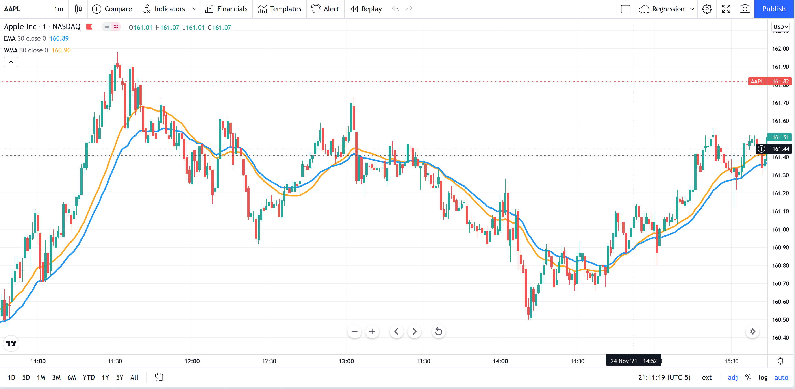
```

## 84 WildeRs Moving Average (rma) {-}
The WildeR's Moving Average is simply an Exponential Moving Average (EMA) with a modified alpha = 1 / length.

```{r, out.width = "100%", echo= FALSE, fig.align = 'center',fig.cap = 'WildeRs Moving Average'}
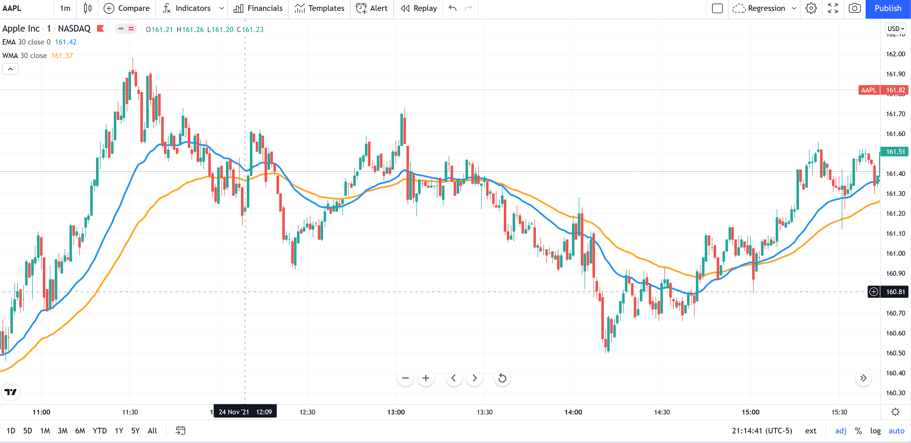
```

## 85 Zero Lag Moving Average (zlma) {-}
The Zero Lag Moving Average attempts to eliminate the lag associated with moving averages. The idea is do a regular exponential moving average (EMA) calculation but on a de-lagged data instead of doing it on the regular data. Data is de-lagged by removing the data from "lag" days ago thus removing (or attempting to) the cumulative effect of the moving average. 

    