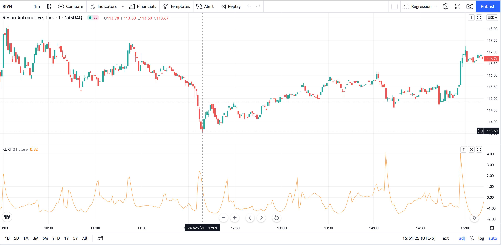
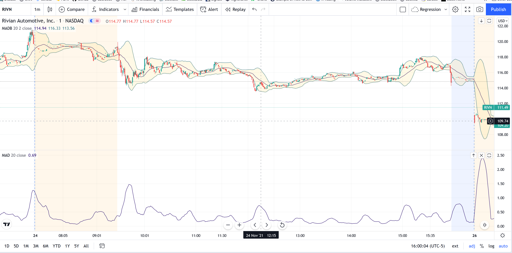
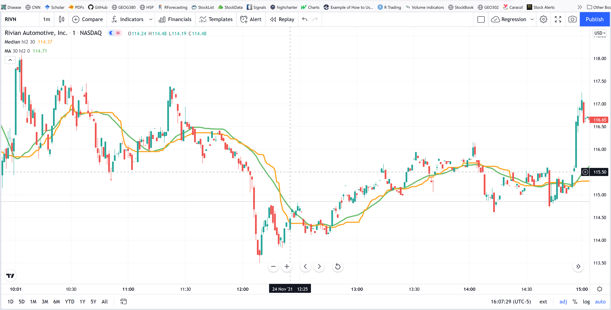

# Statisitcs {}

These are general descriptors of the distribution and central tendency of price over a period of time.


## 86 Entropy {-}
Name as Shannon Entropy in Tradingview. Entropy measures the unpredictability of the data. A die has higher entropy (p=1/6) versus a coin (p=1/2). This is a measure of "surprise" in the data, the larger the move or deviation from the most probable value, the higher the new information gain.

It is measure as:

P = close / SUM(close, length)

E = SUM(-P * npLog(P) / npLog(base), length)

Tradingview functions allows to include volume.

```{r, out.width = "100%", echo= FALSE, fig.align = 'center',fig.cap = 'Shannon Entropy'}
knitr::include_graphics("images/es.png")
```

## 87 Kurtosis {-}

it measure of the "tailedness" of the distribution of price. Larger when high and low are very different. A good metric of volatily.

```{r, out.width = "100%", echo= FALSE, fig.align = 'center',fig.cap = 'Kurtosis'}

```

## 88 Mean Absolute Deviation (mad) {-}
This is similar to the standard deviation. It is simply the average deviation of each price to the mean price, average over a period of time.

It measure volatity, then it can be added to mean price as bands, or used alone. 

```{r, out.width = "100%", echo= FALSE, fig.align = 'center',fig.cap = 'Mean Absolute Deviation'}

```

## 89 Median {-}

This is the price locate in the middle among a group of price values. It is less prone to outliers as the mean does.

```{r, out.width = "100%", echo= FALSE, fig.align = 'center',fig.cap = 'Median'}

```

## 90 Skew {-}
It is the asymmetry  of price about its mean. Zero means data is centered. Positive it means price is trading towards larger prices.

```{r, out.width = "100%", echo= FALSE, fig.align = 'center',fig.cap = 'Skew'}
knitr::include_graphics("images/skew.png")
```

