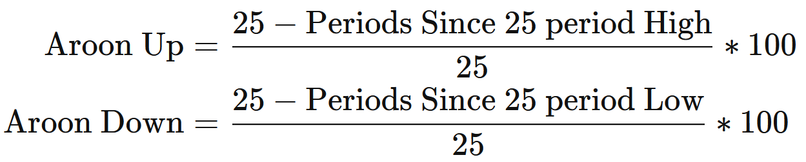
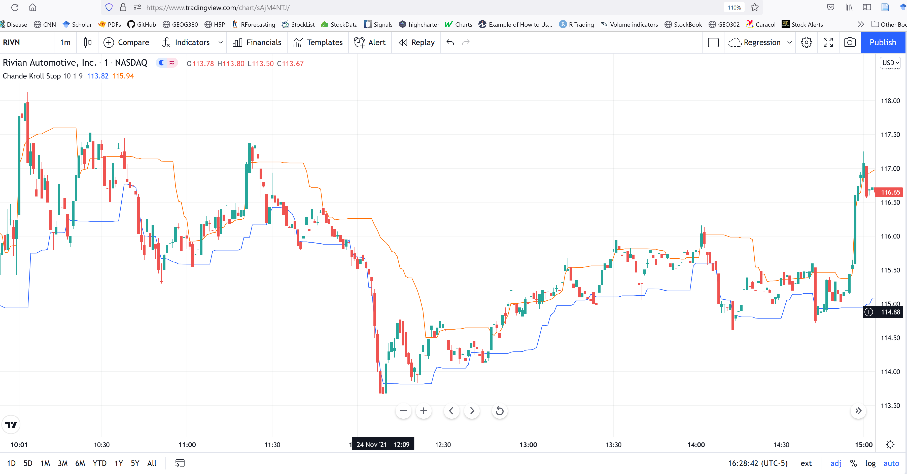

# Trend Indicators

This group of indicators aim to diagnose the direction of stock price.


## 91 Archer Moving Averages Trends {-}

No info

## 92 AAron indicator {-}

By looking at the time between highs and the time between lows over a time period, the Aaroon indicator help to reveal the change as well as the strength of a trend.


The Arron indicator is composed of two lines. An up line measures the number of periods since a High, and a down line which measures the number of periods since a Low. 


The equations are:

```{r, out.width = "100%", echo= FALSE, fig.align = 'center',fig.cap = 'AAron indicator'}

```

The indicator focuses on the last 25 periods, but is scaled to zero and 100. Say Aaron Up yielded a value of 50, this means the price made a new high within the last 12.5 periods. A reading near 100 means a high was seen very recently. The same concepts apply to the Down Aroon. 


The important aspect of Aaron the the comparison between the two lines. When the two Aaron lines crossover it indicates a reversal. When both indicators are below 50 it can signal that the price is consolidating. 

```{r, out.width = "100%", echo= FALSE, fig.align = 'center',fig.cap = 'AAron indicator'}

```

## 93 Average Directional Movement Index (adx) {-}

Unclear how this is different from Directional Movement Average (DM)

## 94 Chande Kroll Stop {-}

It adds the ATR to the SMA on high and low prices, creating bands around price.

The Chande Kroll Stop can be used in a variety of ways. It is common to sell when the price crosses below both lines, whereas it is common to buy when the price crosses above both lines.

```{r, out.width = "100%", echo= FALSE, fig.align = 'center',fig.cap = 'Chande Kroll Stop '}

```

## 95 Choppiness Index (chop) {-}
CHOP is an indicator designed to determine if the market is choppy (trading sideways) or not choppy (trading within a trend in either direction).

The closer the value is to 100, the higher the choppiness (sideways movement) levels. The closer the value is to 0, the stronger the market is trending (directional movement)


Calculated as:

100 * LOG10( SUM(ATR(1), n) / ( MaxHi(n) - MinLo(n) ) ) / LOG10(n)

With readings above the upper threshold, continued sideways movement maybe expected.

```{r, out.width = "100%", echo= FALSE, fig.align = 'center',fig.cap = 'Choppiness Index'}

```


Readings below the lower threshold may indicate a continuing trend.

```{r, out.width = "100%", echo= FALSE, fig.align = 'center',fig.cap = 'Choppiness Index'}

```

It can also indicate reversals.
```{r, out.width = "100%", echo= FALSE, fig.align = 'center',fig.cap = 'Choppiness Index'}

```

## 96 Detrended Price Oscillator (dpo) {-}
Basically a version of the Bias indicator. removing the trend to the price data, which displays the short-term oscillations.

```{r, out.width = "100%", echo= FALSE, fig.align = 'center',fig.cap = 'Detrended Price Oscillator'}

```

## 97 Parabolic stop and reverse (psar) {-}
PSAR determines trend direction and potential reversals in price.

The parabolic SAR indicator appears on a chart as a series of dots, either above or below an asset's price, depending on the direction the price is moving. A dot is placed below the price when it is trending upward, and above the price when it is trending downward.

This indicator tracks the lowest low and highest high values over a prior time period using two independent equations. Each time a new high or low appears, the difference to the prior high or low is multiplied by however many prior highs or lows occurred (starting at 0.02 and as much as 0.2). Which equation to use depends on how the closing price compare to the high or low PSAR.

Basically, as a price gains momentum, the PSAR gets larger or smaller depending if the price trends higher or lower, respectively.
 

```{r, out.width = "100%", echo= FALSE, fig.align = 'center',fig.cap = 'PSAR'}

```

The indicator works most effectively in trending markets where large price moves allow traders to capture significant gains. When a security’s price is range-bound, the indicator will constantly be reversing, resulting in multiple low-profit or losing trades.


## 98 Q-Stick (qstick) {-}
A moving average calculation of the difference between the Open and Close prices over a specific period. Identifies trends in candlestick charts.

```{r, out.width = "100%", echo= FALSE, fig.align = 'center',fig.cap = 'Q Stick'}

```

## 99 TTM Trend {-}
Plots the bars green or red. It checks if the price is above or under the average price of the previous given bars. The indicator should hep you stay in a trade until the colors chance. Two bars of the opposite color is the signal to get in or out.

Indicator 25 (Largest consecutive Higher or lower highs or lows and green and red candles) tries to capture this attributes numerically.

```{r, out.width = "100%", echo= FALSE, fig.align = 'center',fig.cap = 'TTM Trend'}

```

## 100 Vertical Horizontal Filter (vhf) {-}

To identify trending and ranging markets. VHF measures the level of trend activity, similar to ADX in the Directional Movement System. Trend indicators can then be employed in trending markets and momentum indicators in ranging markets.
Vertical Horizontal Filter does not, itself, generate trading signals, but determines whether signals are taken from trend or momentum indicators.

Rising values indicate a trend.

Falling values indicate a ranging market.

High values precede the end of a trend.

Low values precede a trend start.


Example:
1. Vertical Horizontal Filter rises, signaling the start of an up-trend;
2. VHF falls, indicating that the trend is near its' end;
3. VHF rises, signaling the start of a sharp down-trend;
4. Falling VHF signals the end of the down-trend. This is premature as price continues to trend downwards over the next 3 months, albeit at a slower rate

```{r, out.width = "100%", echo= FALSE, fig.align = 'center',fig.cap = 'Vertical Horizontal Filter '}

```

Calculation:
To calculate the Vertical Horizontal Filter:

    Select the number of periods (n) to include in the indicator. This should be based on the length of the cycle that you are analyzing. The most popular is 28 days (for intermediate cycles).
    Determine the highest closing price (HCP) in n periods.
    Determine the lowest closing price (LCP) in n periods.
    Calculate the range of closing prices in n periods:
               HCP - LCP
    Next, calculate the movement in closing price for each period:
               Closing price [today] - Closing price [yesterday]
    Add up all price movements for n periods, disregarding whether they are up or down:
               Sum of absolute values of ( Close [today] - Close [yesterday] ) for n periods
    Divide Step 4 by Step 6:
               VHF = (HCP - LCP) / (Sum of absolute values for n periods)


## 101 Vortex {-}
Two oscillators that capture positive and negative trend movement.

Calculated as:
```{r, out.width = "100%", echo= FALSE, fig.align = 'center',fig.cap = 'Vortex'}
knitr::include_graphics("images/vc.png")
```

A bullish signal triggers when the positive trend indicator crosses above the negative trend indicator or a key level. A bearish signal triggers when the negative trend indicator crosses above the positive trend indicator or a key level. The Vortex Indicator is either above or below these levels, which means it always has a clear bullish or bearish bias. 

```{r, out.width = "100%", echo= FALSE, fig.align = 'center',fig.cap = 'Vortex'}
knitr::include_graphics("images/vc1.png")
```
