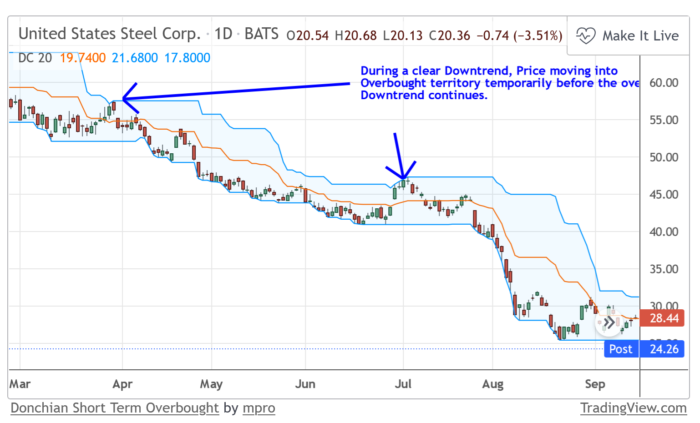

# Volatility

This group of indicators aim to diagnose the variability of stock price.

## 102 Aberration or Keltner Channels {-}
Similar to the Bollinger Bands. In this indicator a buffer of variability (Average True Range: ATR) is added on both sides of a moving average. When price returns to the buffer, probably indicate times in which price is trending back to the average. It could be used to profit from small price corrections.


[INFO](https://github.com/twopirllc/pandas-ta/issues/46).

```{r, out.width = "100%", echo= FALSE, fig.align = 'center',fig.cap = 'Aberration'}

```

During a Bullish Trend, a breakthrough above the upper envelope can be seen as a sign of strength and the uptrend is likely to continue.
```{r, out.width = "100%", echo= FALSE, fig.align = 'center',fig.cap = 'Keltner Channel'}

```

When a market is choppy or trading sideways, Keltner Channels can be useful for identifying overbought and oversold conditions. These conditions can typically lead to price corrections where price moves back towards the moving average (Middle Line).

```{r, out.width = "100%", echo= FALSE, fig.align = 'center',fig.cap = 'Keltner Channel'}

```

Aberration can be recalculated by measuring the distance between price (e.g., HLC3) and the moving average, and quantifying that price difference in ATR times. Basically, how many ATRs is the current price  from the average price. 

```{r, out.width = "100%", echo= FALSE, fig.align = 'center',fig.cap = 'Aberration as solo indicator'}
knitr::include_graphics("images/Aberation2.png")
```


## 103 Acceleration Bands (accbands) {-}
A metric of volatility added to an EMA. We look for breakout indicators outside these bands, while also using the shorter time frames to define likely support and resistance levels at the lower and upper Acceleration Bands.  

Volatility is measure as the fraction between distance between low and high, and the high and low. Basically, 

HL_RATIO = c * (high - low) / (high + low)

```{r, out.width = "100%", echo= FALSE, fig.align = 'center',fig.cap = 'Acceleration Bands'}
knitr::include_graphics("images/Ab.png")
```


## 104 Average true range indicator (ATR) {-}
ATR is used as indicator of volatility, by looking at the highest prior variation in price.

For each time step, ATR is the maximum value among:

1) High price minus low price, or
2) Absolute difference between current high price minus prior close price, or
3) Absolute difference between current low price minus prior close price.

Which ever is highest of the three, is the ATR. ATR is averaged over a prior time period.

ATR can be used to determine the size of a trailing stop. Commonly, the trailing stop is 3x the ATR, this will ensure that volatility will not take you out of a trend and let you ride the trend with the trailing stop.


ATR is also used to buy if the close price in a given day is higher than the ATR plus close price of the prior day. In other words, current price is trading exceptionally higher than prior volatilty and price.

```{r, out.width = "100%", echo= FALSE, fig.align = 'center',fig.cap = 'ATR'}

```


## 105 Bollinger bands {-}

This indicator calculates the standard deviation  in price over a prior period of time and it adds it to the mean price. In general, when price is outside 2 standard deviations, prices are assume to be extreme rare. 

In the figure below, 1 (orange) and 2 (blue) standard deviation bands are shown. Clearly, when price trends between the 1 and 2 upper standard deviations, the price is an up-trend.

```{r, out.width = "100%", echo= FALSE, fig.align = 'center',fig.cap = 'Bollinger bands '}

```

When the price becomes consolidated within narrow BB bands, it is common the case that the price will break in the direction of the first candle that surpasses the bands. This is called Squeeze.

If you think about the philology of this pattern, bulls and bears are fitting equally hard evidence by low stock price variability (Specially if volume is being traded in high numbers). As soon as one group takes the advantage (i.e., breaking above or below the BBands), the other group gives up, causing a breakout price.

```{r, out.width = "100%", echo= FALSE, fig.align = 'center',fig.cap = 'Bollinger bands squeeze'}

```

## 106 Donchian Channel {-}
It is the max and min values of prices added to an EMA. It does indicates the bands of price volatility.

When price, trends close to upper band it supper bull.
```{r, out.width = "100%", echo= FALSE, fig.align = 'center',fig.cap = 'Donchian Channel'}

```

Before price trend, it could move temporarily in the opposite direction. Like a small resistance by the losing team.

```{r, out.width = "100%", echo= FALSE, fig.align = 'center',fig.cap = 'Donchian Channel'}

```

## 107 Elders Thermometer {-}
Looks att he variation between the low and the prior low, and the high and the prior high, and selects the largest of the two. A moving average can be applied to the index to identify points, that are "hot", or so call places where the price is trending considerably in one direction.
 When Market Thermometer rises above its moving average, it warns that the market is hot and slippage more likely. 


```{r, out.width = "100%", echo= FALSE, fig.align = 'center',fig.cap = 'Elders Thermometer'}

```

## 108 Envelope {-}
It is a percent band placed on the SMA. Envelopes are a good indicator for trend identification as well as identifying overbought and oversold conditions.

For instance, a 10% envelop:

Basis = 20 Period SMA

Upper Envelope = 20 Period SMA + (20 Period SMA x 0.1)

Lower Envelope = 20 Period SMA - (20 Period SMA x 0.1)

Frequently, during a strong, clearly defined trend, a breakthrough into overbought or oversold territory is a sign of strength. This can be used to confirmed the likelihood of a continuing trend.

During a Bullish Trend, a breakthrough above the upper envelope can be seen as a sign of strength and the uptrend is likely to continue.

```{r, out.width = "100%", echo= FALSE, fig.align = 'center',fig.cap = 'Envelope'}

```


When a market is choppy or trading sideways, Moving Average Envelopes can be useful for identifying overbought and oversold conditions. These conditions can typically lead to price corrections where price moves back towards the moving average.

```{r, out.width = "100%", echo= FALSE, fig.align = 'center',fig.cap = 'Envelope'}

```

## 109 Historical volatility (hv) {-}
The difference between close and prior close (volatility) is used to stimate the standard deviation. Calculated as:

hv = 100 * ta.stdev(math.log(close / close[1]), length) 


```{r, out.width = "100%", echo= FALSE, fig.align = 'center',fig.cap = 'Historical volatility'}

```

## 110 Holt Winter Channel {-}
A three-parameter moving average calculated by the method of Holt-Winters, and it add a percent change of Price.

    
```{r, out.width = "100%", echo= FALSE, fig.align = 'center',fig.cap = 'Holt Winter Channel '}
knitr::include_graphics("images/Holt.png")
```


## 111 Mass Index (massi) {-}
Mass index examines the range between high and low stock prices over a period of time. The specific equation is:

```{r, out.width = "100%", echo= FALSE, fig.align = 'center',fig.cap = 'Mass Index equation'}

```

You can think of Mass Index as the speed at which price differences are widening; Mass index suggests that the widening and then narrowing of trading ranges identifies potential reversals.


```{r, out.width = "100%", echo= FALSE, fig.align = 'center',fig.cap = 'Mass Index'}

```

## 112 Normalized Average True Range (natr) {-}

Normalized Average True Range standardizes the ATR by the close price. Provides a relative value that can be compared to other securities.

```{r, out.width = "100%", echo= FALSE, fig.align = 'center',fig.cap = 'Normalized Average True Range'}

```

## 113 Price Distance {-}
Measures the "distance" covered by price movements. Very similar to Elders Thermometer.

```{r, out.width = "100%", echo= FALSE, fig.align = 'center',fig.cap = 'Price Distance'}
knitr::include_graphics("images/PD.png")
```

It can be used to indicate extreme changes in price. 
```{r, out.width = "100%", echo= FALSE, fig.align = 'center',fig.cap = 'Price Distance'}
knitr::include_graphics("images/PD2.png")
```

## 114 Relative Volatility Index ( rvi ){-}

Instead of adding up price changes like RSI based on price direction, the RVI adds up standard deviations based on price direction.
    
```{r, out.width = "100%", echo= FALSE, fig.align = 'center',fig.cap = 'Relative Volatility Index'}

```    

## 115 Signal to Noise Ratio {-}   
The n-day SNR for a given market is calculated by taking the absolute price change over an n-day period and dividing it by the average n-day volatility (as ATR).
The interpretation is then relatively intuitive: an SNR value of five indicates that the market has moved five times the volatility (average true range) over the given look-back period. Should be the same as Aberration.

## 116 Ulcer Index {-}
UI measures downside risk in terms of both the depth and duration of price declines. The index increases in value as the price moves farther away from a recent high and falls as the price rises to new highs. The indicator is usually calculated over a given period, with the Ulcer Index showing the percentage drawdown a trader can expect from the high over that period. 
 
 
Calculated as:


Percentage Drawdown = [(Close - 14-period High Close)/14-period High Close] x 100
Squared Average = (14-period Sum of Percentage Drawdown Squared)/14 
Ulcer Index = Square Root of Squared Average

```{r, out.width = "100%", echo= FALSE, fig.align = 'center',fig.cap = 'Ulcer Index'}

``` 

## 117 Volatility {-}

Numerous methods in the TTR packages to calculate volatility.

