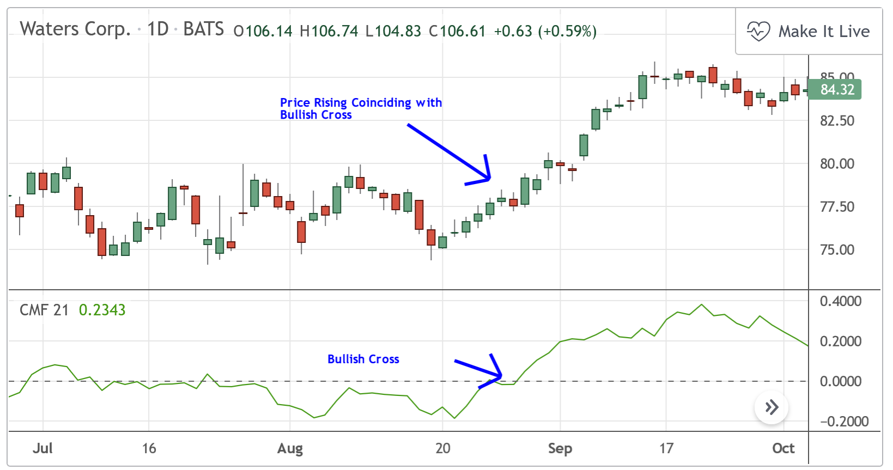
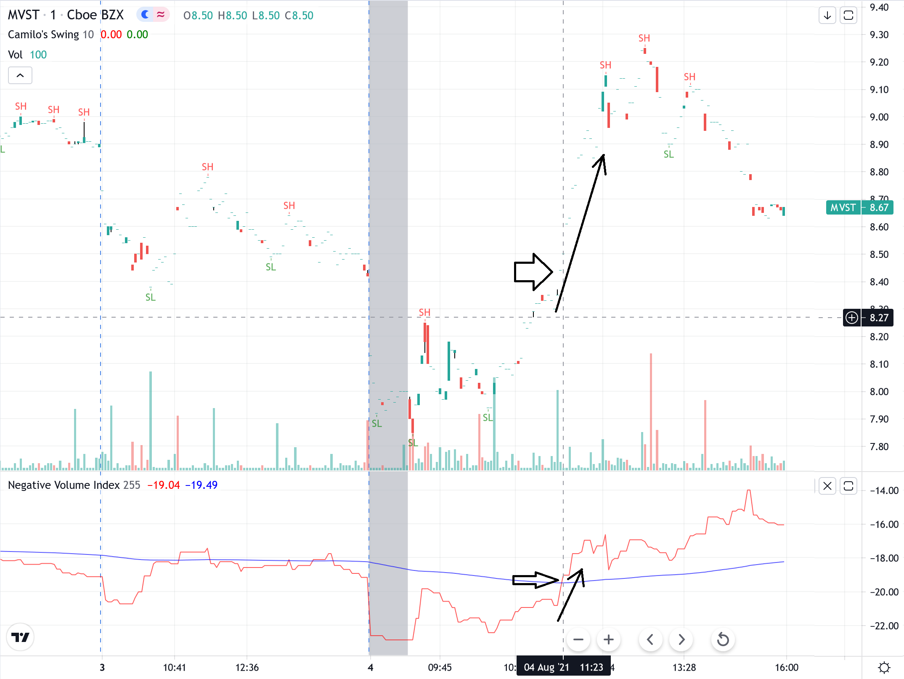

# Volume Indicators {}

Volume is the number of shares traded at a given point in time.

Volume by itself, can at times provide signals of price movement. For instance, you see a peak in price but volume is going down. Basically, there is not motivation in the stock. You can expect prices to fall (see image below)

If you see a major spike in volume, that means the stock will be moving, and could mark the start of a trend.

You should think of volume as the fuel or treasures that runs the battles by the longers and shorters.

```{r, out.width = "100%", echo= FALSE, fig.align = 'center',fig.cap = 'Volume '}

```
There is a set of indicators that provide important signals as the relate to volume...lets check some of them.

## 118 Cummulative volume since the of opening market day {-}
Calculates the volume traded each day. It may help to reveal times when volume has flattened, may be a exhaustion for the day.


```{r, out.width = "100%", echo= FALSE, fig.align = 'center',fig.cap = ' Cummulative volume since the of opening market day'}

``` 

## 119 Cummulative volume since the of opening market week {-}
Similar to the prior indicator, measuring cummulative volume start each new week.

```{r, out.width = "100%", echo= FALSE, fig.align = 'center',fig.cap = ' Cummulative volume since the of opening market week'}

``` 

## 120 Net volume {-}
Net volume is calculated by deducting the uptick volume  by the downtick volume over a period of time. It separates itself from other volume indicators because it makes a clear distinction between whether a market is bullish or bearish.

```{r, out.width = "100%", echo= FALSE, fig.align = 'center',fig.cap = 'Net volume'}

``` 

## 121 Relative Volume (RVOL) {-}

This index compares the current volume by the average volume at that given time of day during a prior number of periods. It basically, tells if the current volume is above or below average volume for that time of day.

If RVOL is 3.5, it means current volume is 3.5 times larger than the average volume.

RVOl is useful indicator for :

Trend reversal: in arrow 1 below, see how price rises while RVOL reduces, this suggests no motivation on the uptrend and a likely reversal.

Trend continuation: in arrow 2, see how after a reversal, RVol is as high as the RVol when price was declining. This suggest strong support for the up-trend.

Consolidation: in arrow 3, see how RVol remains low, this indicates indecision, no-one wants to trade, leading to price consolidation.


```{r, out.width = "100%", echo= FALSE, fig.align = 'center',fig.cap = 'Relative Volume'}

```


## 122 Volume oscillator (VO) {-}
Two moving averages (slow and fast) are applied to volume, and the difference between the two EMAs becomes the volume oscillator. The logic here is that quick changes in volume would become evident from slow volume trend. 

These spikes in short term volume can indicate trend continuation (Orange arrows below) or trend reversal (Black arrows). These alternative patterns can be differentiated by using the color of the candle or momentum indicators.

The longer the 
```{r, out.width = "100%", echo= FALSE, fig.align = 'center',fig.cap = 'Volume oscillators'}

```

## 123 AccumulationDistribution Index (ad) {-}
Accumulation/Distribution indicator utilizes the relative position of the close to it's High-Low range with volume.Then it is accumulated.

Formula:
AD = cumulative ((((Close - Low) - (High - Close)) / (High - Low)) * Volume))

This is actually the simplest benefit of using the ADL. During a strong uptrend or a strong downtrend, The ADL will actually move in the same direction as price confirming the current trend: volume supports the direction of the trend.


```{r, out.width = "100%", echo= FALSE, fig.align = 'center',fig.cap = 'AccumulationDistribution Index'}

```

It can also reveal trends, in divergencies:
Bullish ADL Divergence is when the ADL is trending upwards while price is trending down.
```{r, out.width = "100%", echo= FALSE, fig.align = 'center',fig.cap = 'AccumulationDistribution Index '}

```

## 124 AccumulationDistribution Oscillator (adosc){-}
Applies a MACD or APO to the AD Indicator (124).

## 125 Archer On Balance Volume {-}
No Info.

## 126 Chaikin Money Flow (cmf) {-}
It compares the relative position of close to high and low price (i.e., where is the price trending). Multiple that fcator by volume and average it over a given period of time.


When CMF is closer to 1, buying pressure is higher.
When CMF is closer to -1, selling pressure is higher.

trend continuation: During a Bullish Trend, continuous Buying Pressure (Chaikin Money Flow values above 0) can indicate that prices will continue to rise.

```{r, out.width = "100%", echo= FALSE, fig.align = 'center',fig.cap = 'Chaikin Money Flow'}

```

trend reversal: When Chaikin Money Flow crosses the Zero Line, this can be an indication that there is an impending trend reversal.
```{r, out.width = "100%", echo= FALSE, fig.align = 'center',fig.cap = 'Chaikin Money Flow'}

```

## 127 Ease of Movement (eom) {-}
Ease of Movement is a volume based oscillator that is designed to measure the  relationship between price and volume fluctuating across a zero line. Basically, change in rice relative to the volume:

```{r, out.width = "100%", echo= FALSE, fig.align = 'center',fig.cap = 'Ease of Movement'}

```

It can confirm trends:
```{r, out.width = "100%", echo= FALSE, fig.align = 'center',fig.cap = 'Ease of Movement'}

```

It can also provide entry signal when crossing zero line:
```{r, out.width = "100%", echo= FALSE, fig.align = 'center',fig.cap = 'Ease of Movement'}

```

## 128 Elders Force Index (efi) {-}
Intended to capture  direction, extent and volume.

Calculated as:
(CurrentPeriodClose - (PreviousPeriod Close) X Volume = EFI
13 Period Exponential Moving Average of EFI = EFI (13)

Divergencies can indicate reversal:
```{r, out.width = "100%", echo= FALSE, fig.align = 'center',fig.cap = 'Elders Force Index'}

```

Price corrections when going below zero:
```{r, out.width = "100%", echo= FALSE, fig.align = 'center',fig.cap = 'Elders Force Index'}

```

Work in the opposite direction as well:
```{r, out.width = "100%", echo= FALSE, fig.align = 'center',fig.cap = 'Elders Force Index'}

```
## 129 Klinger Oscillator (kvo) {-}
The idea of this index is to monitor volume given changes in prices. Volume is positive when price is up or negative when price is down. Two types of moving averages are then applied to these data to convert it into an oscillator. The idea is to show how the volume flowing through the securities is impacting its long-term and short-term price direction.

Traders watch for crossovers on the indicator to signal potential price reversals. 

```{r, out.width = "100%", echo= FALSE, fig.align = 'center',fig.cap = 'Klinger'}

```


## 130 Money Flow Index (MFI) {-}
The amount of money going into a trading period is equal to the stock price at the given period multiplied by the shares (volume) traded in that period. 

In this index, the amount of money during prior periods (Often 14) is separated between the periods when prices were up or down.  The index simply calculates the ratio of money flowing when prices when up to the times when prices were down.

This is very similar to the RSI index. The main difference that MFI includes volume.

As RSI, values above 80 indicates that the stocks is overbought (Many people buying) and values below 20 is oversold. As RSI, MFI can be use in divergences with price to spot price reversals.

In the image blow, note how price is going up, but the total capital (money flowing) is going down. From this divergence in patterns, you can expect that prices would reverse and start going down.

```{r, out.width = "100%", echo= FALSE, fig.align = 'center',fig.cap = 'Money Flow Index'}

```

## 131 Negative volume index (NVI) {-}

The premise of this index is that smart-money trades during relatively quiet periods of decreasing volume, while "non-experts" trade when volume is rising. By checking trading during periods of declining volume, this index claims to measure the mindset of the smart money professionals. 

Negative Volume Index simply calculates the difference in price between the current and prior period, only when current volume is smaller than the prior volume.

The NVI gives buying signals when the price is increasing but the volume is decreasing. Supposedly, this indicates smart-money is buying and is time to buy. 

NVI can also be combined with an EMA, to indicate:

1. Reversals, when when NVI crossovers the signal line (e.g., a 255-period moving average).

2. Bull trends, when the NVI is above the 255-period moving average, and

3. Bear trends, when NVI is below the 255-period moving average.


```{r, out.width = "100%", echo= FALSE, fig.align = 'center',fig.cap = 'NVI'}

```


## 132 On balance volume (OBV) {-}

To calculate this index,

if the price at a given period when up, then the period's volume is added to the prior volume. 

if the price at a given period when down, then the period's volume is subtracted to the prior volume. 

OBV measures buying and selling pressure as a cumulative indicator, adding volume on up periods and subtracting it on down periods.

```{r, out.width = "100%", echo= FALSE, fig.align = 'center',fig.cap = 'On balance volume '}
knitr::include_graphics("images/obv-9-ibmshch.png")
```

Basically, at any point in time, it tells you who, the shorters or longers, has collected the most treasures.

The person that invented this index suggested that volume precedes price. In other words, a change in volume is then followed by a change in price.

Basically, if OBV is rising while prices are either flat or moving down, expect prices to move higher. If OBV is falling while prices are either flat or moving up, expect prices to move lower. 

OBV can also be used as signals of trend reversals.


### OBV divergence {-}

Rising OBV during a trading range indicates accumulation, which is bullish.

If OBV is trending higher, while price is going down, expect for price to reverse.

```{r, out.width = "100%", echo= FALSE, fig.align = 'center',fig.cap = 'On balance volume divergence'}

```

In the opposite, if price is rising while OBV is declining, it signals a price decline ahead. Basically, the longers are wining some recent battles but are running low in ammunition.


```{r, out.width = "100%", echo= FALSE, fig.align = 'center',fig.cap = 'On balance volume divergence'}
knitr::include_graphics("images/OBV Negative.png")
```

### OBV trend confirmation {-}
OBV can also be used to confirm a trend. If you expect price to go down, OBV should be going down.

When expecting a trend to go up, OBV should be going up.

So OBV can be used to play safe. Basically, you can look at this indicator and join the team on the lead.

```{r, out.width = "100%", echo= FALSE, fig.align = 'center',fig.cap = 'On balance volume confirmation'}

```

### OBV Crossover {-}

You can also apply a Moving Average to the OBV trend and use that to identify crossovers that can signals entry and exits points. Basically, select as a selling signals times when the OBV moves below its moving average.

```{r, out.width = "100%", echo= FALSE, fig.align = 'center',fig.cap = 'On balance volume crossover'}

```


## 133 Positive Volume Index (pvi) {-}
The Positive Volume Index is a cumulative indicator that uses volume change in an attempt to identify where smart money is active. 

The PVI is typically followed in conjunction with a negative volume index (NVI) calculation. Together they are known as price accumulation volume indicators. 

On days of increasing volume, you can expect prices to increase, and on days of decreasing volume, you can expect prices to decrease. This goes with the idea of the market being in-gear and out-of-gear. Both PVI and NVI work in similar fashions: Both are a running cumulative of values, which means you either keep adding or subtracting price  rate of change each day to the previous day`s sum. In the case of PVI, if today`s volume is less than yesterday`s, don`t add anything; if today`s volume is greater, then add today`s price rate of change. For NVI, add today`s price rate of change only if today`s volume is less than yesterday`s.


calculates as:
```{r, out.width = "100%", echo= FALSE, fig.align = 'center',fig.cap = 'Positive Volume Index'}

```

PVI follows the craw, and the crowd typically loses money, or fairs less well than professional traders. Therefore, the PVI is tracking the "not-smart money."

```{r, out.width = "100%", echo= FALSE, fig.align = 'center',fig.cap = 'Positive Volume Index'}

```

## 134 Price Volume (pvol) {-}
Returns a series of the product of price and volume. The volume price trend indicator is used to determine the balance between a security’s demand and supply. The percentage change in the share price trend shows the relative supply or demand of a particular security, while volume indicates the force behind the trend. The VPT indicator is similar to the on-balance volume (OBV) indicator in that it measures cumulative volume and provides traders with information about a security’s money flow.

The smoothed version appear to provide better signals.
```{r, out.width = "100%", echo= FALSE, fig.align = 'center',fig.cap = 'Price Volume'}

```

## 135 Price Volume Rank {-}
PVR compares the direction of the change in price (up or down) to the direction of the change in volume and assigns a number to that specific relationship. By quantifying price/ volume interaction, P-V rank seeks to determine our position within a typical market cycle.

```{r, out.width = "100%", echo= FALSE, fig.align = 'center',fig.cap = 'Price Volume Rank'}

```

## 136 Price Volume Trend (pvt) {-}

The Price-Volume Trend utilizes the Rate of Change with volume to  and it's cumulative values to determine money flow. Similar to OBV, but the amount of volume added or subtracted to/from the PVT total is dependent on the amount of the current day's price rising or falling compared to the previous day's close.
    
Calculated as:
PVT = [((CurrentClose - PreviousClose) / PreviousClose) x Volume] + PreviousPVT

Useful to confirm, or indicate trend reversal depending on level of divergence.:
```{r, out.width = "100%", echo= FALSE, fig.align = 'center',fig.cap = 'Price Volume Trend '}

```

## 137 Volume Profile {-}
Displays  the price at which volume is being traded. The price with the most volume is call point control (POC). It can help to reveal support prices. Deviations from POC can reveal  short term deviations.

```{r, out.width = "100%", echo= FALSE, fig.align = 'center',fig.cap = 'Volume Profile '}
knitr::include_graphics("images/vp.png")
```

## 138 Weis wave volume {-}
Provides a cumulative volume since the last zig-zag low or high.

```{r, out.width = "100%", echo= FALSE, fig.align = 'center',fig.cap = 'Weis wave volume '}

```