# New indicators

Indicators below may be grouped into the categories above, but were found after the original list was compiled.

## 139 Polarized Fractal Efficiency {-}
Polarized Fractal Efficiency's signature characteristic is its use of fractal geometry in determining how efficiently a security's price is moving.  It determines the strength and direction of the trend.


```{r, out.width = "100%", echo= FALSE, fig.align = 'center',fig.cap = 'Polarized Fractal Efficiency'}
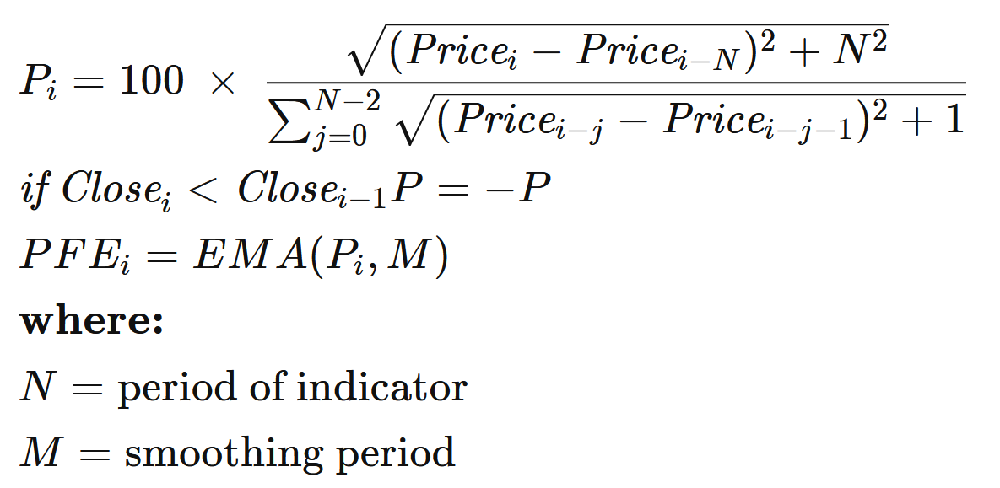
```

The Polarized Fractal Efficiency (PFE) indicator measures the strength of the trend by its position relative to the zero line. As a general rule, the further the PFE value is away from zero, the stronger and more efficient the given trend is. A PFE value that fluctuates around the zero line could indicate that the supply and demand for the security are in balance and the price may trade sideways. 

A reversal in the direction of the PFE indicator and its movement away from zero is generally considered a buy signal.


```{r, out.width = "100%", echo= FALSE, fig.align = 'center',fig.cap = 'Polarized Fractal Efficiency'}
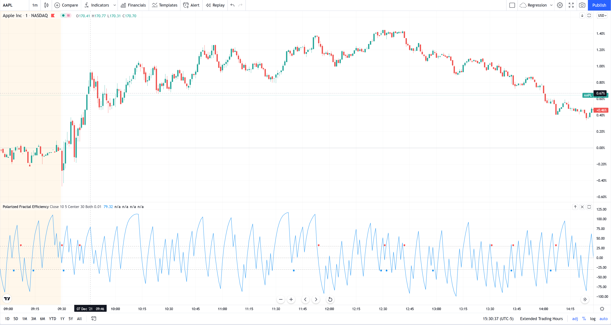
```

## 140 Random Walk Index {-}
RWI compares a security's price movements to random movements in an effort to determine if it's in a statistically significant trend.

The bounds of randomness, also known as displacement distances, could be calculated by taking the square foot of the number of binary events, which refer to two-sided outcomes with equal probability (like a coin toss). Logically speaking, any movement outside of these bounds suggests the movement is not inherently random in nature. The RWI applies these mathematical principles when measuring an uptrend and downtrend to determine if it's random or statistically meaningful. 

The index delivers two ouputs for the high and low trading prices.

```{r, out.width = "100%", echo= FALSE, fig.align = 'center',fig.cap = 'Random Walk Index High'}
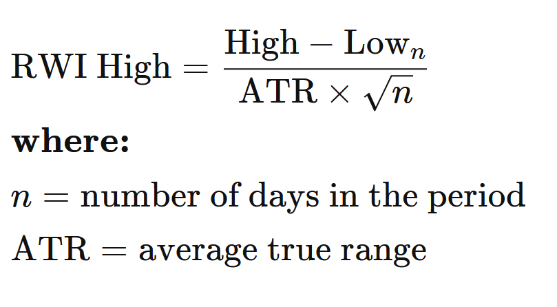
```

the Low index is similar:

```{r, out.width = "100%", echo= FALSE, fig.align = 'center',fig.cap = 'Random Walk Index Low'}
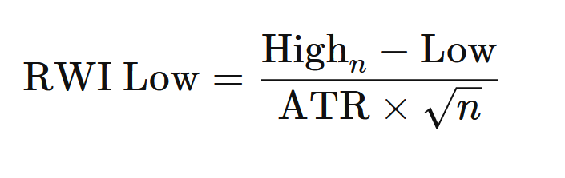
```

Readings above 1.0 indicate that a security is trending higher or lower, while readings below 1.0 suggest that a security may be moving randomly. The two lines can be substracted to create a single indicator, that appears to capture the signals from the two lines:
```{r, out.width = "100%", echo= FALSE, fig.align = 'center',fig.cap = 'Random Walk Index'}
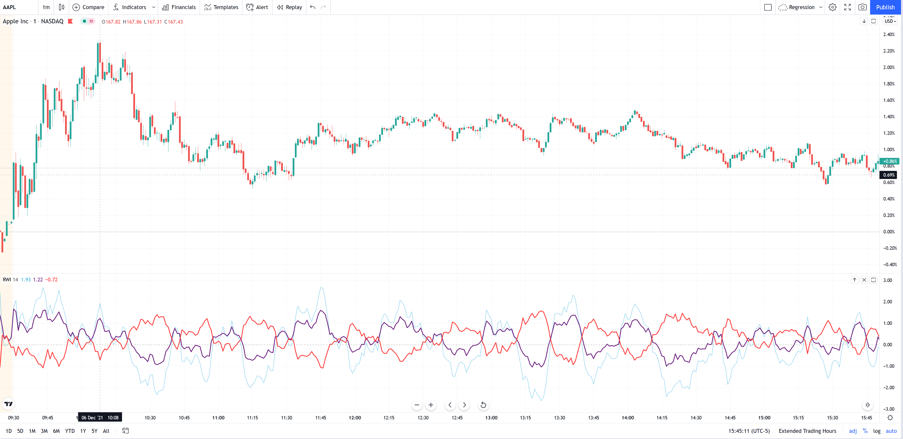
```


Oftentimes, traders and market timers will enter long positions when a long-term RWI High is greater than 1.0 and the short-term RWI Low is also above 1.0. This means the trader tracks two RWI calculations, a longer-term one, say 64-periods, and a short-term one, say seven-periods. 

```{r, out.width = "100%", echo= FALSE, fig.align = 'center',fig.cap = 'Random Walk Index at two lengths'}
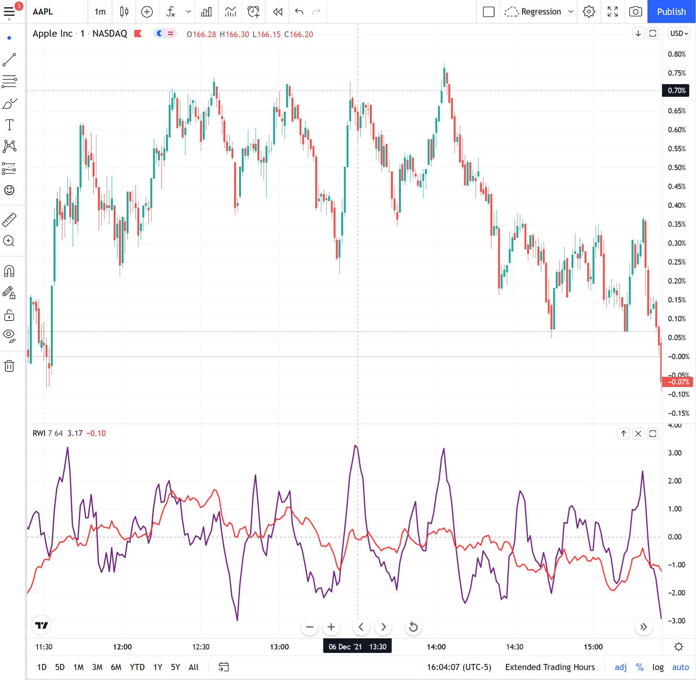
```

## 141 Demarker (DeM) {-}

DeM compares the most recent maximum and minimum prices to the previous period's equivalent price to measure the demand of the underlying asset. From this comparison, it aims to assess the directional trend of the market. 

It helps identify entry or exit points by capitalizing on probable imminent price trends ( it is a “leading” indicator because it signals an imminent change in price trend).

In contrast to  Relative Strength Index, which focuses on the close price, DEM focus on maximumn and minum prices. It could benefr from an EMA (Ornage line, below) to remove short-term variability.


```{r, out.width = "100%", echo= FALSE, fig.align = 'center',fig.cap = 'Demarker'}
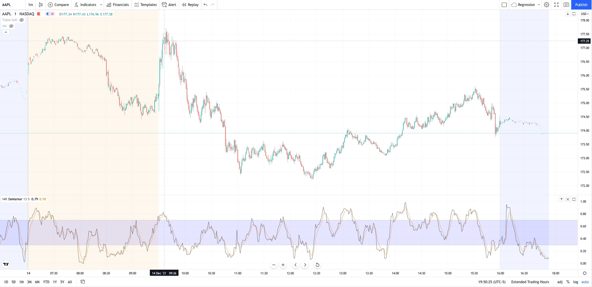
```


## 142 Decision Point {-}
The DecisionPoint Price Momentum Oscillator is derived by taking a 1-period rate of change and smoothing it with two custom smoothing functions. The custom smoothing functions are very similar to Exponential Moving Averages, but, instead of adding one to the time period setting to create the smoothing multiplier (as in a true EMA), the smoothing functions just use the period by itself. 

The PMO oscillates in relation to a zero line. Normally, the PMO direction indicates if strength is increasing or decreasing, while the steepness of the trend angle demonstrates the power behind the move. Since this is an internal ratio calculation (versus external, like the standard relative strength calculation, which divides one price by another price index), it returns a result that is normalized and can be compared to the PMO result of any other security or index. Therefore, chartists can rank a list of securities or indexes in relative strength order simply by using their PMO values. The list does not have to be homogeneous; the PMO can be used to rank market indexes, stocks and mutual funds in the same list. 

The PMO also gives hints of important direction changes by forming divergences against the price index. The most reliable signals are generated when the PMO is near the extremes of its normal range, or when a direction change and crossover occurs following a strong, clean, straight PMO move

```{r, out.width = "100%", echo= FALSE, fig.align = 'center',fig.cap = 'Decision Point'}
knitr::include_graphics("images/dp.png")
```

## 143 B3 directional {-}
Calculation similar to DeMarker, but it adds several smoothing, and an standardization by ATR.

```{r, out.width = "100%", echo= FALSE, fig.align = 'center',fig.cap = 'B3 directional'}
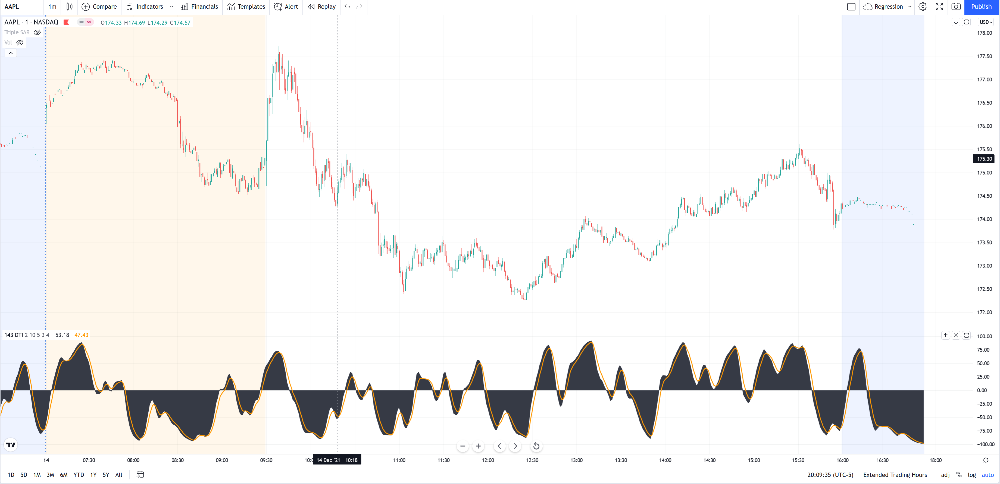
```

## 144 Relative to past Week's High Low {-}

At least two strategies can be identified for using current price to prior weeks high and lows:

### Donchians weekly rule {-}
Donchian suggested that markets move on 4 weeks cycles, such that when a stock ranks at the top of the last 4 weeks, it will result in a price momentum, marking a good entry point for long trades. Exits should be taken when price hits the last four weeks bottom. See image below.

The problem of the raw rule is that by exiting at the bottom of the last four weeks, there are not as much gains, as if to exit earlier. As such, it is recommended to look for alternative points of exit.

```{r, out.width = "100%", echo= FALSE, fig.align = 'center',fig.cap = 'Four week rule'}
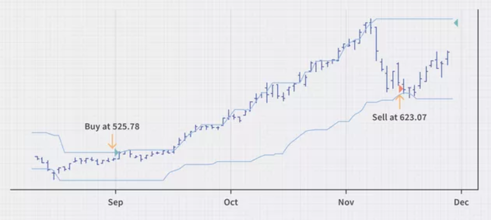
```

### 52 weeks high lows {-}
When a stock gets closer to the highest or lowest price of the past 52 weeks, large volatility is expected.

If it gets closer to the highest 52week price, it is likely because of strong fundamentals and/or positive news, which may then allow the stock to keep moving up. It has also been suggested that acquisitions are likely to move forward for the stock company near its 52w high. Altogether prices may continue to go up (Arrow B in the plot below).

The other possibility at the 52week high, is that long positions get closed to secure profits; and the massive sell off can trigger a price reduction (Arrow A in the plow below).

Differentiating between these alternative options can be done with the use of candles. For instance, if price surpasses the 52week high, but at the end of day closes below it, it should happen with a shooting start candle (Price was force high but did not succeed).


```{r, out.width = "100%", echo= FALSE, fig.align = 'center',fig.cap = 'Relative to 52 Weeks HighLow'}
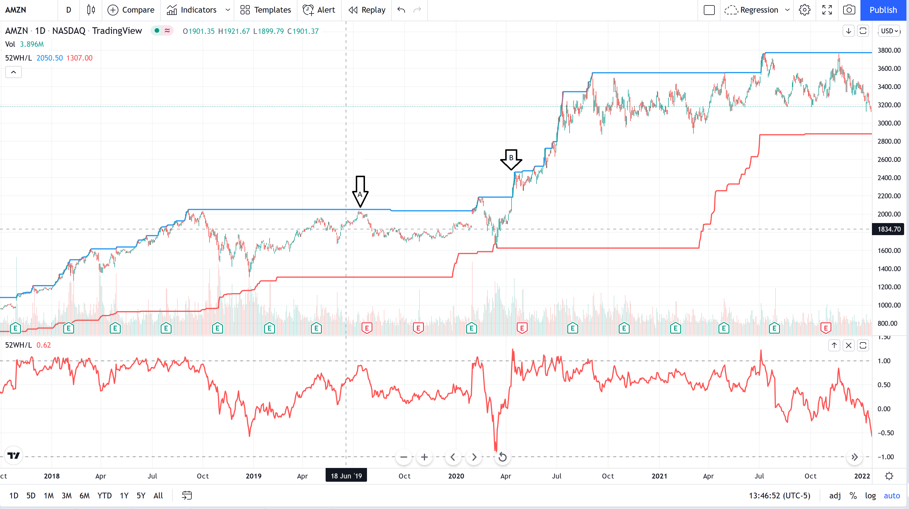
```

Similar volatility can be expected when a stock reaches its lowest price in the last 52Weeks. Price near the low 52w can force traders to close short positions (that is likely as low as price will get); in turn massive buying can trigger price increase (Arrow A). The opposite is also likely, when the price continue to go down (Arrow B). Perhaps a hammer candle should can help differentiate between these alternatives.

```{r, out.width = "100%", echo= FALSE, fig.align = 'center',fig.cap = 'Relative to 52 Weeks HighLow'}
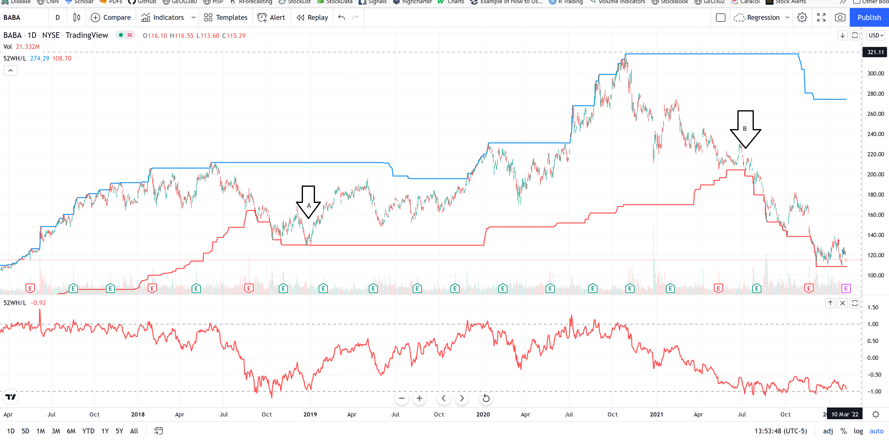
```
One study showed that when an entire sector nears its 52-week high, individual stocks within that sector are likely to see excess gains that are higher than stocks that breach 52-week highs in a mixed or downtrodden sector.


Additional [here](https://www.moneycrashers.com/52-week-high-stocks/)
and [here](https://www.investopedia.com/terms/1/52weekhighlow.asp)

### Momentum in weekly winners and lossers {-}
Rather that looking at current price relative to last year or last month, this indicator looks at the winners from last week. Several studies have indicated that after a given stock ranks at the top or bottom of all stocks weekly (winners and losers), results in predicable patterns of price change during the following weeks.

This idea is at the core of "The Stocktwits Top 25 reports", which is realease each saturday by Stocktwits.
```{r, out.width = "100%", echo= FALSE, fig.align = 'center',fig.cap = 'ST Top 25 S&P 500'}
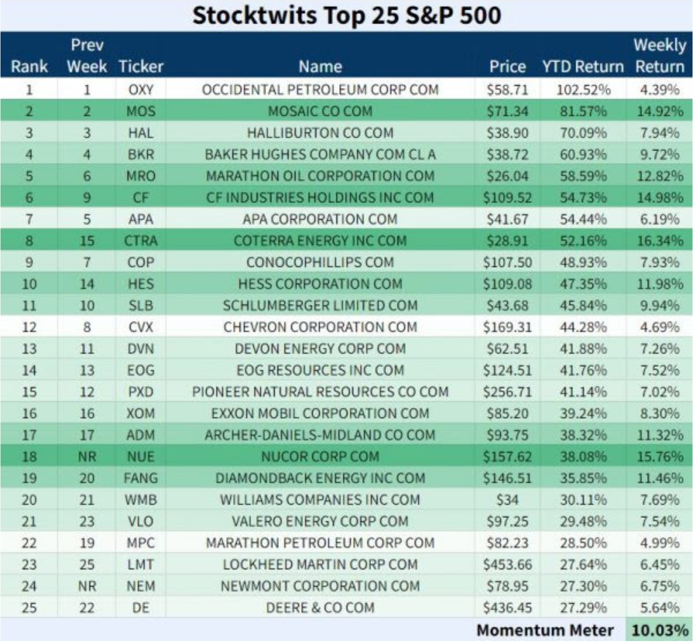
```


## 145 Ratio  wick to body{-}

It is common for the trajectory of an up trend to start with larger body candles, which indicate effective price action in which the closing price is consistently higher than the opening price. As the trend approaches its end, the candle wicks increase while the bodies may decline. Basically, there is some pressure in the uptrend (as noted with the larger wicks), which is not effective at maintaining the trend (which is indicated by the closing getting closer to the opening, that is the candles start having smaller bodies). As such the comparison between the body and wick of candles may be good indicators for the start and end of the trend. 


```{r, out.width = "20%", echo= FALSE, fig.align = 'center',fig.cap = 'Ratio body to shadow'}
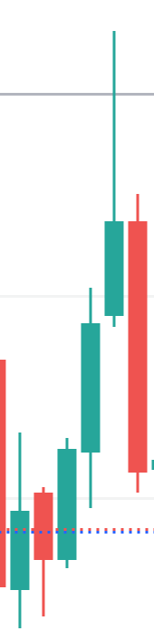
```


## 146 Divergency  wick to body {-}

The Ratio  wick to body indicator (Indicator #148) attempts to describe the beginning or likely end of a trend by calculating the ratio of the wick to the body of the candles.

Such a ratio has a problem that it is based on each single candle. The divergence indicator, attempts to deal with that problem by looking at the correlation between bodies and wicks of recent candles. Values moving towards -1 indicate a wick to body divergence. Values near to 1 indicate that the bodies and the wicks are equally increasing. This indicator can adjust the time resolution of the candles, and the time period over which the correlation is done.


```{r, out.width = "100%", echo= FALSE, fig.align = 'center',fig.cap = 'Divergency  wick to body'}
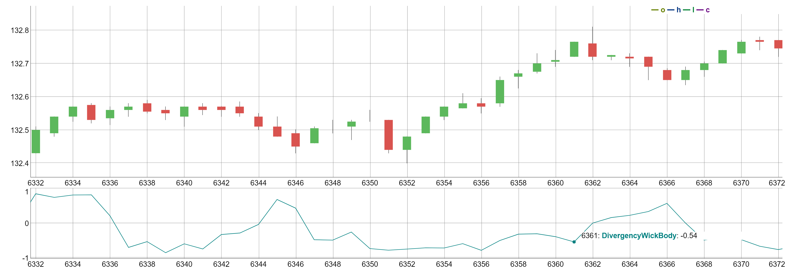
```


## 147 Relative position to after hour market {-}
Price variation after trading hours is well know to be very volatility due to reduced liquidity. After opening predictable price patterns came occur.

This indicator calculates the price position of a given candle relative to the prior minimum and maximum price during off market hours (i.e., minimum and maximum price from 4pm to 8 pm the prior day and 4am to 9:30am from the current day).

A value of +2 indicates that the given candle is twice the range between the minimum and maximum price after trading hours. If positive, the candle is above the maximum after hour price. If negative, the candle is below the minimum after hour price.

```{r, out.width = "100%", echo= FALSE, fig.align = 'center',fig.cap = 'Relative to After hour '}
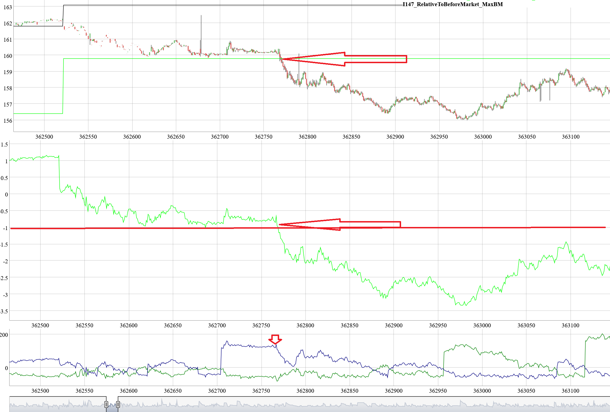
```

## 148 Relative position to prior market day {-}
Price variation during the prior market day can indicate potential benchmarks. 

This indicator calculates the price position of a given candle relative to the minimum and maximum price during the prior day (i.e., minimum and maximum price from 9:30am to 4:00pm the prior day).

A value of +2 indicates that the given candle is twice the range between the minimum and maximum price during the prior day. If positive, the candle is above the maximum price the day before. If negative, the candle is below the minimum price the prior day.

```{r, out.width = "100%", echo= FALSE, fig.align = 'center',fig.cap = 'Relative to price range prior day'}
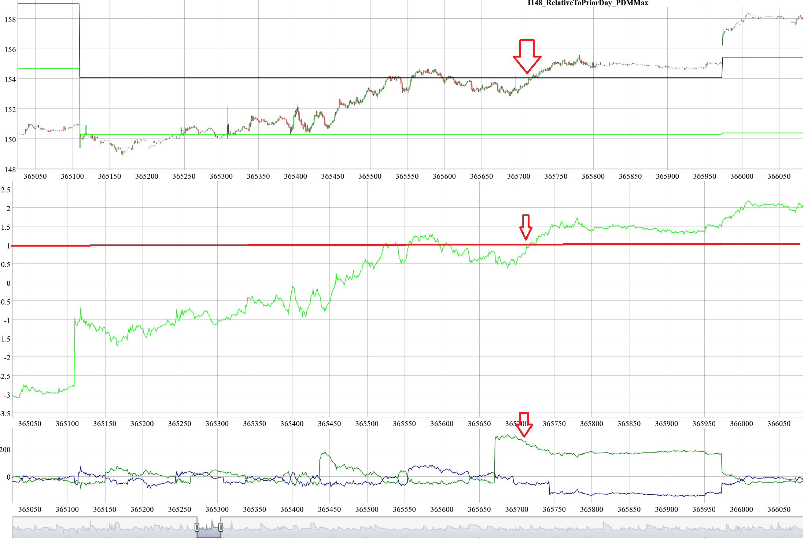
```

## 149 Point of Control prior Off market (OnPoc) {-}
This indicator calculates the volume profile of the prior off market data (i.e., after market yesterday and before market today) to estimate the Point of Control, which is used as reference for the price data of the current day. This offmarket POC can indicate pockets of volume, which in turn can reveal important points of support or resistance.


```{r, out.width = "100%", echo= FALSE, fig.align = 'center',fig.cap = 'POC prior off market'}
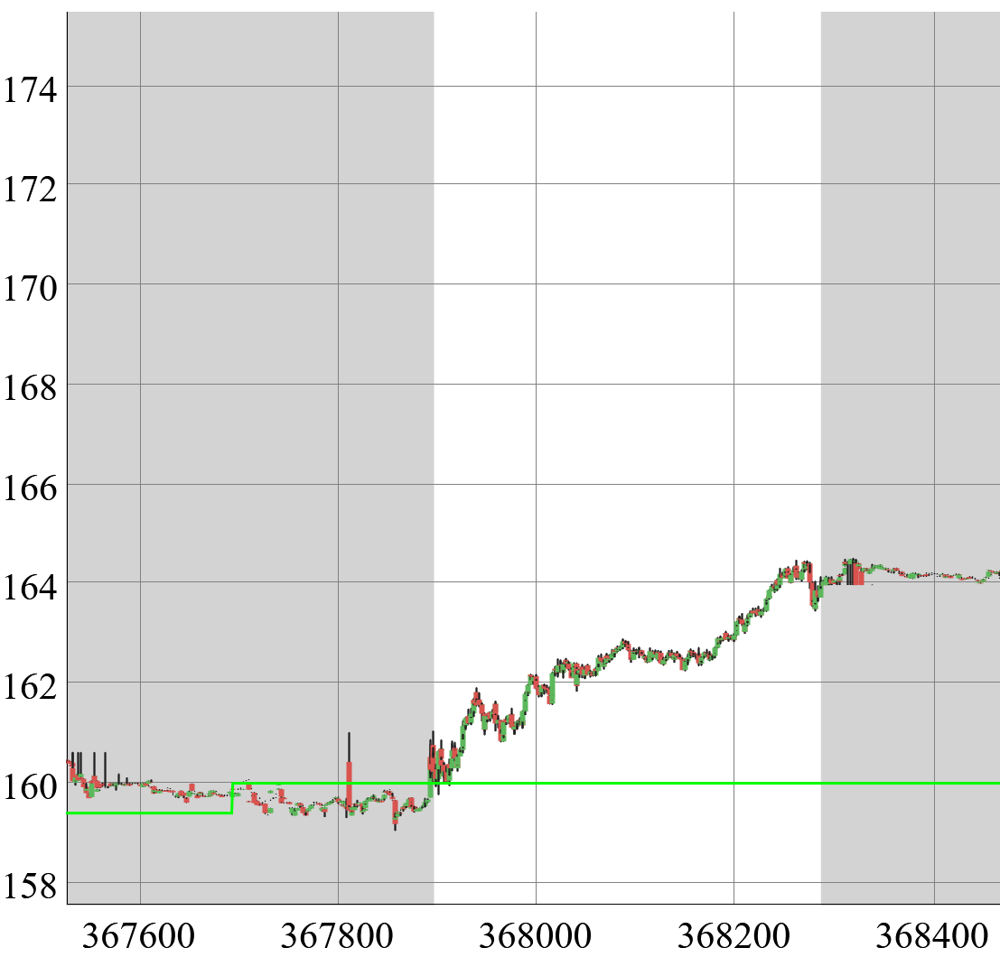
```


## 150 yesterday's point of Control (YPoc) {-}
This indicator calculates the volume profile of the prior market day to estimate the Point of Control, which is used as reference for the price data of the current day. Yesterday's POC can indicate pockets of volume, which in turn can reveal important points of support or resistance.


```{r, out.width = "100%", echo= FALSE, fig.align = 'center',fig.cap = 'Yesterdays POC'}
knitr::include_graphics("images/Ypoc.png")
```


## 151 yesterday's Min Max and Mid (Yh, Yl, Ym) {-}
This indicator calculates the minimum, maximum and mid value of price (or any other indicator) from the prior day's market data. These values can reveal important points of support or resistance.

Note how breaking above yesterday's high, results in price breaking up.

```{r, out.width = "100%", echo= FALSE, fig.align = 'center',fig.cap = 'Yesterdays High Low Mid'}
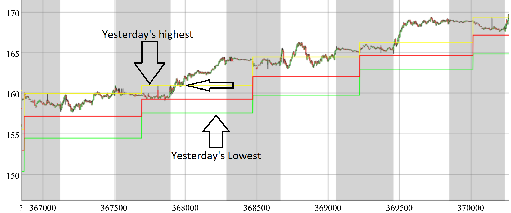
```

## 152 Prior off market Min Max and Mid (Oh, Ol, Om) {-}
This indicator calculates the minimum, maximum and mid value of price (or any other indicator) from the prior overnight (off market) market data (Includes yesterday's after hours trading and today's before market trading). These values can reveal important points of support or resistance.

Note how breaking above overnight's high, results in price breaking up.

```{r, out.width = "100%", echo= FALSE, fig.align = 'center',fig.cap = 'Overnights High Low Mid'}
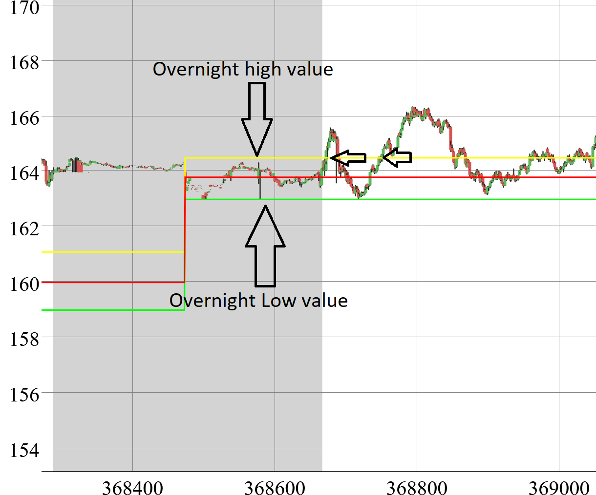
```

## 153 Lazzy Squeeze {-}
The squeeze indicator (#45) assess the extent to which the Bolliger Bands are inside the Keltner's Channels, when they are the market is considered to be in a consolidation. When the BB become larger than the KC bands, the market is trending. This new indicator (153), calculates the difference between the BB and the KC bands. When values are Zero, the BB bands are fully inside the KC bands. In the opposite the indicator provide the amount of price the BB are outside the KC bands (market is trending). 

See how in the image below, breaking up from a squeeze can turn into a long good profit.
```{r, out.width = "100%", echo= FALSE, fig.align = 'center',fig.cap = 'Lazzy Squeeze'}
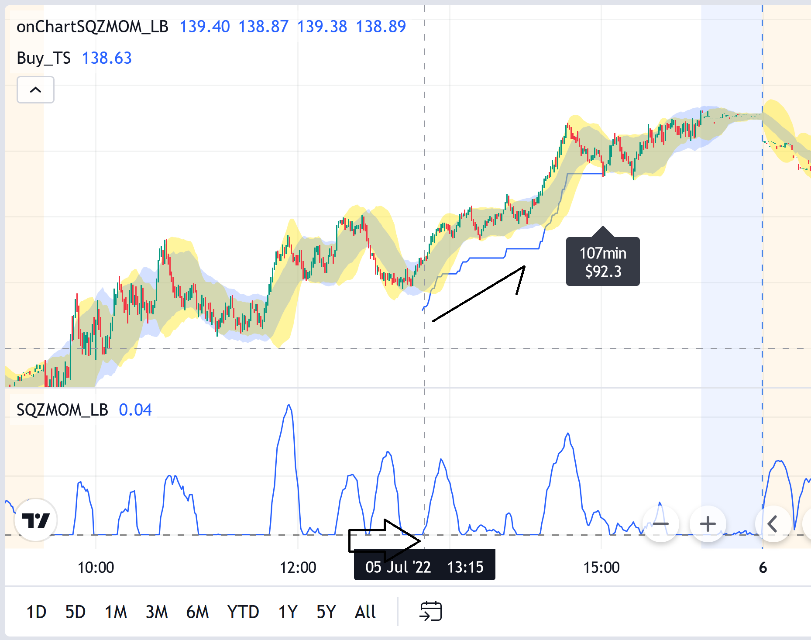
```


The Lazzy Squeeze can be calculated differently as:
each time the BB is inside the KC bands, get zero (pirce is consolidated), in the opposite calculate  the BB minus the KC bands (in other wordss how much larger are the BB bands that the KC bands, market is trending)


```{r, out.width = "100%", echo= FALSE, fig.align = 'center',fig.cap = 'Lazzy Squeeze at different lengths'}
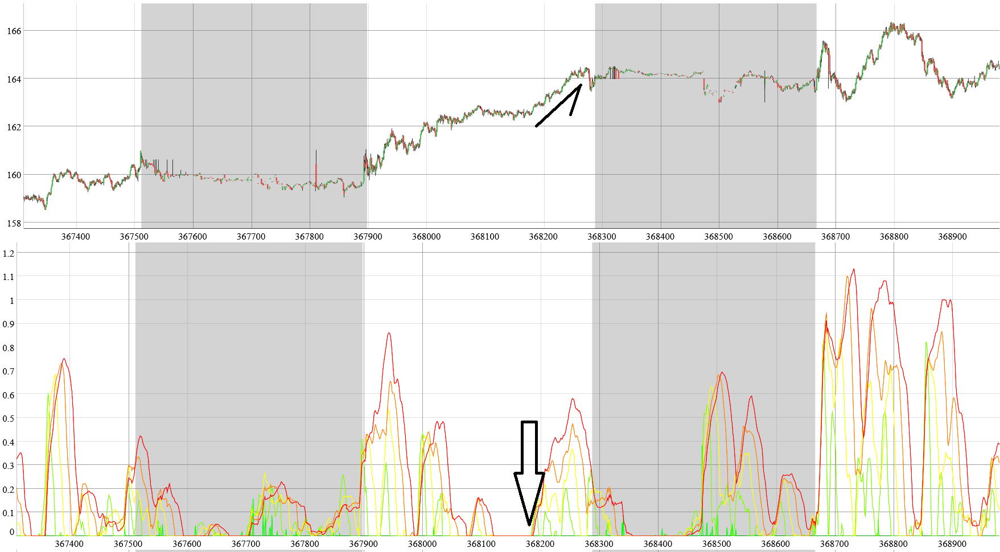
```


## 154 DesAccelerarion {-}
This indicators looks at changes in the body size of the candles. When a trend is approaching its end, it is common for the body of the candles to become smaller. This indicator simply standardizes all candles and quantifies the difference between any one candle and its prior candle. Extreme negative values indicate a desacceleration, and likely the start of a consolidation or the end of a trend (i.e., a likely reversal.)


The indicator can be calculated at different time frame (time of window used in the candles). En the example below, one  minute candles are show, and the DesAccelerarion indicator for one minute is shown in green. From the Value, it can be seen that the green candes reduced to about 10% of the red candle. In other candles with larger time frames (red and orange), the desacellration was larger, probably indicating a considerable reducion in the uptrend and potentially a reversal or correction.

```{r, out.width = "100%", echo= FALSE, fig.align = 'center',fig.cap = 'DesAccellerarion'}

```

## 155 Average proportional capital (CPM) {-}
This indicator display the current capital invested in a stock (volume * price) relative to the highest capital invested in the recent past.The indicator can be suited to display reversals.


```{r, out.width = "100%", echo= FALSE, fig.align = 'center',fig.cap = 'CPM'}
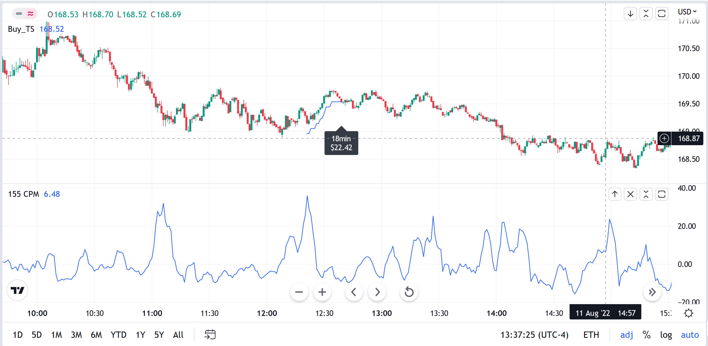
```


## 156 Velocity {-}
This indicator uses the angle of price tendency as indication of the speed at which price is moving up or down. This should capture the same attributes as momentum (difference in price) and ROC (relative change in price), but on different units. The angle/velocity of price change should be stepper at the start of strong price movements.

```{r, out.width = "100%", echo= FALSE, fig.align = 'center',fig.cap = 'Velocity'}
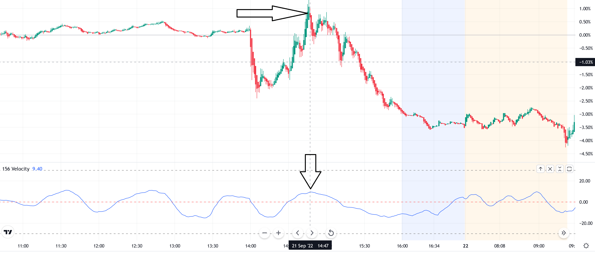
```


## 157 Acceleration {-}
This indicator uses is the angle of the velocity (#156) (like the speed of the speed). The speed of price change should remain constant at the start of a major price movement. Note in the image below how a steady price decline, was refelected in a constant acceleration. In the opposite a price reversal should see fast changes in acceleration.

```{r, out.width = "100%", echo= FALSE, fig.align = 'center',fig.cap = 'Acceleration'}
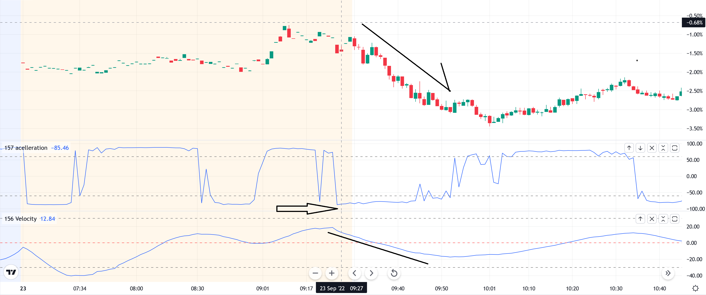
```


## 158 Physical Momentum {-}
Many trading platforms refer to momentum as the change in price (a.k.a speed), the relative version of which is call Rate of Change (ROC). In Physics, however, momentum is speed times mass. It aims to capture the inertia with winch an object will move given its speed and mass. Think of a small car and a large truck (Different masses), moving at the same speed. If you were to break both automobiles at the same time, given the larger mass, the truck will move further. In trading, one could think of volume as the mass, and this indicator simply measures momentum as it is meant in physics: velocity times volume.

Commoly, the start of a big price movement should coincide with a large Physics Momentum, there is motivation/interest in the trend of the current price.

```{r, out.width = "100%", echo= FALSE, fig.align = 'center',fig.cap = 'Physical Momentum'}
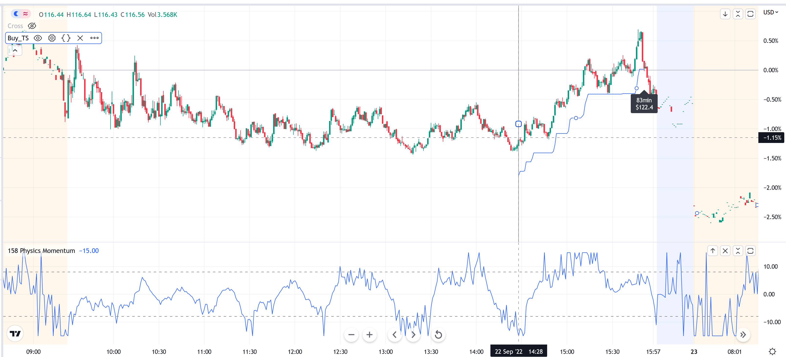
```


## 159 Force {-}
AS in physics, force is measured here as acceleration times mass (volume)

Commonly, the start of a big price movement should coincide with a large Physics Momentum, there is motivation/interest in the trend of the current price.

```{r, out.width = "100%", echo= FALSE, fig.align = 'center',fig.cap = 'Force'}
knitr::include_graphics("images/Force.png")
```

## 160 ZAPO {-}
The APO indicator aims to capture the price deviance from a mean (MACD, does a similar think). APO then yields an absolute value, which carries two problems, 1) within a given stock it is hard to determine is the deviance is large or small, 2) the indicator cannot be compared among stocks. ZAPO calcualtes a Z-score on the APOs, which allows to reinterpret the APO in terms of the number of standard deviations prices is above or below the mean. This allows to assess is the APO is large or small, which being comparable among stocks.

Any price reversal, should in principle coincide with an extreme ZAPO value.


```{r, out.width = "100%", echo= FALSE, fig.align = 'center',fig.cap = 'ZAPO'}
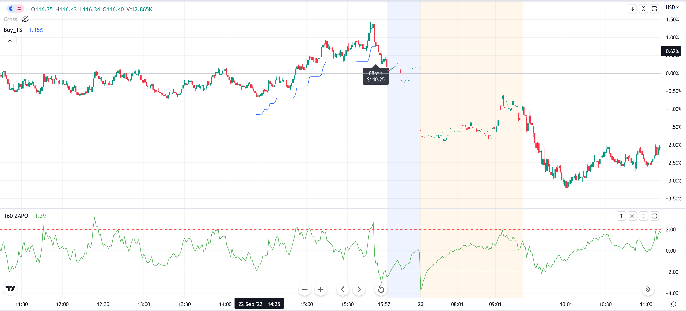
```

## 161 Volatility width {-}
This indicator calculates the price range (difference between highest and lowest value), over a prior period of time, as percentage. it can be used to assess if price is consolidating, and or whether the variation in recent price is within the desire profit take. If desite profit take is say 1%, but this indicator yields only 0.5% in recent past, then it will not be wise to enter.


```{r, out.width = "100%", echo= FALSE, fig.align = 'center',fig.cap = 'Volatility width'}
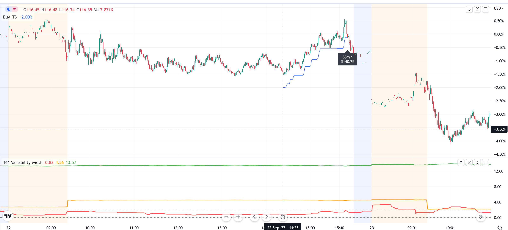
```

## 162 Blai5 Koncorde {-}
This indicator combines four indicators of tendency with 2 of volume. Extended details are provided [here](https://www.blai5.net/blai5-koncorde-que-es-y-como-usarlo/).

Here we only show the "marron" line, which combines rsx, money flow, bollinger and stochastic. In combination, they yield a picture of the direction and strength of the tendency.


```{r, out.width = "100%", echo= FALSE, fig.align = 'center',fig.cap = 'Blai'}
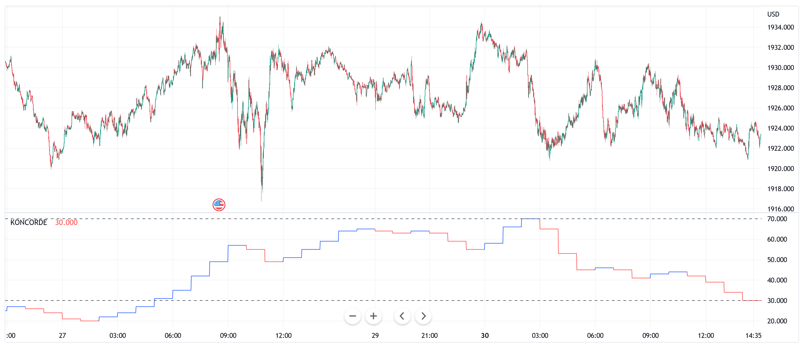
```


## 163 Moras compression {-}

Ultimately, we know the price is consolidated (current volatility ) when it starts raging within a narrower band that we are use to see ( Historical volatility ), so the ratio of the current to historical volatility becomes a straightforward identification of consolidation zones and that is what this indicator provides.

The indicator is scaled such that values near zero mean price is compressed and values near 100 price is over-extended. The indicators is designed to allow different time-frames, while avoiding repainting.


```{r, out.width = "100%", echo= FALSE, fig.align = 'center',fig.cap = 'Moras compression indicator'}
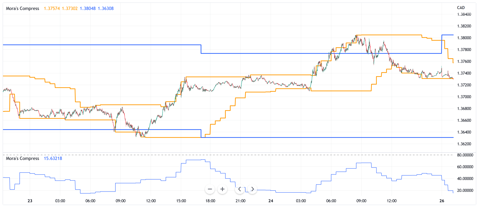
```
