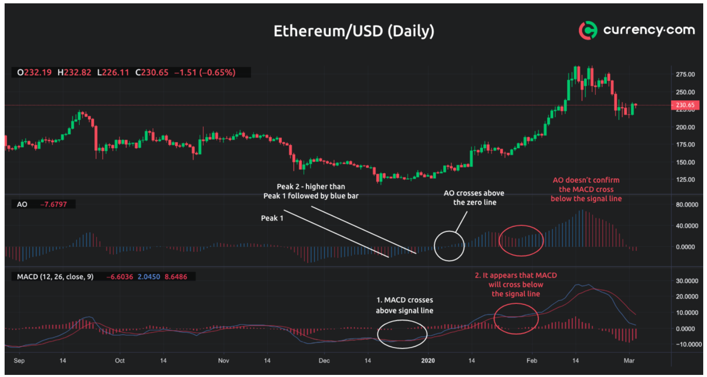

# Combinations

Individually, most technical indicators add value to an strategy, but rarely they will be suffient alone, as they all have limitations. A way to improve the odds is to satisty the limitations in one indicator with the strengths of another.

As such, several strategies are proposed that combine multiple indicators.

## MACD and Awesome oscillator {-}
Alone MACD and AO provide many false positive signals (i.e., signaling a trade that ends up being not right). To address this, one can detect entry and exit signals using the MACD indicator and confirm the signals with the AO Indicator. As suggested [here](https://currency.com/awesome-oscillator-vs-macd).

```{r, out.width = "100%", echo= FALSE, fig.align = 'center',fig.cap = 'MACD and Awesome oscillator'}

```

The white circle displays the point at which the MACD line crosses above the signal line, which is an indication of potential bullish movement. The bullish movement is confirmed when the AO indicator exhibits a fully formed bullish twin peaks alert by forming two peaks with the second one being higher, followed by a blue bar.


In another example, see the red circle; here  the MACD line cross below the signal line, which is an alert for potential bearish movement. However, the AO does not confirm the bearish move with neither of its signals as the histogram does not cross the zero line, it does not fulfill the twin peaks alert and also the saucer bar set-up does not exist. In fact, all the AO is moving above zero (Commonly bull territory).