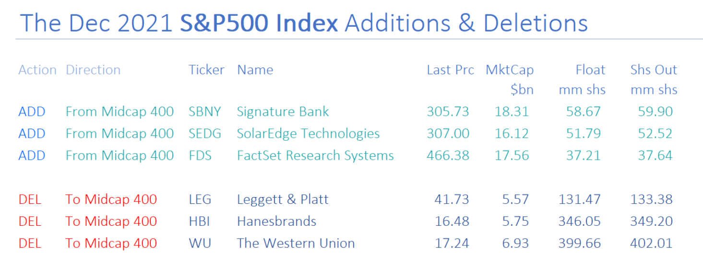
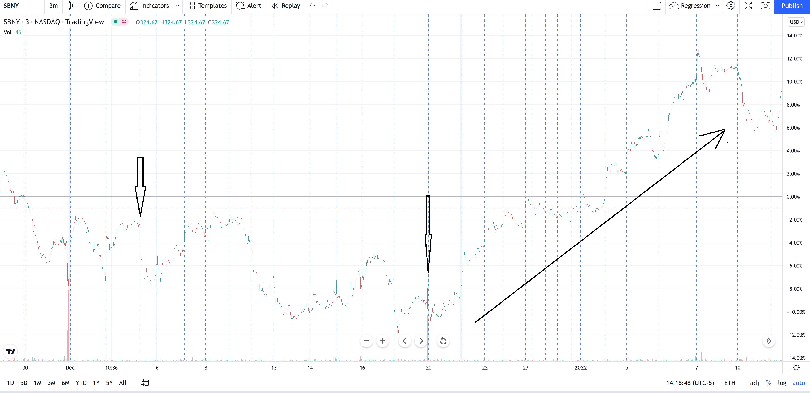
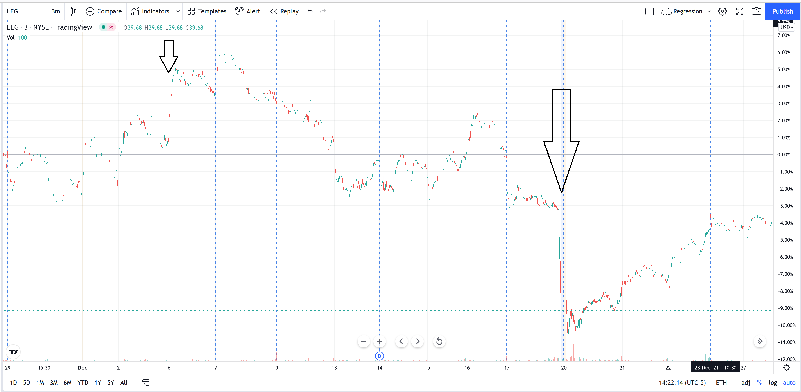
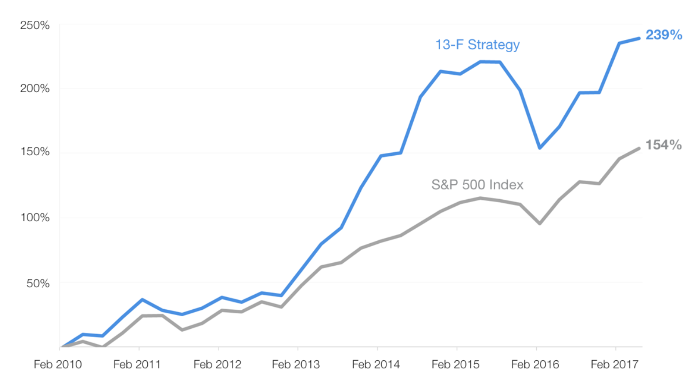
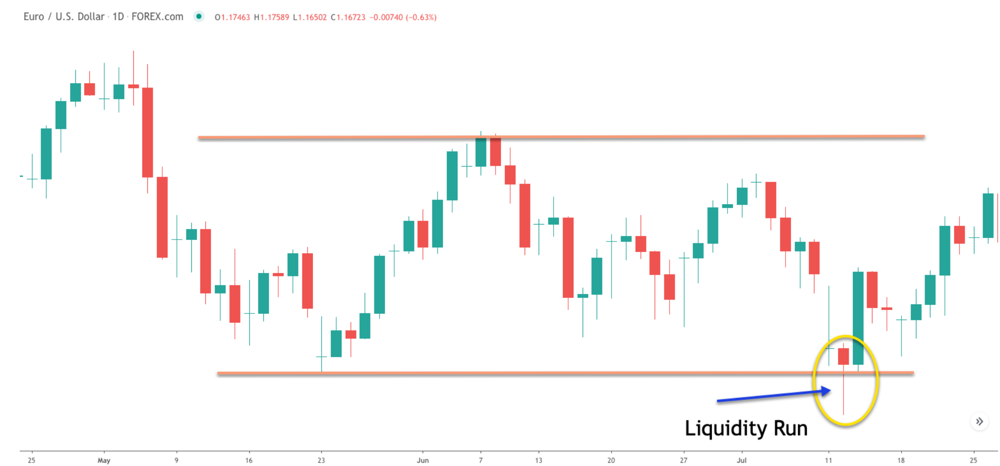

# Cautions and Comments

## Check slower trend {-}

Any time when making a short term entry, it is recommended to look at the mid- and long-term trend to avoid making trades against the direction of the intermediate trend [1].

1. [Murphy, John (1999). Technical Analysis of the Financial Markets. Prentice Hall Press. pp. 252–255. ISBN 0-7352-0066-1] 

## Sell in May and go away {-}

Traders, like everyone else takes holidays, and it appears they do so in the summer. As such, there is an existing theory that bullish traders take a break during the summer and early autumn months and that stocks will typically fall until just before the winter holidays. 

With that said, in 2021, the S&P rose 10% between the start of May and the end of October, and has averaged a 5.7% gain between May and October over the past decade. The only time the market fell in that period was in 2015. 

This, however, speaks to potential timing effects on stock price. They clearly exists within a day, and week, and according to this idea, year.

## Wall of worry {-}

This idea suggest that there is always a pull back from a large drop (like a market crash). Markets often rally in troubling times, partly because investors are looking ahead to a rosier future when all those fears diminish.

## Disposition effect{-}

Most investors have an affinity for selling winners. It feels good. It builds our confidence and gives us something to brag about for years.

In fact, we’d rather sell an investment that’s made money — likely continues to make money — than suffer the pain of selling a loser. So we hold onto the loser with the hopes that it breaks even.

The blunder of selling winners too soon and holding losers too long is known as the disposition effect. It’s one of the biggest mistakes investors make.

## Correlation effect{-}

Diversification is commonly seen as a way to avert risk; like do not put all your eggs in a single basket.
At times, however, different stocks can be related to each for numerous reasons, and thus, in such cases, you may not have as many independence investments as you may think, and all may be associated with the same risk. As such it is recommended, to check for collinearities among stock price of invested stocks to avoid such a risk. It should be noted, however, that correlation between pairs of stock can at time be used as a trading strategy.

## Removal from or addition to SP500 {-}
The addition or removal of a stocks from the SP500, and perhaps other indicators based on high standards for inclusion, can have strong effects of stock price. The idea here is to short stocks that are removed and buy stocks that are added.

In 2021, the S&P announced additions and removals in December 3 and changes became effective on the closing of December 17th.

```{r, out.width = "100%", echo= FALSE, fig.align = 'center',fig.cap = 'SP500 removed or added'}

```

The figure below show the price for one of the stocks added. As noted changes were obvious after the 17th.
```{r, out.width = "100%", echo= FALSE, fig.align = 'center',fig.cap = 'SP500 added'}

```


The figure below show the price for one of the stocks removed As noted changes were obvious on the 17th. Although price eventually recovered to that position several days later.
```{r, out.width = "100%", echo= FALSE, fig.align = 'center',fig.cap = 'SP500 removed'}

```


Additional [info](https://www.smartkarma.com/insights/s-p500-rebalance-for-december-2021-rearranging-the-deckchairs)

## Hedge Fund copycat {-}
Hedge Funds are organizations, where people can place their money to be invested at the discretion of the experts working the given Hedge Fund. Some of these organizations have access to lots of money to acquire data available, have the best information and manpower to take advantage of inefficiencies in the markets, or make wise (sane) long term investments.

By law, every three months, they have to release the list of stocks they have invested on. Using this list as reference for investment have shown considerably high profits that investing in the S&P500 alone.

```{r, out.width = "100%", echo= FALSE, fig.align = 'center',fig.cap = 'Returns of copy large HedgeFunds'}

```


## Stop loss hunt {-}
When you have shares of a stock in long, it is common to set a stop loss as a protection of the price moving downwards. Large institutions, at times and for different reasons, can find out where most of such stop losses are found, and then they place some trades that will trigger the stop losses, forcing you to sell at a loss (cheaper) for the large institutions to buy on the cheap, and ride the wave of the price moving up. The alternative is also true with shorts.

This type of market manipulation is only possible when some type of information (algo, level II data), allows large insitutions to predict where many stop losses are placed, but also have lots of money to buy enough shares to trigger the stop losses, and them buy them when they are cheap.

Additional [info](https://forextraininggroup.com/stop-loss-hunting-by-forex-brokers-and-professionals/)


This type of market manipulation can be identified somehow with the existence of candles with very large shadows.

```{r, out.width = "100%", echo= FALSE, fig.align = 'center',fig.cap = 'Stop loss hunt'}

```

