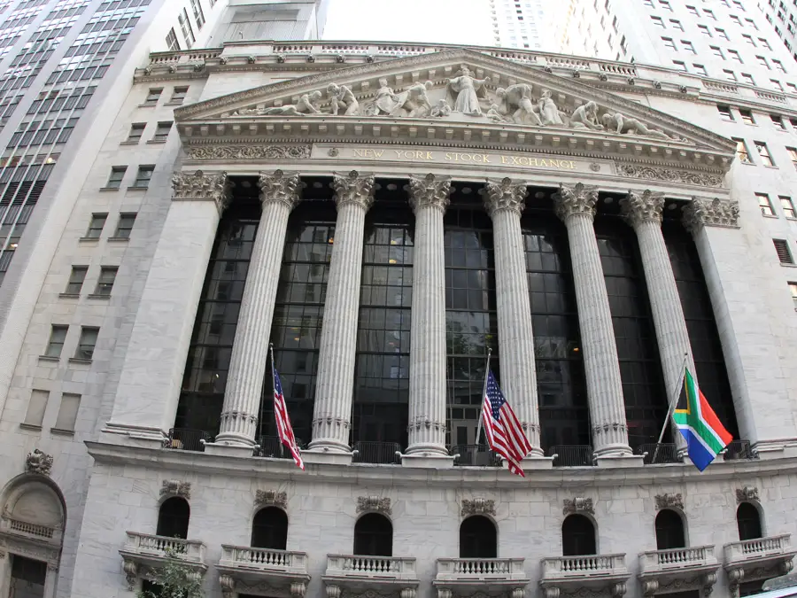

# Introduction {-}
This book is a quick reference for trading as well as useful indicators. For extended details, visit  [investopedia](https://www.investopedia.com/terms/m/macd.asp).


Any given company can chose to become publicly traded by creating an IPO.


```{block2, type='rmdexercise'}
Initial Public Offering (IPO) refers to the process of offering shares of a private corporation to the public in a new stock issuance. Public share issuance allows a company to raise capital from public investors. In turn, any person can buy and sell the given stocks.
```


Once public, a company can be traded (buy or sell its stocks) in a stock exchange or stock market, which is a physical or digital place where investors can buy and sell stock.

The price of each share of the given company is driven by supply (how many stocks are available for sale) and demand (how many stocks people want to buy).

Let's review that again: the price of a stock is determined by the supply and demand.

If the supply of an stock is high (that means there is an over-offer of stocks), the price would expect to go down.

If the demand of an stock is high (that means there is short-supply of stocks), the price would expect to go up.

# what affects the price of a stock? {-}
The price of an stocks can vary for several reasons and at different time scales:

## Scale of months or years {-}

At scales of years, aside from how good or bad a company is, there is a general trend for stocks to move at the speed of the economy. 

Robust companies should expect to grow at least to the same speed of economic grow of a country. 

If a country grows at 2% per year, it is expected that stocks of robust companies will grow to at least the same rate. 

The reason for this relationship is that the central bank regulates interests rates as to ensure an optimun  growth. 

If the economy is tanking, the bank/federal reserve reduces interest rates (meaning people can loan money from banks at lower interest). That allows company to invest, and grow.

If the economy is growing too fast, the federal reserve increases interests rates.

There is an optimum balance here, as increasing or decreasing interest affects inflation, or  buying less for the same amount of money (things become more expensive).

The image below show the stock price of Apple over 5 years. Note how this robust company has positive growth, generally reflecting the overall growth of the economy.


```{r, out.width = "100%", echo= FALSE, fig.align = 'center',fig.cap = 'Apple long term grow'}
knitr::include_graphics("images/AppleLong.png")
```

## Short term {-}
Dramatic changes in the price of an stock can happen from day to nigh, or rather from one minute to the next, depending on given developments of the company. Here is why it is important to keep up with the news.

As an example, in June 21 2021, the Chinese government once again made headlines by claiming that no one in China can trade with Bitcoin. As a result, the price of Bitcoin drop from $31,298 at 1:59 am to $29,470 by 2:44 am. 

```{r, out.width = "100%", echo= FALSE, fig.align = 'center',fig.cap = 'Bitcoin crash'}
knitr::include_graphics("images/BitcoinCrash.png")
```

Elon Musk is another classic example, in which simple Twitt can affect considerably the price of stocks.

Other factors that can cause dramatic changes in stock price from one moment to the next one include: Expected reports of economic performance of the given company, purchase of new machines, granting of new patents, lawsuits, changes in CEOs, selling of the company, the climate, terrorist attacks,etc.


## Intra-day variation {-}
Over the lapse of a day thousands of people trading look at charts of stocks going up and down in price.

The observation of those chart make these people buy or sell the stocks depending if they see a chance to gain, or an opportunity to avoid losing, money.

Imagine you see a stock going up in price, while available shares (so call volume) decline . You may see this as an opportunity to get on the wave and buy, hoping to sell at a higher price.

```{block2, type='rmdexercise'}
Volume is refered as the number of stocks/shares traded (sold or bought) at a given time intervals. 
```

However, as the price starts to go up, some people may start to capitalize by selling their stocks, and this may slow down the price later on. 

It follows that many traders may get scared that there would be a downturn, forcing them to sell, causing the price to go down.

```{r, out.width = "100%", echo= FALSE, fig.align = 'center',fig.cap = 'Bitcoin crash'}
knitr::include_graphics("images/StockBehaviour.png")
```

As noted, the change of the stock price over this small scales, can be influenced by very predictable human behavior. 

# how to improve the odds {-}
If one could collect data on all factors that influence the supply and demand of a stock, one could almost certainly predict the price of that stock. 

The reality is that such data is difficult to gather. Just image if one can predict the next time Elon Musk will twitt?

Because of the inability to collect all data that affects supply and demand, stocks may appear unpredictable, or in the eyes of many a gamble.

However, shorter fluctuations in stocks price and volume can at times provide signals, likely reflecting supply and demand, which can then allow to forecast to at least short term scales the price of stocks.

The idea here is that changes in stock price and volume can lead to predictable human behavior. Here I provide a compilation of indicators used to beat the odds over short term periods: the human behaviors side of stock prices variations.


# Trading times {-}
Shares of a given stock can be traded on any stock exchange in which a company is listed. Like you can buy Coke in Walmart or 7/11, but may be not in Homedepot. 

This is important because at times the same stock can have different prices in different exchanges. You can actually at times make money but just buying in one exchange and selling in another. There are all pretty fine tune, tough :)

There are stock exchanges in almost every country, the most famous is the NYSE or the New York Stock Exchange. They operate from 9:30 am to 4:00 pm.

```{r, out.width = "100%", echo= FALSE, fig.align = 'center',fig.cap = 'Bitcoin crash'}

```


Other stock exchanges are fully electronic like the NASQAT. 

```{block2, type='rmdexercise'}
The Nasdaq is the largest and oldest electronic stock market in the world, meaning all of its buying and selling happens electronically, rather than on a physical trading floor. 
```

With the availability of digital trading, some stocks can be traded after hour. The after-hours market trades are from 4:00 p.m. to 8:00 p.m. 

You also can trade during the pre-market from 4:00 a.m. to 9:30 a.m. ET.

These are times in New York.


